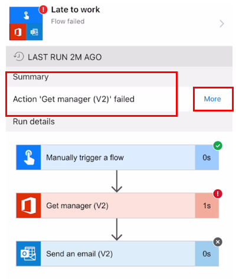

A flow can fail for one of these three reasons:

- User authorization

- Data connections

- Power Automate actions or conditions

### User authorization

The flow works only for users of your tenant. Confirm that
the user's Office 365 account is active. If the account is active, then
confirm that the user's account has a Microsoft Power Automate license.

### Data connections

Connectors need both authentication and authorization. Depending on the
connector, you'll need a URL as well. Confirm that
the connector is authenticated and authorized for your flow.

To validate your connector:

1. Sign in to your [Power Automate](https://flow.microsoft.com/?azure-portal=true)
    tenant.

1. On the left vertical pane, expand **Data** and then select
    **Connections**. Verify the **Status** of each connector.

When you share a button, you can allow people you've
shared the button with to use all connections that your button uses.
You can also require them to use their own connections.
If you allow others to use your connections, they can't access
the credentials in your connection or reuse them in any other flow.

### Power Automate actions or conditions

In the app, select the activity on the bottom horizontal menu and
find your flow. Check to see if a red exclamation icon is on your flow.
If so, the flow has an error and you'll see that Power Automate has failed.

> [!div class="mx-imgBorder"]
> 

Select the flow to determine where the error has occurred. The **Summary** section
will tell you which action has failed. You can select **More** to get
more information, which should provide all the details that you
need to fix the flow. Also, you can select the other steps to see how
the action ran and view the schema of the inputs and outputs.

> [!div class="mx-imgBorder"]
> 

By selecting the flow name, you'll be redirected to another screen that gives
you the following options:

- Enable flow

- Edit flow

- Owners

- Users and connections

- Run history

- Save as

- Delete flow

Selecting the run history will provide you with more clues such as how many
times the flow has failed, whether it failed at the same action or condition every
time, and so on. You can then select **Edit flow** and fix the issue.

In this example, the Get manager (v2) action has failed. This could be because of the user not having a manager assigned yet.

You can view the history for up to 28 days for all run flows. You can also export this history as a CSV file that will give you details on all the runs including successful, failed, running, and canceled.
