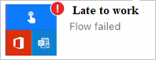
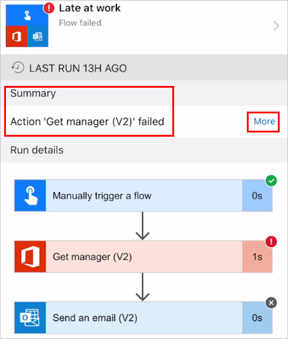

A flow can fail due to one of the three reasons:

1.  **User authorization**

1.  **Data connections**

1.  **Power Automate actions or conditions**

### User authorization

The flow works for only users of your tenant. Hence you need to confirm
the user's Office 365 account is active. If the account is active, then
confirm the user's account has a Microsoft Power Automate license.

### Data connections

Connectors need both authentication and authorization. Depending on the
connector, you'll need a URL as well. Hence you need to confirm you have
all this correct for the flow to run.

To validate your connector, you'll have to:

-   Log into your [Flow](https://flow.microsoft.com/?azure-portal=true) tenant.

-   On the left vertical navigation, expand **Data** and click on
    **Connections**. Check to see the **Status** of each connector.

It is important to know that when you share a button, you can allow
users with whom you've shared the button to use all connections that
your button uses. You can also require them to use their own
connections. If you allow others to use your connections, they can't
access the credentials in your connection or reuse them in any other
flow.

### Power Automate actions or conditions

In the flow app, click on the Activity at the bottom horizontal menu and
find your flow. Check to see if there is a red color exclamation icon on
it. If there is, it means the flow has an error and you will see Power
Automate failed.

Click on the flow to see where the error is. The **Summary** section
will tell you which action has failed. You can click on **More** to get
more information. This information will provide all the information you
need to fix the flow. You can also click on the other steps to see how
the action ran, you can view the schema of the inputs and outputs.

Clicking on the flow name will take you to another screen which gives
you the options to:

-   Enable flow

-   Edit flow

-   Owners

-   Users and connections

-   Run history

-   Save as

-   Delete flow

Clicking on the run history will provide you more clues such as how many
times the flow failed, did it fail at the same action or condition every
single time, etc. You can then click on Edit flow and fix the issue.