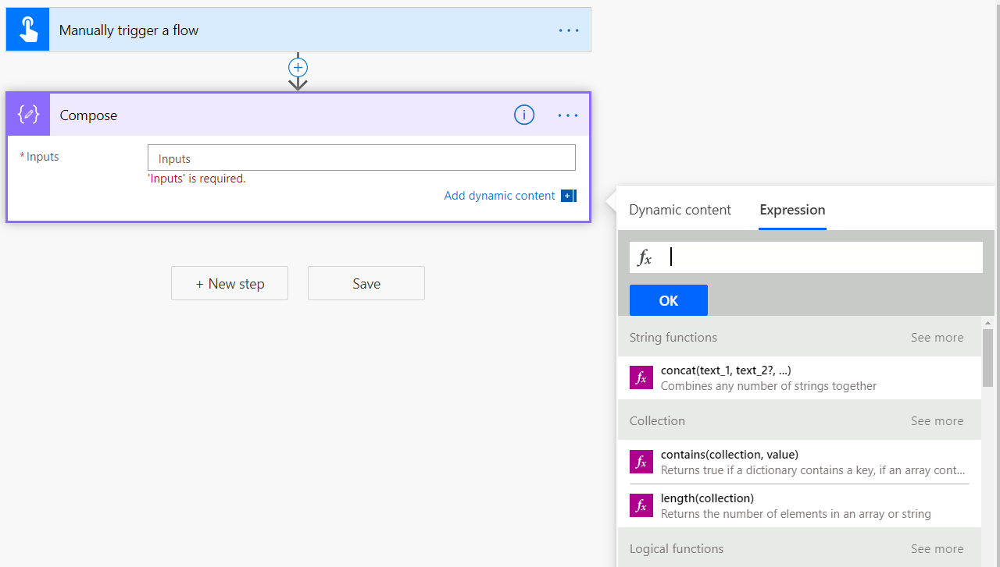
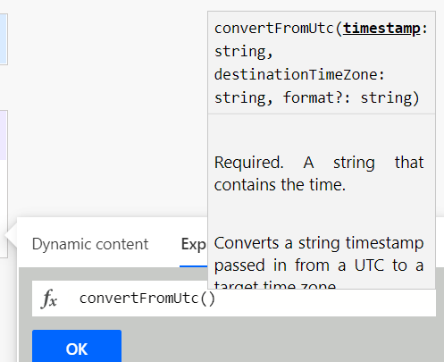
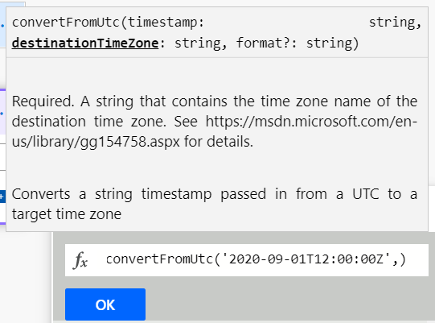
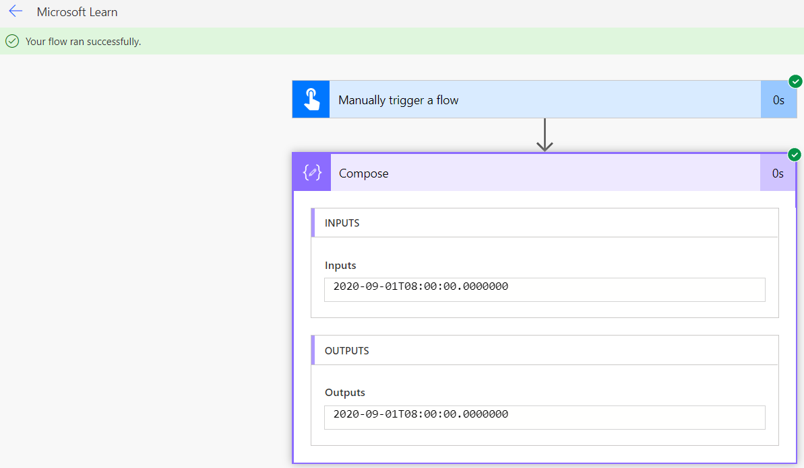

To write an expression in Power Automate, select a field to open the **Dynamic content** menu and then select **Expression** as shown below.

> [!div class="mx-imgBorder"]
> 

The formula box is where you can type your expressions by combining one or more functions. Before you learn about the different types of functions and their usage, there are some commonalities you should learn first. Function names aren't case-sensitive.

> [!TIP]
> Notice in the screenshot that we used a **Manually triggers a flow** trigger and a **Compose** action. This allows you to have a simple setup for writing and testing your expressions without worrying about other inputs or actions. Use this setup to follow along in this app or any time you want to try out something new.

## Auto suggest, hints, and links in the formula bar

When you enter a function in the formula bar, you'll see a pop-up with syntax suggestions.

> [!div class="mx-imgBorder"]
> 

Here you can see for the **convertFromUtc** function that it has two required inputs and one optional input.

- **Timestamp** is required and expects a string
- **destinationTimeZone** is required and expects a string
- **format?** is optional and expects a string.

    > [!note]
    > The question mark at the end of **format** tells you that it is an optional input.

After entering a Timestamp as a string then typing a comma, the flow prompts for the destinationTimeZone:

> [!div class="mx-imgBorder"]
> 

This can be daunting. What does it want for the time zone? If you look in the pop-up, you'll see that it provides a link to the [list of time zone values](https://msdn.microsoft.com/library/gg154758.aspx/?azure-portal=true). This page provides you the string for the **destinationTimeZone**. With that information, we can now complete the expression.

`convertFromUtc('2020-09-01T12:00:00Z','Eastern Standard Time')`

Once the expression is completed, you can select OK to save your changes. Always be sure to select OK or UPDATE when editing an expression. If you select out of the inputs, you will lose your changes. Power Automate does not have AutoSave.

With your first expression complete, you can now select **Test** in the top right-hand corner. Then select **Save & Test**.

Once the test has completed, you should see the green bar that says "Your flow ran successfully." Expand the **Compose** action and you'll see that the **OUTPUTS** is your date time converted to the new time zone.

> [!div class="mx-imgBorder"]
> 

Use this same process to see the output of any test expressions you create.
