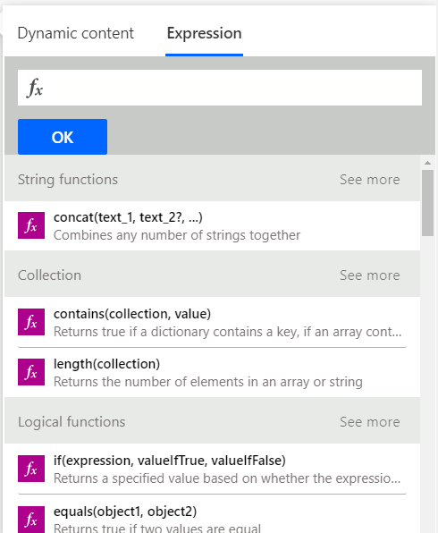
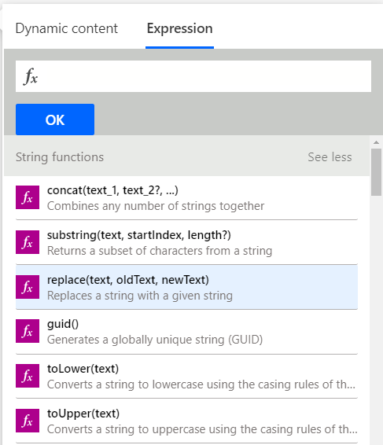
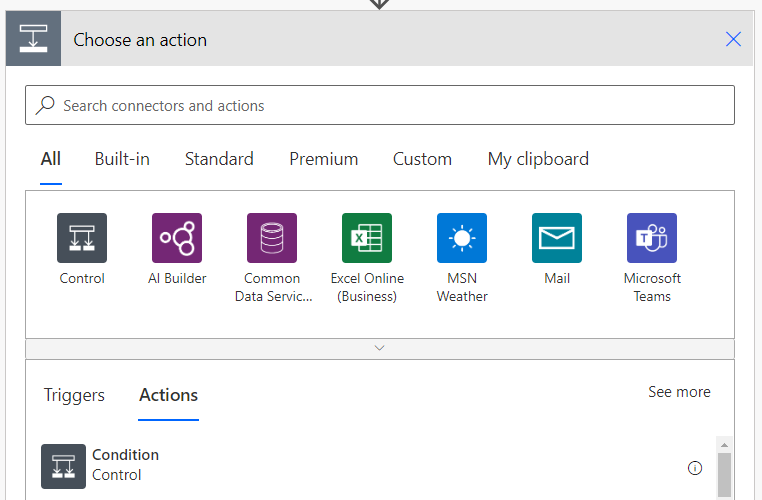
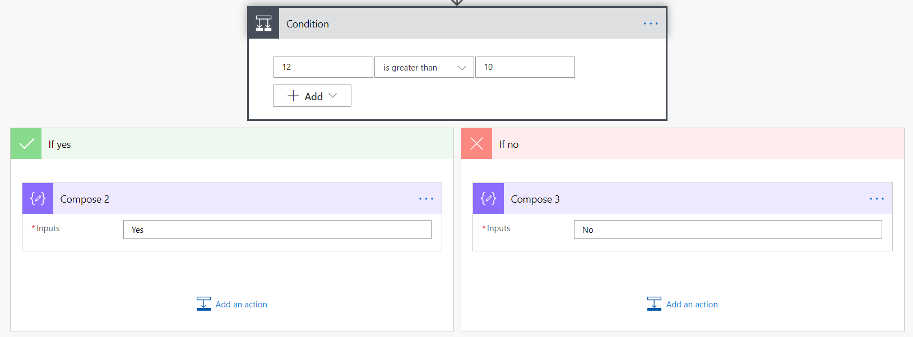
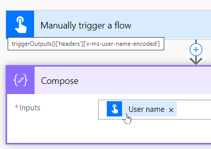

Functions are grouped into 10 different categories like math and logic. The categories are organized to make finding a particular function easier. Below you will get an overview of each category and some examples.

Keep in mind as you go through the various examples, we use static text and values. This is to allow you to test and recreate the examples as easily as possible. In your flows, you may substitute dynamic content in place of this static data. Just ensure that your dynamic data is the correct format for the function.

In the screenshot below, you'll notice to the right of each category header (like String functions or Collection) the words **See more**. By selecting **See more**, the complete list of functions for that category will be shown.

> [!div class="mx-imgBorder"]
> [](../media/see-more-ss.png#lightbox)

Select **See more** beside String functions.

> [!div class="mx-imgBorder"]
> [](../media/string-function-see-more-ss.png#lightbox)

## String functions

String (text) functions are used to modify strings, find characters in a string, format strings, and more. Text manipulation is a core skill often used when trying to better format or modify data you received from somewhere else.

An example of a string function is the **formatNumber** function. This function can convert a number into a string in a given format. A common request is to make a number look like currency. To change the number 12.5 into $12.50, use the following formula:

```regex
formatNumber(12.5,'C')
```

The C represents the Currency numeric format string. Don't worry, a list of the other options are available at [Standard numeric format strings](/dotnet/standard/base-types/standard-numeric-format-strings/?azure-portal=true). You might be asking what if you wanted to show the number as currency but with the Yen symbol? There's an optional parameter where you can pass the locale.

```regex
formatNumber(12.5,'C','ja-JP')
```

This formula will return ¥13.

## Collection functions

These functions are used for arrays and strings. They may be used to check if an array is empty, to grab the first, or last item, or even for join, union, and intersection operations.

An example of a helpful Collection function is *length*. You can use *length* to return the number of items in a string or array. The following example would be used to count the number of characters in the string "I love Power Automate."

```regex
length('I love Power Automate.')
```

The output would be 22. Notice that a space counts as one character. You can use this type of function for validation or in conjunction with the String functions to manipulate strings.

## Logical functions

These functions are used to work with conditions, to compare values, and to do other logic-based evaluations. These are often thought of as If statements where you want to compare if a number is greater than another number. Power Automate supports all of the logical comparisons you would expect.

In the example below, an expression will compare if 12 is greater than 10 and then output the appropriate string. This will also be your first expression that uses more than one function. We'll combine **if** and **greater** logical functions.

```regex
If(greater(12,10),'Yes','No')
```

The result of this expression would be the string **Yes**. To understand the expression, work from the inside out. Greater(12,10) returns true or false depending on whether 12 is greater than 10. Since it is, the value returned is true.

Now that you know the answer is true, you can see that the **If** function returns the data after the first comma. In this case that is the string **Yes**. Had it been false then the string **No** would have been returned.

> [!IMPORTANT]
> While you can write logical expressions as shown above, there is also an action called **Condition** that lets you write **If** statements without an expression. Insert a new step in your flow and search for a connector called **Condition**.

> [!div class="mx-imgBorder"]
> [](../media/condition-ss.png#lightbox)

Here's the same condition written using the action.

> [!div class="mx-imgBorder"]
> [](../media/condition-action-ss.png#lightbox)

You'll find over time that you use a combination of both methods depending on your requirements.

## Conversion functions

These functions are used to change the type of your data. This can be a simple thing like converting a text number into an integer, or more complex functions like changing the encoding of a file from base64 to binary. Knowing that these functions are available will help you overcome problems you come across when getting your data shaped correctly.

A common scenario is the need to use **int** or **float** to change a text number into an actual number. This is common when importing data into your flow from a data source. The number 12 or 12.4 may be stored as text. To use that number in a logical function or write it to a location that expects a number, you'll need to covert it. The following example changes the string "12" into the integer 12.

```regex
Int('12')
```

That will output the integer 12. Had it been the string "12.4" then you would need to convert it to a float because of the decimal digits. In that case you would use

```regex
Float('12.4')
```

Now you could use text number to do the previous example.

```regex
If(greater(Int('12'), Float('12.4')),'Yes','No')
```

This would output the string "No" because 12 isn't greater than 12.4. Combining functions like this is common and is a useful pattern to learn.

## Math functions

Math functions do exactly as you would expect. They allow you to add, subtract, multiply, and perform other similar functions. Also, Math functions allow you to find the smallest and largest numbers from a data set or get a random number between a specified interval, among other things. To get a random number from 1 to 10, use the following:

```regex
rand(1,10)
```

One thing to keep in mind is that there's a different function for adding numbers (*add*) and for subtracting numbers (*sub*). Many formula languages add negative numbers to produce subtraction, but Power Automate doesn't. To add two numbers together, you use the following:

```regex
Add(12, 13)
```

This would return 25. If you wanted to add three numbers, then you would need to add a second function like so:

```regex
add(add(12,13),15)
```

This would return 40. As you've seen before, you'll often find yourself nesting functions to get the results you want.

## Date and time functions

These functions are used to return the current date and time, change time zones, find specific info about a date and time, and do other date or time manipulations. If you have date and time values in your data, you'll need these functions.

One important thing to remember as you explore date and time functions in Power Automate is that they're often based on UTC. Most data sources pass data back and forth with Power Automate in UTC format. Also, if you use the function UTCNow(), that will return the current time in UTC format. If you want to use that to compare to user data that is currently in the Eastern Time Zone, then you'll need to use the following formula to convert it:

```regex
convertFromUtc(utcNow(), 'Eastern Standard Time', 'dd-MM-yyyy hh:mm tt' )
```

This will output 06-07-2021 05:39 PM. For a complete list of the date time format options, see [Custom date and time format strings](/dotnet/standard/base-types/custom-date-and-time-format-strings/?azure-portal=true).

## Referencing functions

The referencing functions are used to work with the outputs of your actions and triggers. The nice thing is that most of the time, Power Automate will write these functions for you. When you add dynamic content to your flow, you're using referencing functions without knowing it. If you add dynamic content and then hover on top of that content, you can see this in action.

In the screenshot below, you can see this in action by adding the **User name** dynamic content from my trigger to the **Inputs** for Compose.

> [!div class="mx-imgBorder"]
> [](../media/user-name-ss.png#lightbox)

By hovering over **User name** with the mouse pointer, you can see

```regex
triggerOutputs()['headers']['x-ms-user-name-encoded']
```

Power Automate created the expression using the triggerOutputs for you. It's pulling the x-ms-user-name-encoded property from the **Headers** property. Most of the time in Power Automate you'll reference these properties via dynamic content. But it's possible to write your own expressions to recreate this if necessary. Each trigger and action will have different formats for how you retrieve their data.

Explore these functions by adding different triggers, actions, data sources, and apply-to-each loops in your flow. Then, use their properties as dynamic data to see more examples. The good news is writing these types of expressions isn't common.

## Workflow functions

The workflow functions are used to retrieve information about your flow and are closely related to the referencing functions. One of the functions is called workflow. You can use it as shown below.

```regex
Workflow().run.id
```

This will return the ID of the current flow run. You could use this for error reporting or logging if needed. These functions aren't commonly used.

## URI parsing functions

These functions are used to dissect a URI that is passed in as a string. You may use these functions to find the host, path, query string, or other portions of the URI. The following example shows you how to use **uriQuery** to get the query string portion of the given URI.

```regex
uriQuery('https://flow.microsoft.com/fakeurl?Test=Yes')
```

This would return the string "?Test=Yes" which you could then parse with string functions to get the value passed in from the URI.

## Manipulation functions

Manipulation functions are used to work with specific objects in your flow. You can do things such as find the first non-blank value, work with properties, or find xpath matches. These functions are used typically in JSON or XML nodes evaluations.

One function you may find handy here's **coalesce**. This function will allow you to find the first non-null value from a specified set of values. You use the function as shown in the following formula:

```regex
Coalesce(null, 'Power Automate', 'Power Apps')
```

This formula would return the string **Power Automate**. Handy when you're passing in multiple values and want to find the first one that isn't null.
