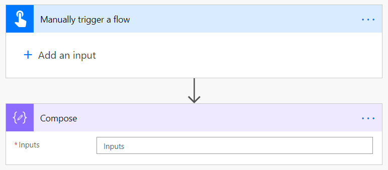
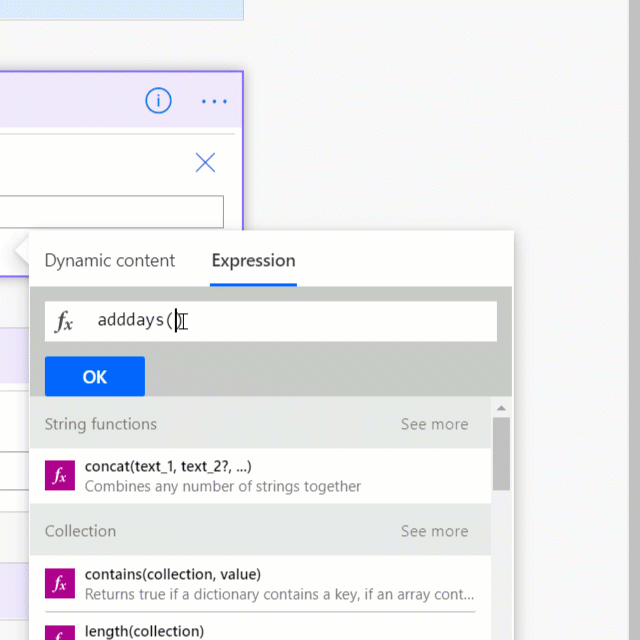
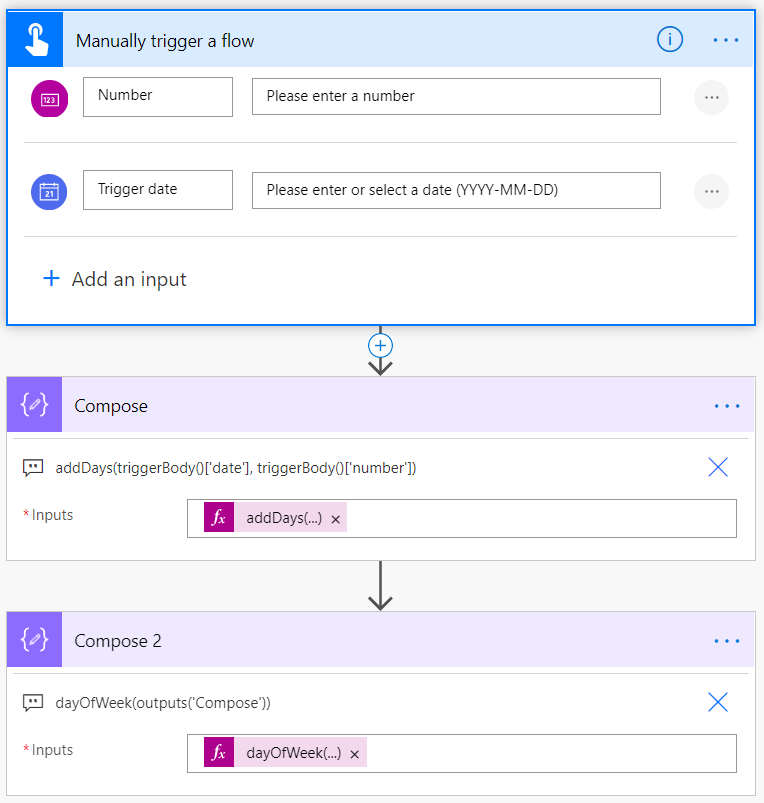

Complex expressions are when you combine more than one function to get the result you want. In the Math functions and Date Time functions sections, you have already seen examples of this. You saw that to add three numbers, you need to combine two **add** functions like:

```regex
add(add(12,13),15)
```

Which resulted in the output of 40.

Then you saw how you use the **utcNow** function to get the current date and time and then use **convertFromUtc** to change it to the Eastern Standard time zone as shown below:

`convertFromUtc(utcNow(), 'Eastern Standard Time', 'dd-MM-yyyy hh:mm tt' )`

Which resulted in the output of 06-07-2021 05:39 PM.

When you think of complex expressions, it's more than one function in an expression where you use the output of one function as an input of another. There's no special syntax, operators, or considerations.

For a final example of a complex expression, take the scenario of having a couple of inputs as part of your **Manually trigger a flow** trigger and then using that input in a formula to compute a new time. You can use the example flow that you've used to test your expressions or to build a new flow that looks like the one below.

> [!div class="mx-imgBorder"]
> [](../media/new-flow-ss.png#lightbox)

Now select **Add an input** under **Manually trigger a flow** and add a Number. Then select **Add an input** again and add a Date. Your trigger should now look like this:

> [!div class="mx-imgBorder"]
> [](../media/manual-trigger-ss.png#lightbox)

Now, in the Compose step you'll add an expression to add the number of days from the trigger to the date.

```regex
addDays(triggerBody()['date'], triggerBody()['number'])
```

This is using the Date Time function **addDays** and the Referencing function **triggerBody**.

> [!NOTE]
> If you find yourself asking "How do I know what goes in for trigger body?" then you are thinking correctly. The secret is you can combine dynamic content into your expressions. To do so, start your expression by typing addDays() and then with your cursor between the (), select **Dynamic content**. Then you can choose your fields as shown below. This is a great way to reference that content while letting Power Automate do the hard work of writing the formula.

> [!div class="mx-imgBorder"]
> [](../media/add-expression-ss.gif#lightbox)

If you test your flow and enter the date 2021-06-01 and the number 2, your output will be 2021-06-03T00:00:00.0000000, which is UTC format for June 3, 2021.

Now you can find out what day of the week that is by using another Compose action with the following expression:

```regex
dayOfWeek(outputs('Compose'))
```

This returns the value of 4, which represents Thursday as it counts up from Sunday as 0. Here's a screenshot of the current flow to validate what you have built. Note the expressions have been placed in a note to make them easier to read.

> [!div class="mx-imgBorder"]
> [](../media/flow-built-ss.png#lightbox)

Now add another Compose step to check to see if the date they selected is a Thursday. Do this with the following expression in Compose 3.

```regex
if(equals(outputs('Compose_2'),4), 'You chose a Thursday', 'You did not choose a Thursday')
```

For June 3, 2021 this will return the string "You chose a Thursday."

This example is a typical build pattern for a complex expression, building piece by piece in separate steps. Now that you have all of the functions necessary worked out, add another Compose step. In Compose 4, write one large expression that does everything in one step. The expression will look like:

```regex
if(equals(dayOfWeek(addDays(triggerBody()['date'], triggerBody()['number'])),4), 'You chose a Thursday', 'You did not choose a Thursday' )
```

The output for June 3, 2021 will be the string "You chose a Thursday." Congratulations. You've written a complex expression by doing small steps and then putting it all together in the end.
