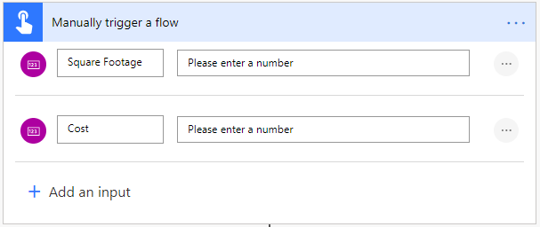
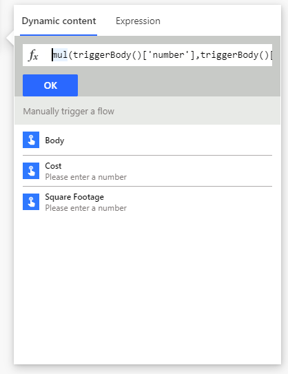
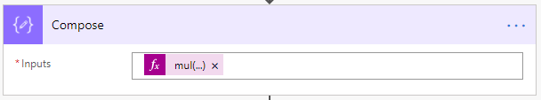
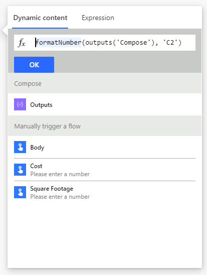
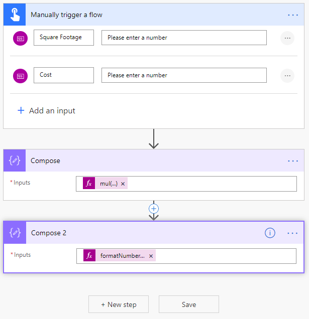
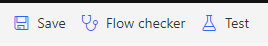
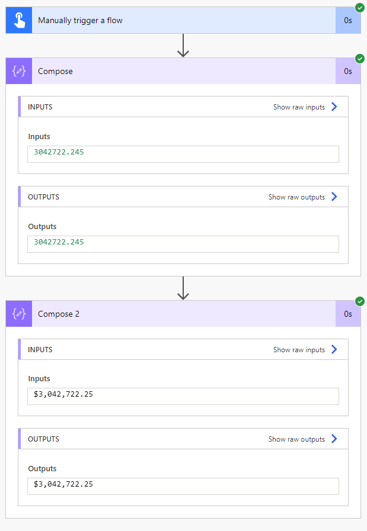

Let's say you need to find out how much it would cost to carpet a room based on its' square footage. In this exercise, you will create a manual flow that will use your input to do those calculations.

1.  Sign into [Power Automate](https://flow.microsoft.com/?azure-portal=true).

1.  Create a new Instant flow from blank.

1.  Name it *CalculateFlow* and select Manually trigger a flow.

	> [!div class="mx-imgBorder"]
	> 

1.  Select the Manually trigger a flow step and select Add an input.

1.  Choose Number and name it *Square Footage*.

1.  Select Add an input and choose Number again and name it *Cost*.

	> [!div class="mx-imgBorder"]
	> 

1.  Select New Step and search for and select the Compose action.

1.  Select the Inputs box and the Dynamic content window will appear.

1.  Select the Expression tab and type in **mul(**. Flow will know that you are using the multiply expression and automatically add a **)** at the end for you.

1. With your cursor still between the two parentheses in the expression field, select the Dynamic content tab.

1. Select **Square Footage** in the dynamic content below.

1. Next add a **,** and choose **Cost** in the dynamic content below.

1. The complete expression should be:
    `mul(triggerBody()['number'],triggerBody()['number_1'])`

1. Select OK to add the expression into the Compose step.

	> [!div class="mx-imgBorder"]
	> 

1. You will know your expression is correct if it is added into the Compose step and looks like:

	> [!div class="mx-imgBorder"]
	> 

	This compose step is now doing the math of calculating the square footage of the area multiplied by the cost per square foot based upon inputs you will provide. However, we still need to convert the final result to currency to get an accurate answer.

1. Select New Step and search for and select the Compose action again.

1. Select the Inputs box and again the Dynamic content window will appear.

1. Select the Expressions tab and type in **FormatNumber(**.

1. With your cursor in place select the Dynamic content tab and choose **Outputs** from the preview Compose step.

1. Next finish the expression with **, 'C2'**.

    The C formats the number as currency, with the 2 representing how many decimal places. Refer to [Standard numeric format strings](https://docs.microsoft.com/dotnet/standard/base-types/standard-numeric-format-strings/?azure-portal=true) for more number formats.

1. The complete expression should be:
    `formatNumber(outputs('Compose'), 'C2')`

1. Select OK to add this expression in the Compose 2 step.

	> [!div class="mx-imgBorder"]
	> 

	Now after our flow is triggered and multiplies the two inputs it will convert the result into currency. This will give you a quick way to get the cost associated with carpeting a room.

1. Your complete flow will look like this:

	> [!div class="mx-imgBorder"]
	> 

1. In the top-right corner, select the Save button, then select Test.

	> [!div class="mx-imgBorder"]
	> 

1. Choose I'll perform the trigger action and then select Test.

1. Enter the two number inputs, *Square Footage* and *Cost*, and then select Run flow at the bottom.

1. The page will reload and you will see green check marks next to each step of your flow.

1. Selecting each step will expand the details showing you the inputs and outputs of each step.

1. Selecting Compose will show the multiplied value of the two numbers you entered, while selecting Compose 2 will show the currency format of that multiplied value.

	> [!div class="mx-imgBorder"]
	> 

Let's recap what we've done.

**Manually trigger a flow** - Allows us to press a button to trigger a Flow and provide inputs. In this case our two inputs are *Square Footage* and *Cost*, which we are using to find out the total price to carpet a room.

**Compose** - We use this to write expressions using the data from elsewhere in the flow. In this case, we first multiplied the two inputs from the trigger. This gave us the correct number, but we still needed to convert it to currency. We then used another compose action to format the multiplied result into currency. Finally giving us the easiest answer of how much it would cost to carpet a room.

