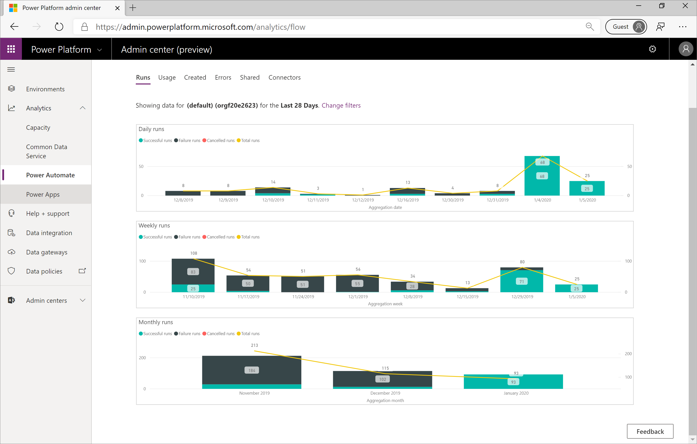

In the previous section, we discussed steps that can be taken to support
communicating with users once you are ready to make governance changes.
However, it is important to understand what the impacts of upcoming
changes are before sending out communication. In this section, we will discuss how the Power Platform Admin Analytics feature can aid administrators in understanding how Power Automate is used to
avoid undesirable impacts.

There are six Power Automate reports that are available inside of the
Power Platform Admin Center including:

-   Runs

-   Usage

-   Created

-   Errors

-   Shared

-   Connectors

We will walk through each of these reports and highlight how
administrators can leverage them to gain insights about how their users
utilize Power Automate.

To access the Admin Analytics feature, navigate to the [Power Platform
Admin Center](https://admin.powerplatform.microsoft.com/) using an
account that has environment or tenant admin privileges. Once you have
logged in, expand the **Analytics** dropdown from the left navigation
and click on **Power Automate**.

{width="6.495138888888889in"
height="3.370138888888889in"}

In Module 1, we discussed environment and tenant scopes. When it comes
to Admin Analytics, everything is in the context of an environment.
There is currently no way to see aggregated analytics, across the
tenant, in this experience. A tenant administrator will be able to see
analytics on a per-environment basis. Environment administrators will
only see analytics for the environments that they are admins in. To
change the environment, an administrator can click on the filter icon in
the upper right-hand corner. From there they can select their desired
**Environment** and the **Time period** that they would like to see
analytics for.

The Power Platform Admin Center will store analytics for up to 28 days,
but administrators can filter based upon the last 14 and 7 days. In
addition, the analytics are not aggregated in real time. Administrators
can expect up to a three-hour delay before the latest analytics are
published.

{width="6.495138888888889in"
height="3.4583333333333335in"}

Let's now dive into each of the reports that are available in the Power
Automate Analytics feature, starting with Runs. Within the Runs report,
administrators will be able to determine the number of flow runs within
that environment per Day, Week and Month. In addition, Power BI embedded
slicers allow the administrator to filter data based upon whether the
run was successful, failed or cancelled.

For organizations who are adopting Power Automate, this report will
provide insights that help determine the level of adoption within the
organization. The people who are responsible for change management can
use this data to help support training and adoption campaigns by being
able to show measurable progress.

{width="6.5in" height="4.145833333333333in"}

The Usage report outlines the Types of flows in use, including whether
or not the flow is Scheduled, Button clicked or System Event driven. In
addition, for each flow in use, the number of Runs are aggregated so an
administrator can see how frequently the flows run and what is the most
frequently run flow. The Flow creator email is also captured so that if
an administrator needs to contact this person, they have their email
address. Lastly, there is a trend that highlights the number of unique
flows in use per day based upon the Time period filter.

{width="6.5in" height="4.135416666666667in"}

When looking to identify new flows, the Created flow report will
identify these new assets. Once again, these flows will be broken down
by their Type: Scheduled, Button clicked or System Events. The flows
that have been recently created will also be listed in a table that
includes the Created date and the Flow creator email address. Lastly, a
trend of when these flows were created is also displayed.

This report is particularly interesting for people responsible for
change management. Perhaps the organization has recently provided Power
Automate training and want to see if people are putting these new skills
to use.

{width="6.5in" height="4.1305555555555555in"}

For Administrators, detecting when makers are experiencing errors with
their flows can become a great concern if a flow continues to fail and
supports an important business process. The Errors report will help
administrators identify flows that are failing and will display the
Error count, the Last occurred timestamp and the Flow creator email. In
addition, a pie chart will break down the Error types that will
highlight the different types of errors that makers have been
experiencing.

{width="6.5in" height="4.151388888888889in"}

The Shared report will identify the Types of flows shared, including
System Events, Button clicked and Scheduled. In addition, a table will
be displayed that includes the Flow name that was shared, the number of
Shares and the Flow creator email. Lastly, a trend will display what day
the flow was shared on within the configured time period.

This report is particularly useful for identifying makers who are
sharing their work with others within the organization. These makers are
often referred to as champions who should be empowered so they can drive
further business results.

{width="6.5in" height="4.1409722222222225in"}

The last report we will discuss is probably the most important
report to consider when evaluating DLP changes. The Connectors report
will identify all the connectors that have been involved in Flow runs
and how many Connector calls have been made. Much like you would expect
with a Power BI embedded experience, an administrator can filter out
connectors as required. For example, consider a situation where an
administrator wants to make a DLP connector change that involves the
SharePoint connector. They can click on the sharepointonline connector
from the Connectors by flow runs visualization. As a result, the
Connectors by connector calls visualization will be updated. In
addition, we will see a table updated called Flows using connectors. In
this visualization, we will see all the flows that use the SharePoint
connector and the Flow creator email address. This will help us identify
all of the makers that we should proactively reach out to before making
any DLP changes.

This report becomes very useful in both governance and change management
situations. It allows administrators to identify if connectors are being
used that are not in the best interests of the organization and allows
administrators to work with those people to better understand why they
are using those connectors and potentially implement actions that
prevent further usage.

On the other hand, if an administrator discovers there is a lot of
utilization around a particular connector, like Microsoft Forms, perhaps
they want to evangelize its usefulness with other business units in an
attempt to scale the organization and reap more benefits for the
organization.

{width="6.5in" height="4.15625in"}
