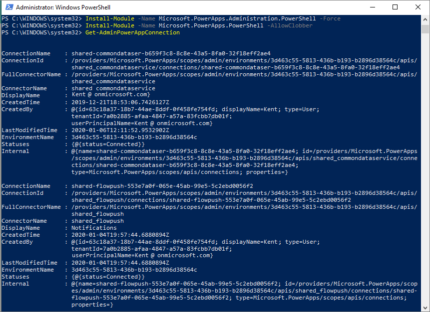

In this exercise, we will walk through connecting to the Power
Apps and Power Automate PowerShell Cmdlets to list all the connections
that are in our tenant. You can use this information to determine which
users are making connections through different connectors.

1.  Launch **Windows PowerShell** and **Run as Administrator**

    

2.  Import the required modules using the following commands:

    **Install-Module -Name Microsoft.PowerApps.Administration.PowerShell**

    **Install-Module -Name Microsoft.PowerApps.PowerShell-AllowClobber**

3.  If you are prompted to accept the change to the *InstallationPolicy*
    value of the repository, accept this for all the modules by typing
    'A' and pressing **Enter** for each module.

4.  List all connections using the **Get-AdminPowerAppConnection**
    command.

5.  At this point, you should be prompted for credentials. Enter your
    credentials while accounting for the prerequisites that were
    discussed at the beginning of this module.

6.  After your credentials have been entered, the Cmdlet will run and
    all of the connections will be returned. Data that is returned
    includes the name of the connector, who created the connection, the
    environment and its current status.

    
