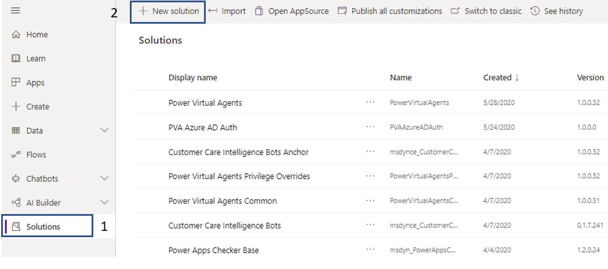
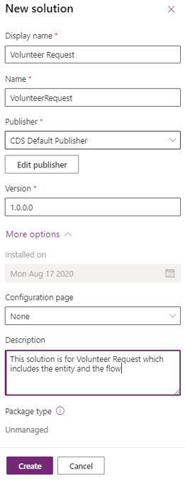
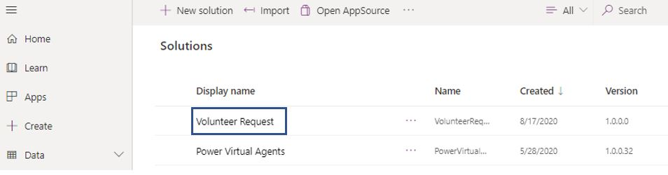
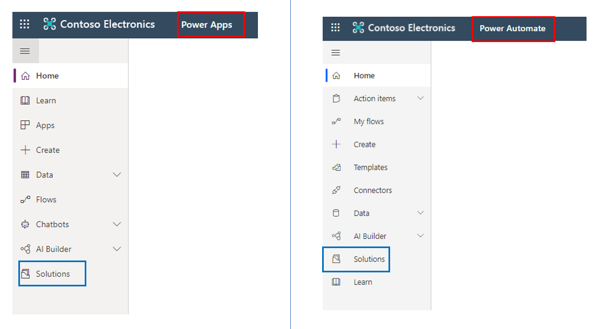
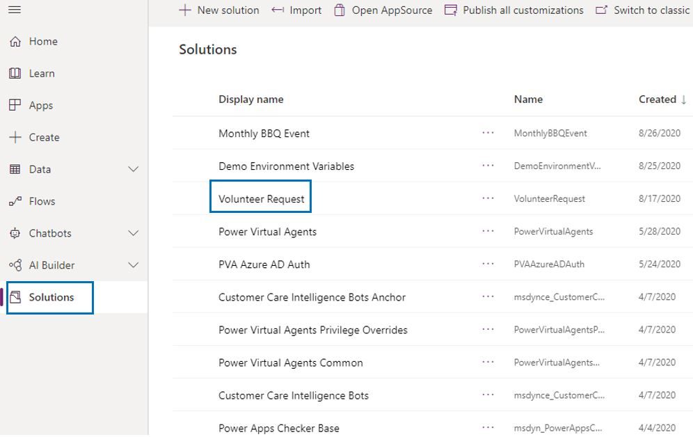

Solutions allow us to package features such as Power Apps apps (both canvas and model-driven), site maps, flows, entities, forms, custom connectors, web resources, option sets, charts, and fields to transport from one environment to another. Only the metadata, such as entities and their columns and configuration data, are transported. No business data is transported.

Solutions are part of the overall Application Lifecycle Management (ALM) practice of the Power Platform. Solutions are an important mechanism for implementing ALM. For more information, visit [Overview of application lifecycle management with Microsoft Power Platform](https://docs.microsoft.com/power-platform/alm/overview-alm/?azure-portal=true)

## Learn the basics

### Power Automate flows

Microsoft Power Automate (previously known as Flow) is a service that allows us to create workflows that are either automated or manually triggered by a user. There are several templates already available that either fully match your requirement or require minor changes. Other options include creation from a Visio template, UI and business process flows.

The designer feature that comes along with Power Automate is very user-friendly. However, sometimes drawing your flow logic on a Visio diagram can help design a better workflow, and hence the integration of Power Automate with Visio was created. In Visio, you use the BPMN Basic Shapes to design the flow and export it. You then import that file into Power Automate, after which you have the flexibility to make further enhancements.

UI flows bring Robotic Process Automation (RPA) directly into Power Automate. This functionality comes with either a Desktop or a Web app that you use to record the user interface, including clicks and keyboard input. This comes in very handy to work with legacy applications that do not have APIs available.

Business process flows are built using Power Platform and Common Data Service. You can also leverage Power Automate workflows. The business process is a series of steps that the user needs to complete in a specific stage. The business process flow visually guides the user through various stages. These flows are created and managed by using Power Automated, and several templates are readily available. These templates can use the entities that are already available, or you can use custom entities that you have created.

Power Automate flows that you create in a solution are known as solution-aware flows. You can build a new flow directly inside a solution. In addition, you can edit and delete that flow.

### Connection references

A connector is a user-friendly way to allow a service to connect with Power Automate. Each connector comes with a set of operations classified as 'Actions' and 'Triggers'. Once you connect to the service, these operations can be leveraged within your Power Automate workflow.

There are three separate categories of connectors, Standard, Premium, and Preview. Custom connectors and connectors for Azure Logic Apps fall under the Premium category.

You can add connectors to a solution. You have the option to add existing connectors to a solution or create a new one that automatically becomes part of that solution.

### Environment variables

It was a common practice for all the data that was stored to be available in a single environment only. Now thanks to environment variables, you have the flexibility to transport your configuration data from one environment to another within the same tenant. After creating Environment variables in Common Data Service for apps, you can consume them by retrieving data from the Environment Variable Definition and Environment Variable Value entities.

You can add environment variables in a solution. You have the option to add an existing environment variable in solution or create a new one that automatically becomes part of that solution.

## Managed and unmanaged solutions 

Solutions are the mechanism for implementing ALM in Power Apps and Power Automate. A solution can either be managed or unmanaged.

Unmanaged solutions are used while you are still in your development environment in the initial design, building, and testing phase. Unmanaged solutions should be considered your source for Microsoft Power Platform assets. When an unmanaged solution is deleted, only the solution container of any customizations included in it is deleted. All the unmanaged customizations remain in effect and belong to the default solution.

Managed solutions are used to deploy to any environment that isn't a development environment for that solution. This includes test, User Acceptance Testing (UAT), System Integration Testing (SIT), and production environments. To make it easier and faster, Managed solutions can be created independently from other managed solutions in the same environment. As an ALM best practice, managed solutions should be generated by exporting an unmanaged solution as managed and considered a build artifact.

It is important to note that changes can only be made to unmanaged solutions. If you need to modify a managed solution, you need to add them to an unmanaged solution. When you do this, you create a dependency between your unmanaged customizations and the managed solution. When a dependency exists, the managed solution can't be uninstalled until you remove the dependency.

Some managed components can't be edited. To verify whether a component can be edited, view the Managed properties.

You can't export a managed solution. Also, when a managed solution is deleted (uninstalled), all the customizations and extensions included with it are removed.

## Create a new solution(s)

Consider a Common Data Service (CDS) entity called Volunteer Requests, which saves all the requests that are submitted. A Power Automate flow is created to send an email notification to team members of the respective departments.

1. In Power Automate, click on **Solutions** and then **+ New solution**.

	> [!div class="mx-imgBorder"]
	> 

1. Add the **Display name**, select **CDS Default Publisher,** and a **Description**. Then click **Create**.

	> [!div class="mx-imgBorder"]
	> 

Congratulations! You have created your new solution.

> [!div class="mx-imgBorder"]
> 

## View an existing solution(s) 

You can view your solutions either from Power Apps or from Power Automate. 

1. Log into either one of them to find **Solutions** available on the bottom left of the vertical navigation.

	> [!div class="mx-imgBorder"]
	> 

1. Click on Solutions. Here you'll see the list of solutions you've previously built including the new one called 'Volunteer Request' you created above.

	> [!div class="mx-imgBorder"]
	> 
