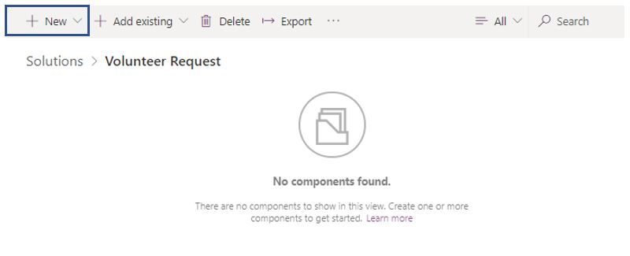
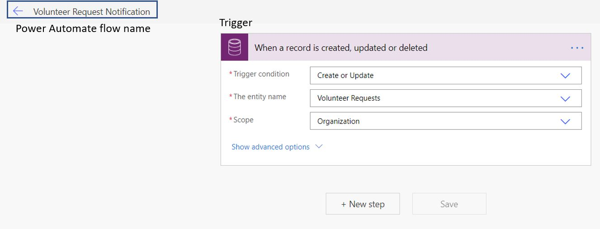
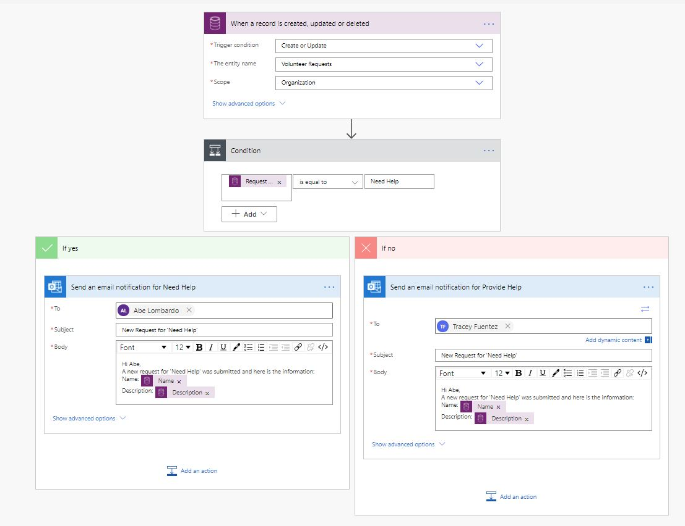
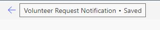
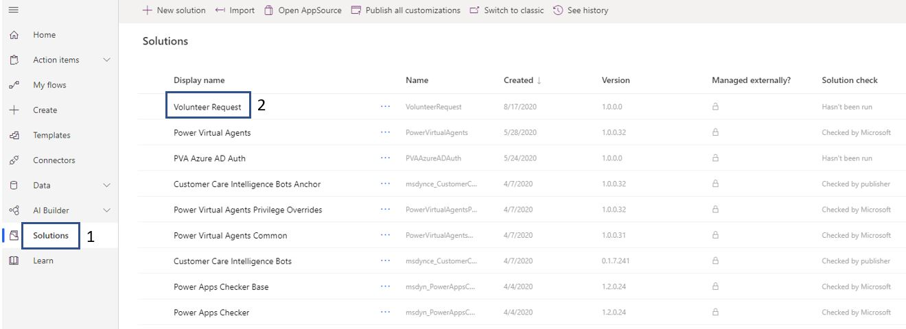
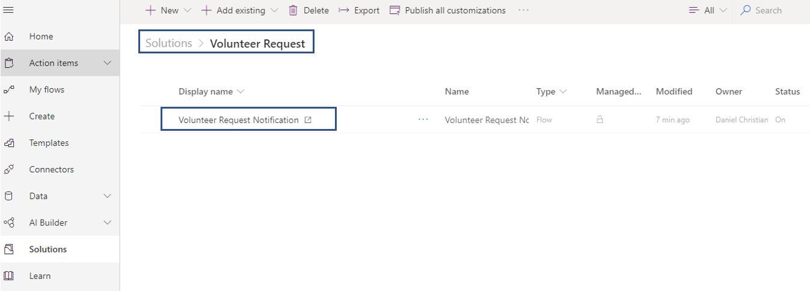
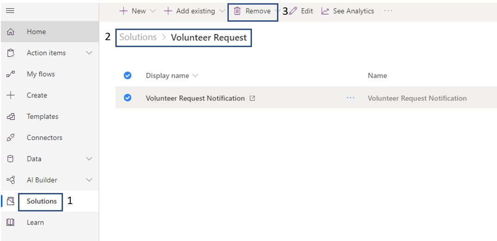

The following steps go through the process of creating a flow and adding it to a solution.

1. To create a simple flow and add it to a solution, select the new **Volunteer Request** solution that you created and then select the **+ New** option at the top of the page. 

	> [!div class="mx-imgBorder"]
	> 

1. Select **Flow**.

	> [!div class="mx-imgBorder"]
	> 

	The following screenshot shows the name of the flow and the initial trigger.

	> [!div class="mx-imgBorder"]
	> 

	The remaining design of the flow is shown in the following figure.

	> [!div class="mx-imgBorder"]
	> 

1. Select **Save** in the upper-right corner of the page.

1. Confirm that the flow has been saved and then select the left arrow icon.

	> [!div class="mx-imgBorder"]
	> 

1. Return to validate that the flow has been created and is part of the solution. Select **Solutions** on the left vertical navigation pane, and then select **Volunteer Solution**.

	> [!div class="mx-imgBorder"]
	> 

Congratulations, you have successfully created a Power Automate flow, which is now part of the solution.

> [!div class="mx-imgBorder"]
> 

## Remove a flow from a solution 

Power Automate flows that are part of a solution don’t show up in the flows. For example, the new flow that you previously created doesn’t show up in the flows list. The only way that you can find it is by selecting **Solutions** and then selecting your solution name.

> [!div class="mx-imgBorder"]
> 

> [!NOTE]
> Do not complete the ensuing steps if you are following along. The **Volunteer Request Notification** flow will be referenced in later sections.

To remove the solution, select the solution name and then select **Remove**. For example, select **Solutions > Volunteer Request > Volunteer Request Notification** flow and then select **Remove**.

> [!div class="mx-imgBorder"]
> 
