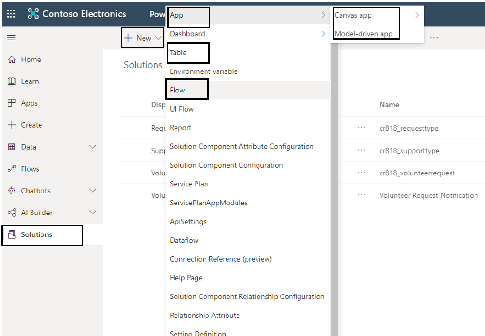
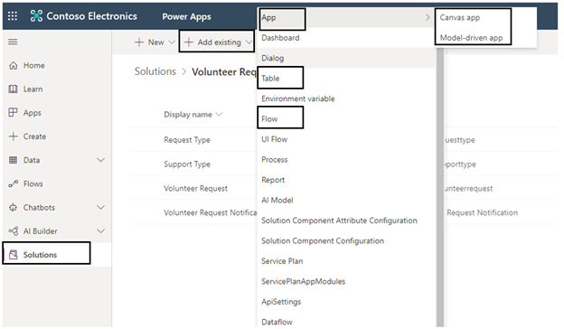
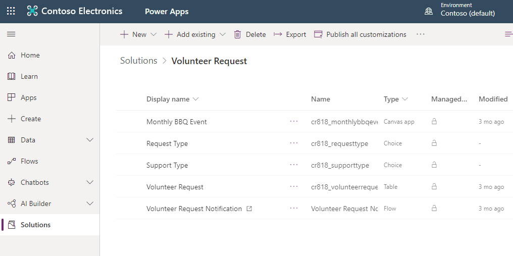

1. To create a solution first sign into Power Apps and select **Solutions** which is available in the left vertical navigation. 
 
	> [!div class="mx-imgBorder"]
	> 

1. Add the **Display name**, select **CDS Default Publisher**, and a **Description**. Then click **Create**.

	> [!div class="mx-imgBorder"]
	> 
 
	Congratulations! You have created your new solution.
 
	> [!div class="mx-imgBorder"]
	> 

You now have the option to create new apps, flows and tables into this solution or add existing ones.

1. To add new apps, flows, and tables click on Volunteer Request solution first, then click on + New which is available on the top and then select your option.

	> [!div class="mx-imgBorder"]
	>  

1. To add existing apps, flows and tables, click on **+ Add existing**. You then select **App** to add existing apps, **Table** to add existing tables (previously known as entities) and **Flow** to add existing flows.

	> [!div class="mx-imgBorder"]
	> 
 
Once you are done adding your solution should look something like this:
 
> [!div class="mx-imgBorder"]
> 