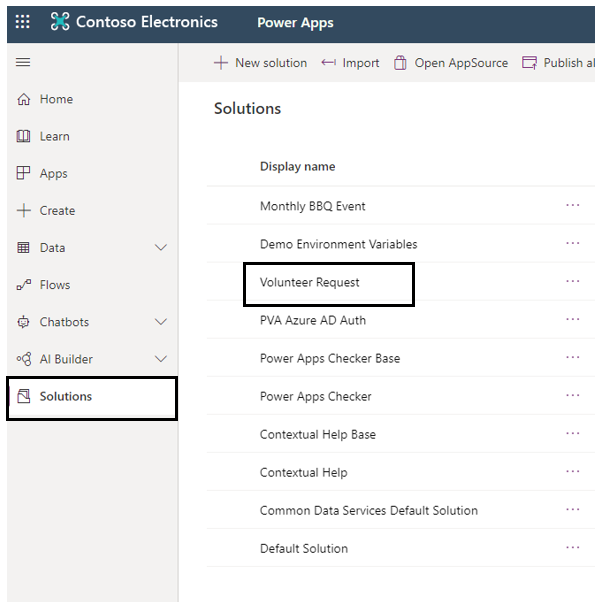
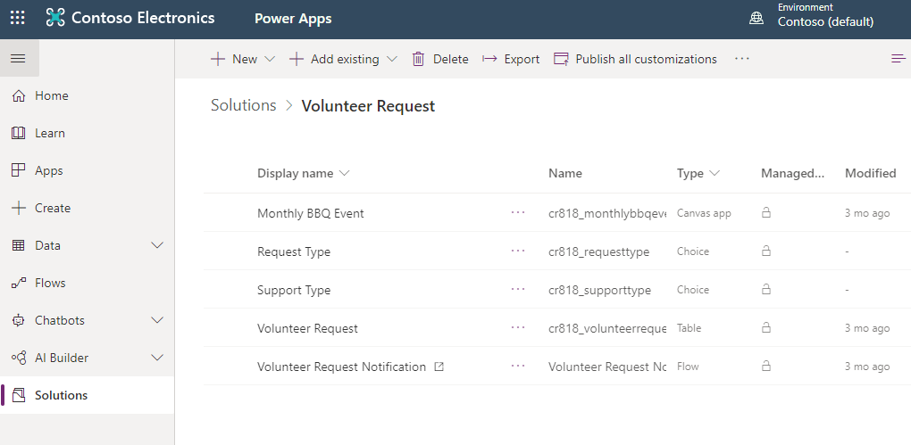
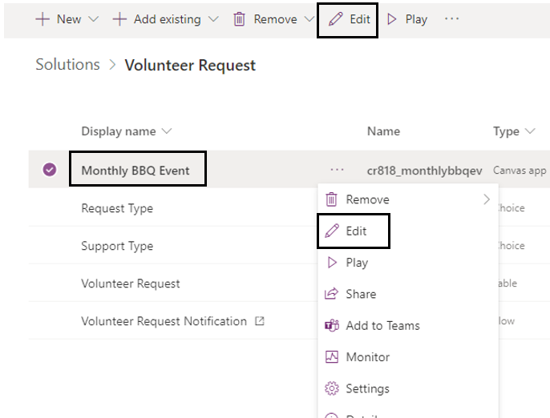
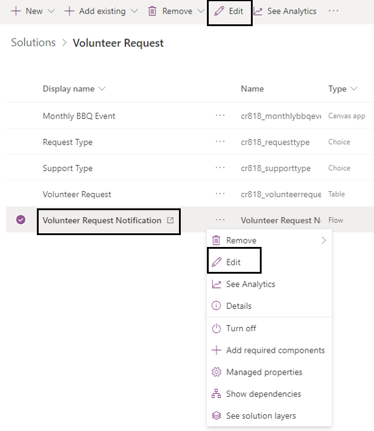
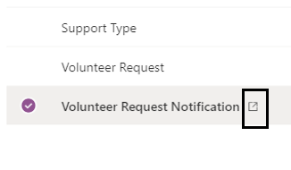
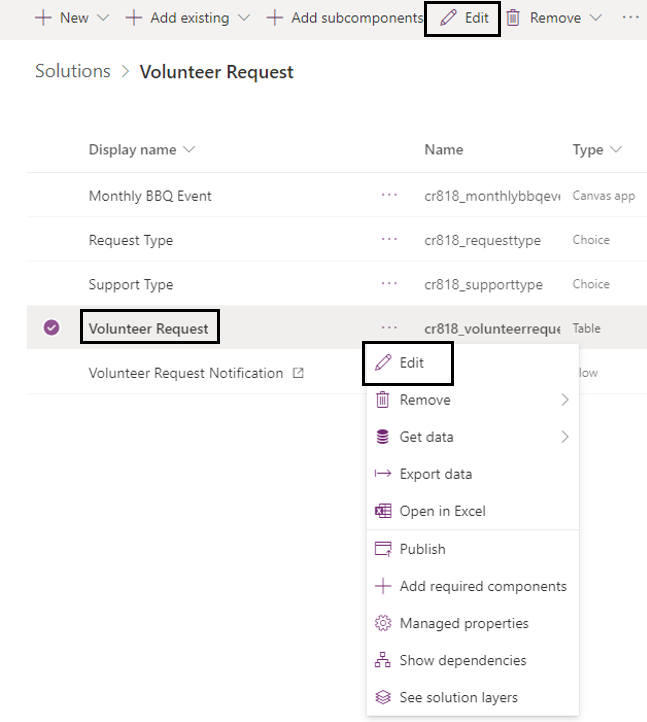
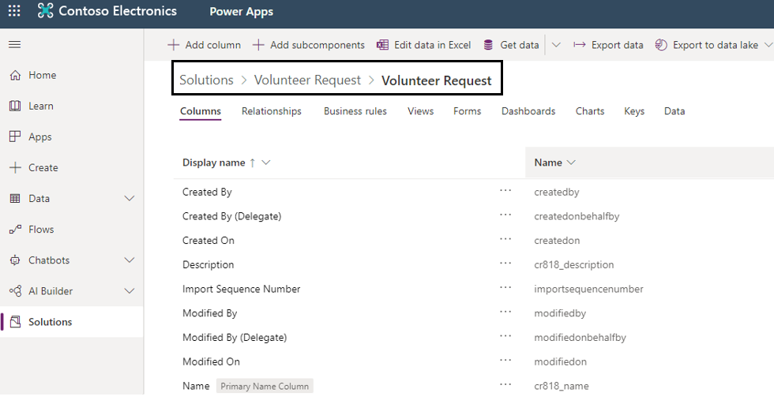

Editing a solution-aware app, flow and table requires you to first go into your solution and select the items from there. 

1. In this scenario we first sign into Power Apps and selected **Solutions** and then selected **Volunteer Request**.

	> [!div class="mx-imgBorder"]
	> 

1. Now you see all of your apps, flows and tables.

	> [!div class="mx-imgBorder"]
	> 

1. To edit the canvas app, you first select the app and then select Edit. Edit is available on the top or using the ellipses. This will take you directly into the power apps studio. 

	> [!div class="mx-imgBorder"]
	> 

1. Similarly, select the flow and then select Edit. Edit is available on the top or using the ellipses. This will take you directly into edit mode of the flow.

	> [!div class="mx-imgBorder"]
	> 

1. For flows you can also select the icon which takes you into the details section of the flow. Details is where you can see run history, connections, owners, etc.

	> [!div class="mx-imgBorder"]
	> 
 
1. Finally, select the table then select Edit. Edit is available on the top or using the ellipses. This will take you to the section where you can view the columns, relationships, business rules, etc. 

	> [!div class="mx-imgBorder"]
	> 
 
The bread crumb path shows where that table is located.

> [!div class="mx-imgBorder"]
> 