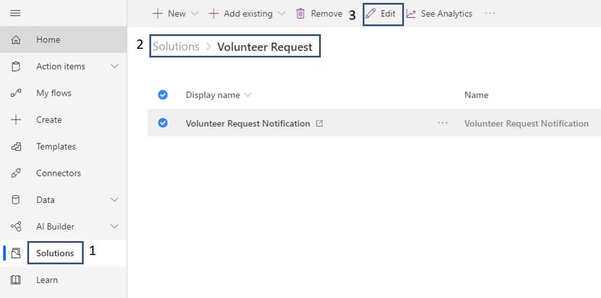
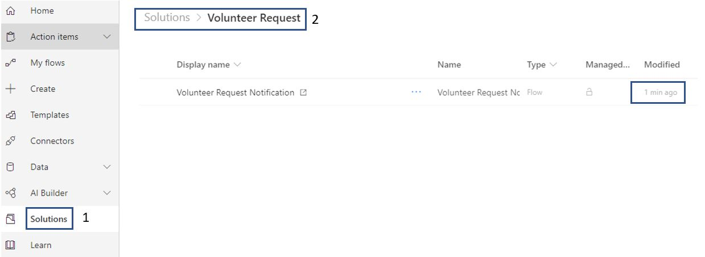

The only way to edit a solution-aware flow is by going to **Solutions**, clicking-on your solution, and select the flow to edit. Solution-aware flows do not show up in your **My flows**.

In this example, we are going to edit the flow we created above. The change is to change the text in the body of the **Send an email** step.

1. Click on **Solutions**, then select **Volunteer Request** solution, select the **Volunteer Request Notification** flow and then click on **Edit**.

	> [!div class="mx-imgBorder"]
	> 

1. In both, the email actions add the following text at the end.

	> [!div class="mx-imgBorder"]
	> 

1. Next, click on the **Save** on the top right of the screen and confirm the flow has been saved.

	> [!div class="mx-imgBorder"]
	> 

1. Next, click on **Solutions** and **Volunteer Request** and confirm your flow has been recently modified. The next time this flow runs you will see the updated text in the email body.

	> [!div class="mx-imgBorder"]
	> 
