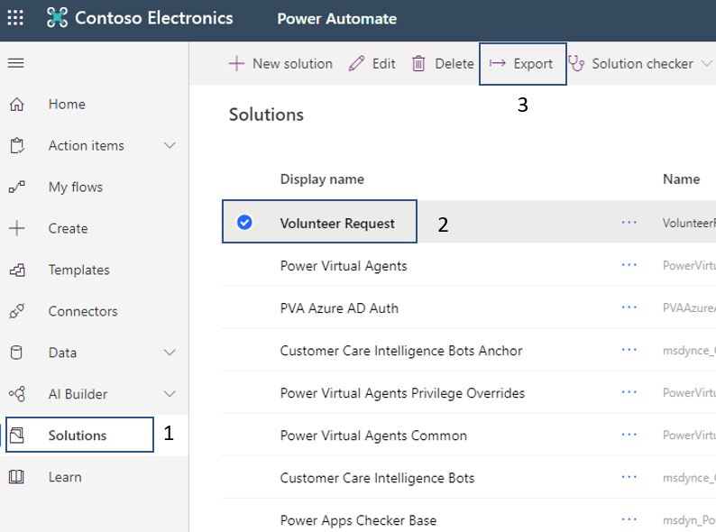
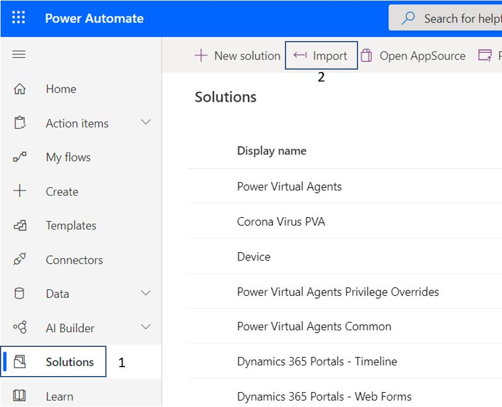
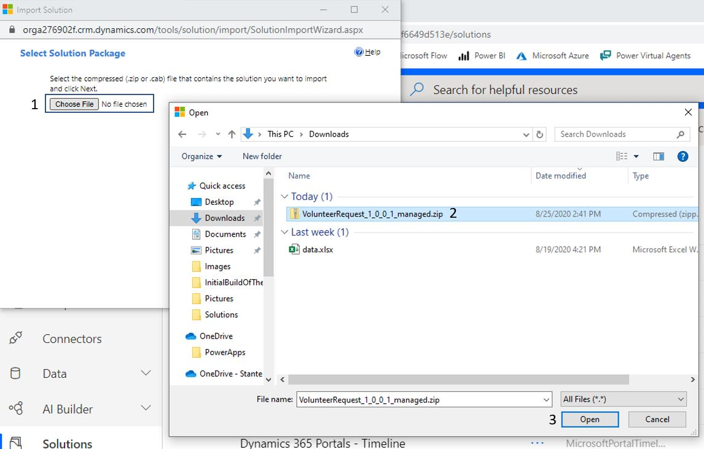
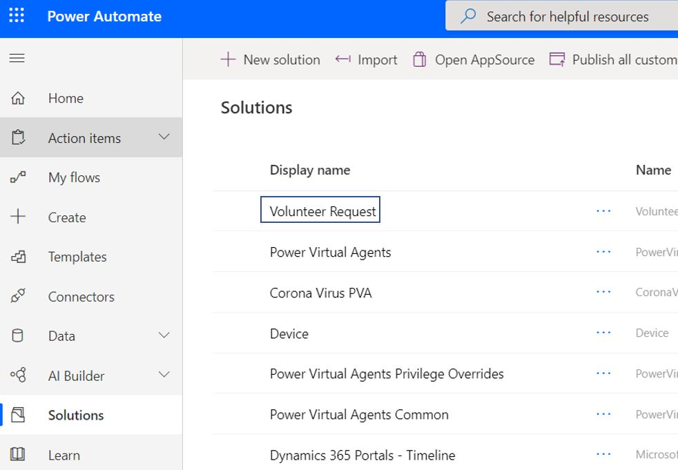

Consider a scenario where you have a solution that includes a Common Data Service entity and its flow. You now want to export this solution from one tenant, which is the source, and import it to another tenant that is the destination.

1. In the source tenant, go to [Power Automate](https://flow.microsoft.com/?azure-portal=true), on the left vertical navigation, click on **Solutions**, select your solution, and then click on **export**.

	> [!div class="mx-imgBorder"]
	> 

1. Click on **Publish**. This will make sure all the changes made to this solution are part of this published solution.

	> [!div class="mx-imgBorder"]
	> 

1. Next click on Run to check for issues.

	> [!div class="mx-imgBorder"]
	> 

	While it is running, you should see the **Running...** right below your solution name.

	> [!div class="mx-imgBorder"]
	> 

1. Once the check is complete, and no issues have been found click on **Next**.

	> [!div class="mx-imgBorder"]
	> 

1. You need to decide which environment this solution is being exported to. If it is a test or a production environment, then select **Managed (recommended)**. If you are moving it to another development environment, then choose *Unmanaged* and finally click **Export.**

	> [!div class="mx-imgBorder"]
	> 

1. On the top left, you'll see a message stating the solution was exported and will download soon. Soon after that, a zipped file will be downloaded to your default download location.

	> [!div class="mx-imgBorder"]
	> 

	The zipped filename contains the solution name, if it is managed or unmanaged, and the version number.

	> [!div class="mx-imgBorder"]
	> 

1. Now you can log into your destination tenant and go to [Power Automate](https://flow.microsoft.com/?azure-portal=true). On the left vertical navigation, click on **Solutions** and then click on **import**.

	> [!div class="mx-imgBorder"]
	> 

1. If you receive an authentication window, simply type in your credentials to continue.

	> [!div class="mx-imgBorder"]
	> 

1. Choose the zipped file that was exported.

	> [!div class="mx-imgBorder"]
	> 

1. Click **Next**.

	> [!div class="mx-imgBorder"]
	> 

1. If solutions items are available, then you will see this window. If you have missed anything, for example, an option set, then you will get an error message with details on what you are missing. Click **Next.**

	> [!div class="mx-imgBorder"]
	> 

1. Keep the **Enable an SDK message processing steps included in this solution** checked and click **Import.**

	> [!div class="mx-imgBorder"]
	> 

1. Wait until the solution importing process has been completed.

	> [!div class="mx-imgBorder"]
	> 

1. If you have received any warnings, then you can click on the warning or download the log file.

	> [!div class="mx-imgBorder"]
	> 

You will now see your Solution imported successfully in the new tenant.

> [!div class="mx-imgBorder"]
> 
