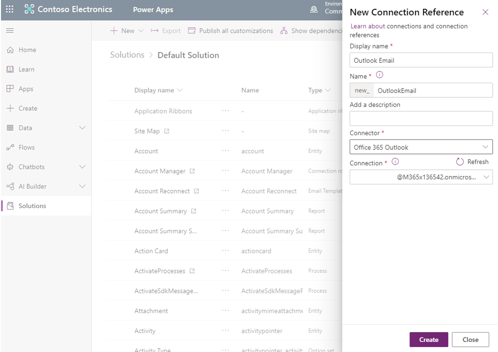
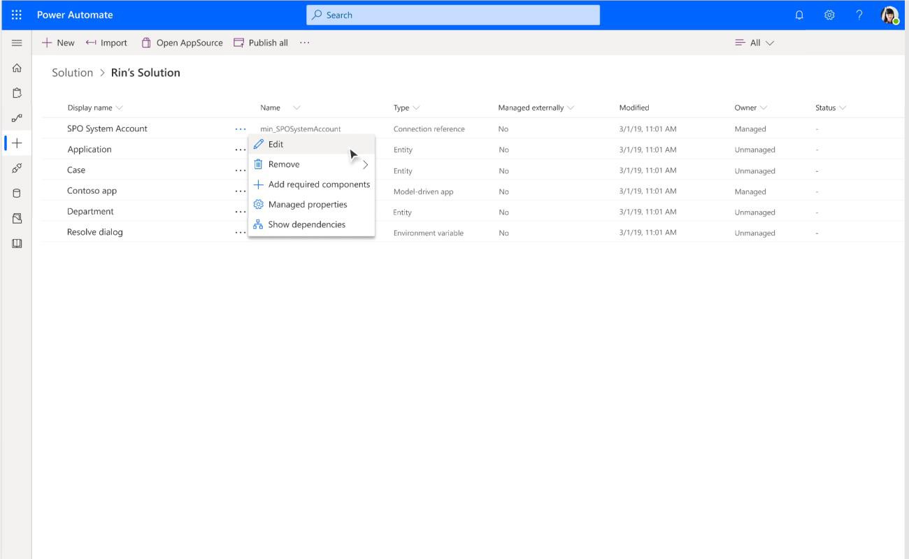
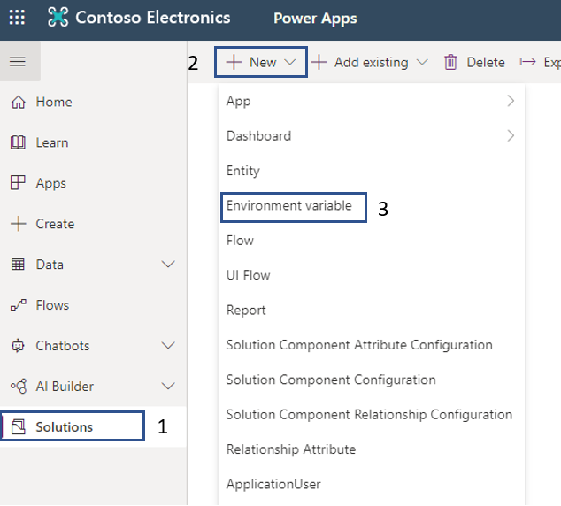
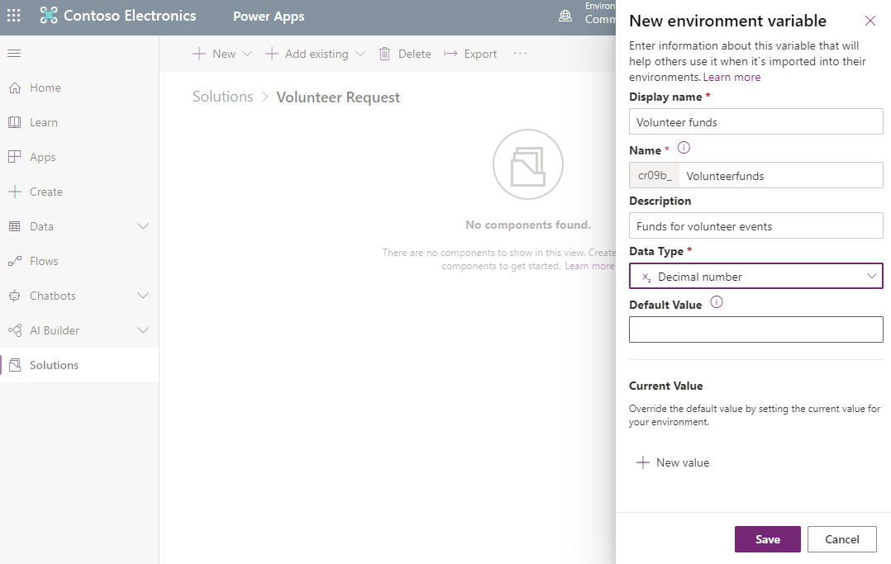
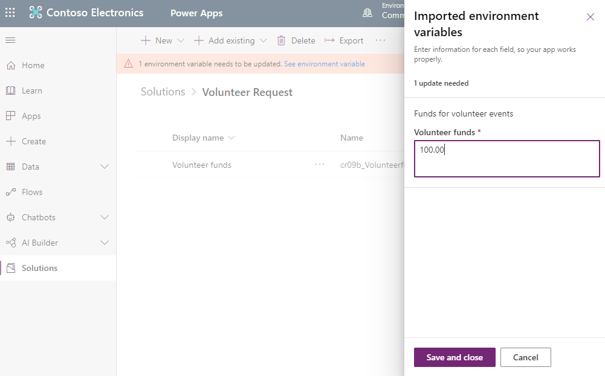
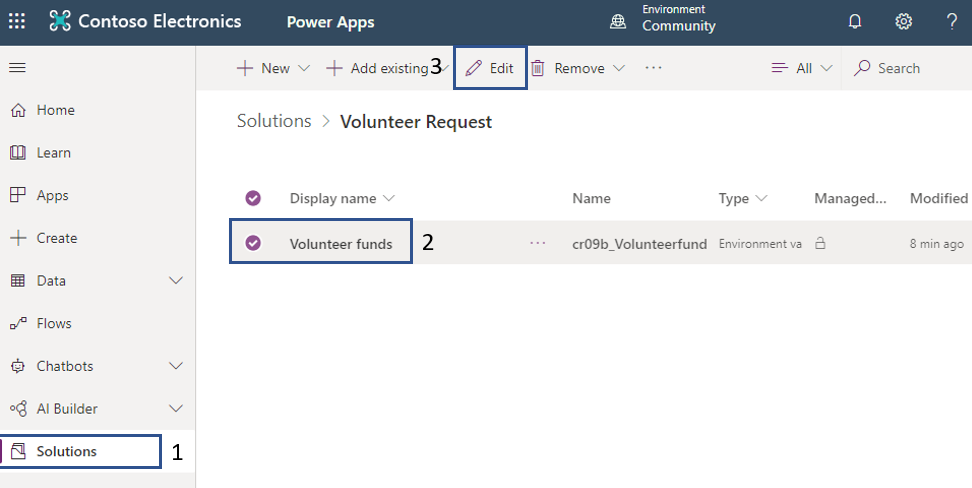
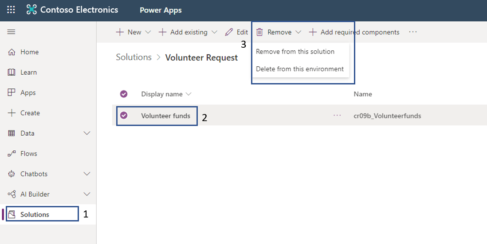

To create your connection reference declaratively, inside your solution, you can create a new connection reference by clicking **+ New** at the top and selecting **Connection Reference** in the list. This will open a pane for you to fill in a few details including:

- **Display name** (You can give it a friendly name to help differentiate this connection reference from others.)

- **Description** (optional)

- **Connector**

> [!div class="mx-imgBorder"]
> 

If you want to create a connection reference using a new connection, you will be routed to the **Connections** page where you will need to create your connection, then come back to this tab and click **refresh**. You should now see your new connection in the list for you to select.

From **Solutions**, you can see the list of entities (including connection references) inside a solution. You can also filter at the top of the page by **Connection Reference**.

You can edit a connection reference in your solution from **Solutions**.

> [!div class="mx-imgBorder"]
> 

Editable fields include Display name, description, and connection.

You can change the display name of your connection reference to give it a more friendly name relevant to you or how you plan to use it. This can also help you differentiate it from your other connection references.

When you make an update to a connection reference, consider possible dependencies as it will be updated in other apps/flows it is used in.

You can remove or delete connection references from **Solutions**. You should consider possible dependencies on your connection reference before making any changes.

#### Environment variables

You can now create environment level variables with the benefit of being able to modify values during solution imports.

1. To create a new environment variable, go to your **Solution** and on the **+ New** select **Environment variable**.

	> [!div class="mx-imgBorder"]
	> 

1. Add the **Display name**, **Description**, **Data Type** and click **Save**.

	> [!div class="mx-imgBorder"]
	> 

1. If you do not add a default value, then after saving the variable you will see a message appear on the top. Click on See environment variable and add the default value.

	> [!div class="mx-imgBorder"]
	> 

	> [!div class="mx-imgBorder"]
	> 

1. To edit the environment variable select it and then click on **Edit**.

	> [!div class="mx-imgBorder"]
	> 

1. To remove the environment variable, select it and then click on **Remove**. You have the option to remove it from the existing solution or the entire environment.

	> [!div class="mx-imgBorder"]
	> 
