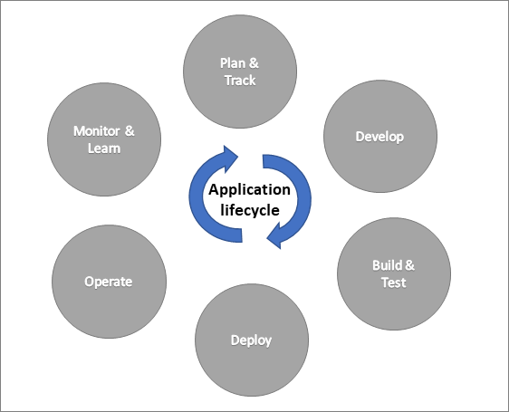
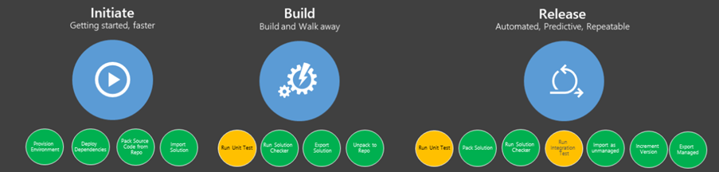

So far in this module you have seen how solutions can be used to track your app components and transport them from one environment to another manually. In this topic, we will look at how automating some of these actions can help implement a more robust application lifecycle management (ALM) for your project. ALM involves more than just the building of the app, it includes the governance (for example, requirements management), the development, and the maintenance. Solutions play a key role in an ALM strategy along with tools like Azure DevOps or GitHub.

On projects, the solution architect typically would outline the ALM strategy, and a DevOps focused resource would implement the automation. As a team member you would participate in the ALM process by managing your work items in the chosen tool and using solutions to track your app and flow changes, you make. The solution would then be the put into the ALM automated processes that would start a build and release process to move your changes automatically from dev, to test, to production with appropriate approvals along the way. Think of the application lifecycle as a cyclical app development process that involves these areas: plan and track, develop, build and test, deploy, operate, monitor, and learn from discovery.

> [!div class="mx-imgBorder"]
> 

While all the actions can be done manually, automation ensures they are done consistently each time performed. They also can still happen if, for example,  the person who performs the manual actions is out sick. DevOps focused tools like Azure DevOps or GitHub provide the automation, but also provide work item tracking and source control.

## Source control and solutions

Source control is a feature of Azure DevOps and GitHub that allows keeping track of versions of your solution components. As you change a Power App, for example,  and the solution is exported and checked into source control, you created a new version. If you use the work items to track the change that you made it could be associated with the version when it is checked into source control. This allows a project team to track when changes were made and if necessary, rollback changes that were problematic. Source control can also provide ways for a current production version to be serviced while at the same time a development team is working on a newer version.

Source control is an important part of ALM because it becomes the source of truth for your solution. This means that if your development environment was destroyed it wouldn't be a problem because you would go to source control to rebuild a new development environment. Source control makes development environments disposable. All deployments to test and production environments originate from the source-controlled version and not an untracked development environment.

While technically solution files exported from an environment can be checked in to source control, it is not an effective way to track your individual component changes. Solution files are a single compressed binary file that is checked in source control would just be able to tell you that the file changed and not allow you to easily enumerate what is changed within each component. To improve this, a step is added to the automation that takes the solution from the development environment and puts it into source control and in the process unpacks the compressed file. by unpacking the compressed solution file individual files are created for each component and in some cases multiple files for each component and are checked into source control allowing much granular tracking of changes. By using these individual files for the components also opens up the possibility of having multiple development environments that are tracking changes in the source control and minimizing one change from conflicting with another.

## Automating with DevOps tools

Automation is important because it brings consistency to what would otherwise be a manual process. Once built, automations can run on demand, on a schedule or based on a check-in event. While there are many tools, you could use to implement the automation Azure Pipelines and GitHub Actions both have pre-built Power Platform task and action support from Microsoft.

### What can you automate?

There is a wide range of what can be automated since the automation just runs tasks or actions. Think of it as being similar to Power Automate flows but more specific to working with app management and deployments. The following are some of the common automations that might be found on Power Platform projects:

-   Creating a new development environment and installing solutions from source control

-   Taking changes from development environment and updating source control

-   Running solution checker to identify quality problems

-   Provisioning / de-provisioning environments

-   Running automated tests including Power Apps Test Studio tests

-   Building-managed solutions from source control for deploy to downstream environments

-   Deploying to downstream environments like test and production

Automation is tailored to each projects requirement but commonly has initiated, build, and release automations

> [!div class="mx-imgBorder"]
> 

When working on a project that uses automation you should be aware of the overall processes that are in place, however, building the automation is typically done by a DevOps focused resource.

## Power Platform build tools

Microsoft Power Platform Build Tools are a collection of Power Platform-specific tasks/actions that eliminate the need to manually download custom tooling and scripts to manage the application lifecycle of apps built on Microsoft Power Platform. They can be used individually to perform a task, such as importing a solution into a downstream environment, or used together in a pipeline to orchestrate a scenario.

The exact terminology differs depending on if you're using Azure DevOps or GitHub Actions to build the automation. For example, the Power Platform specific operations are called tasks for Azure DevOps and actions for GitHub Actions.

The following are some of the common operations:

-   **Power Platform Checker** - Runs static analysis on your solution and allows catching problems early by adding it to your automation.

-   **Export Solution** - Export a solution as unmanaged, managed or both from an environment.

-   **Import Solution** - Import a solution into an environment.

-   **Unpack Solution** - Used to break a compressed solution file into individual files for each component to allow checking them into source control.

-   **Pack Solution** - Packs a solution represented in source control into a solution.zip file that can be imported into another environment.

-   **Set Solution Version** - Allows you to update the version number in your automation allows implementing a consistent versioning strategy.

-   **Create, Delete, and Copy Environments** - Allows automation of environment management as part automations.

Automating solution management is a good way to improve consistency of your application lifecycle on your projects. If you are working on a project using only manual processes, you should encourage your team to look into implementing some basic automations. In addition to being more consistent, implementing more complete application lifecycle management practices can improve the quality of the apps that you produce and deploy.
