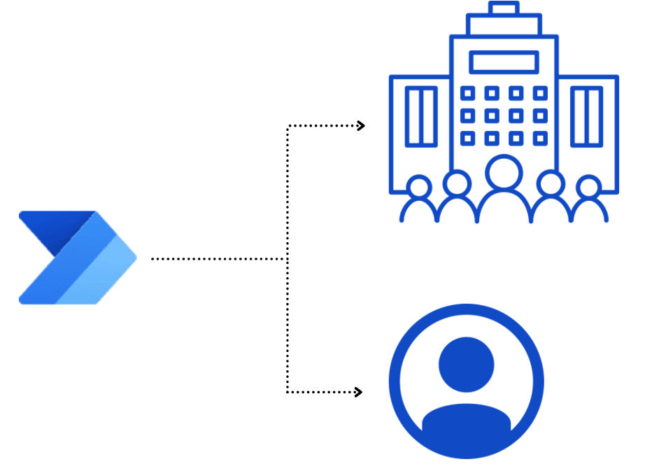

Not only does the Power Platform serve the needs of small businesses and large enterprise level companies, but it can also improve productivity for individual users. In this module, we'll focus on the key features available in Power Automate that can make your life easier. 

> [!div class="mx-imgBorder"]
> 

If you're a beginner with Power Automate, this module will expand your flow skills. If you already have some experience, this module will tie concepts together and help fill in the gaps.

Be more productive automatically, that's what Power Automate is all about.

So, let's get started!
