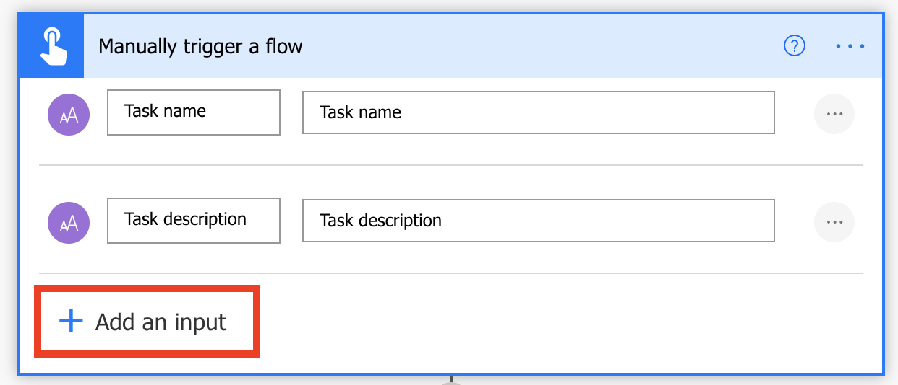
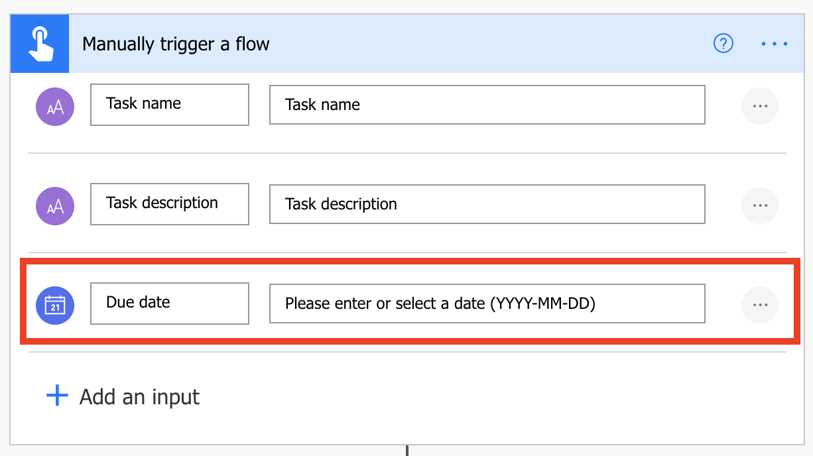
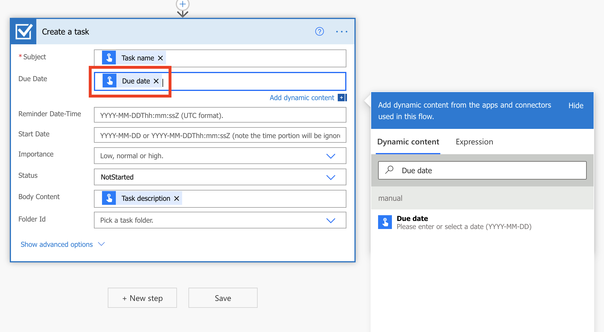

You can customize button flows by letting the user provide specific details that will be used when the flow runs.

You can create a button flow either on the Power Automate website or in the mobile app for Power Automate. For this unit, you'll use the website.

In this exercise, our objective is to search for a template available to create a new **Outlook** task and modify it to match our need.

## Prerequisites

- Access to [Power Automate](https://flow.microsoft.com/?azure-portal=true).

- A basic understanding of Power Automate and experience with creating a flow is recommended.

## Open the template

1. Launch Power Automate and sign in using your organizational account.

1. Select **Templates** and search *Create New Outlook Task*.

    > [!div class="mx-imgBorder"]
    > 

1. Sign in if you're prompted to do so and select **Create Flow**.

## Customize the user input

You'll notice that this flow already requests more input, but let's add another field.

1. Select **Edit** and on the trigger card, select **+ Add an input**.

    > [!div class="mx-imgBorder"]
    > 

1. For each custom field that should be available when someone runs your flow, enter values in the **Input title** and **Input description** field.

    In this example, you'll create one custom input field, **Due Date**.

    > [!div class="mx-imgBorder"]
    > 

## Customize the task

1. On the **Create a task** card, select the title bar to expand the card.

1. For the Due Date field, search for "Due date" in the Dynamic Content search field and then select **Due Date**.

    > [!div class="mx-imgBorder"]
    > 

1. Select **Save**.

## Run the flow

You'll now use the mobile app for Power Automate to run the button flow that you created. You'll provide all the user input that's needed to create a task with a name, description, and due date.

1. In the mobile app for Power Automate, select the **Buttons** tab at the bottom of the window, and then select the **Create new Outlook Task** button.

    > [!div class="mx-imgBorder"]
    > 

1. Enter the requested inputs and select **Done**.

    > [!div class="mx-imgBorder"]
    > 

    The flow runs.

1. Select the **Activity** tab at the bottom of the window to view the results.

    > [!div class="mx-imgBorder"]
    > 

1. To view the detailed results of the flow run, select the **Create new Outlook Task**  flow at the top of your Activity Feed and then select the **Create a task** step.

    > [!div class="mx-imgBorder"]
    > 

Now you can not only run button flows with the already available information, but also request inputs from the user.
