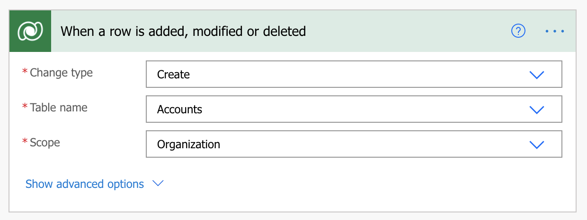
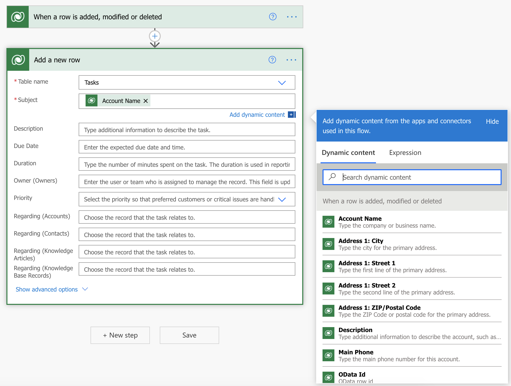
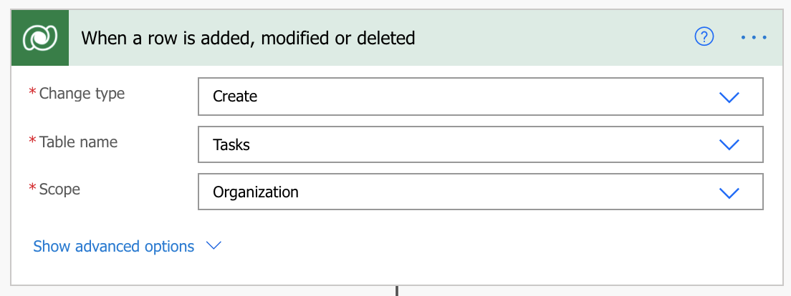

You can create flows that start when an event occurs in Microsoft Dataverse or some other service. These flows then perform an action in that service.

In Power Automate, you can set up automated workflows between your favorite apps and services to sync files, get notifications, collect data, and more.

In this unit, we'll look to build two flows:

- The first flow creates a task in Microsoft Dataverse when a new Account has been created in another instance of Microsoft Dataverse.
- The second flow copies a list item to the Planner when a task is created in Microsoft Dataverse.

Here are some other examples of flows that you can create by using Microsoft Dataverse:

- Create a list item in Microsoft SharePoint when an object is created in Microsoft Dataverse.
- Create Microsoft Dataverse account records from a Microsoft Excel table.

## Prerequisites

- Access to [Power Automate](https://flow.microsoft.com/?azure-portal=true).
- An [environment](/power-platform/admin/environments-overview/?azure-portal=true) with a [Microsoft Dataverse database](/power-platform/admin/create-database/?azure-portal=true). (Applicable only for work or school accounts).
- A basic understanding of Power Automate and experience with creating a flow is recommended.

> [!IMPORTANT]
> To invoke a flow trigger, the Microsoft Dataverse customer engagement table that's used with the flow must have change tracking turned on. For more about how to turn on change tracking, see [Enable change tracking to control data synchronization](/power-platform/admin/enable-change-tracking-control-data-synchronization/?azure-portal=true).

## Example one: Create a task from a new account

This example shows how to create a task in Microsoft Dataverse whenever an Account is created in another instance of Microsoft Dataverse.

1. Sign in to [Power Automate](https://ms.flow.microsoft.com/?azure-portal=true) using your organizational account.
1. In the left pane, select **My flows**.
1. Select **+ New flow**, and then select **Automated cloud flow**.
1. In the list of flow triggers, enter *Microsoft Dataverse* in the search all triggers field and then select **Microsoft Dataverse - When a row is added, modified Or deleted**. Microsoft Dataverse keeps information in the Dataverse, so we'll use this connector throughout.
1. Select **Create**.
1. If you're prompted to sign in to Dataverse, do so.
1. In the **Change type** field, select create.
1. In the **Table name** field, select the Table to listen to. This Table will act as a trigger that starts the flow.

    For this unit, select the **Accounts** table.

1. For Dataverse, you also need to specify the **Scope**. This will determine if your flow runs if you create a new record, if a user within your business unit creates a new record, or if any user in your organization creates a new record. For this example, choose **Organization**.

    

1. Select **+ New step**.
1. In the search field, enter *Microsoft Dataverse* and select **Microsoft Dataverse – Add a new row**.
1. In the **Environment** field, select the environment where the flow should create the record. This doesn't have to be the same environment that the event is triggered from.
1. In the **Table Name** field, select the Table that will create a record when the event occurs.

    For this unit, select the **Tasks** table.

1. More fields appear on the table selection. Select the **Subject** field. A dynamic content pane appears, where you can select fields from the previous steps.

    For this unit, select **Account name**.

    

    > [!TIP]
    > In the dynamic content pane, select **See more** to see more fields that are associated with the table. For example, you can also insert the **Company Name**, **Customer**, **Description**, or **Email** field for the account into the **Subject** field for the task.

1. Select **Save**.

## Example two: Create a planner task from a Microsoft Dataverse task

This example shows how to create a task in Microsoft Planner whenever a task is created in Microsoft Dataverse. Planner is a service that you can use to create to-do lists, add reminders, and track errands.

1. Sign in to [Power Automate](https://ms.flow.microsoft.com/?azure-portal=true) using your organizational account.
1. In the left pane, select **My flows**.
1. Select **+ New flow**, and then select **Automated cloud flow**.
1. In the list of flow triggers, enter *Microsoft Dataverse* in the search all triggers field and then select **Microsoft Dataverse - When a row is added, modified Or deleted**.
1. If you're prompted to sign in to Dataverse, do so.
1. In the **Change type** field, select the instance where the flow should listen.
1. In the **Table Name** field, select the table to listen to. This table will act as a trigger that starts the flow.

    For this unit, select the **Tasks** table.

1. In the **Scope** field, choose **Organization**.

    

1. Select **+ New step**.
1. In the search field, enter *Planner*, and then select **Planner – Create a task**.
1. For Group ID, hit the dropdown and select a Group. In our example, I'll select **Marketing Plan**.
1. For Plan ID, hit the dropdown and select a Plan.
1. In the **Title** field, enter some text and then add the **Subject**, from the dynamic content pane. In our example, for the Title field, I'll enter *Begin onboarding process for:*. This will give my new Planner task some more clarity, when it shows up in the Planner App.
1. For Bucket ID, hit the dropdown and select a Bucket (optional).

   

   See [create a task parameters](/connectors/planner/#create-a-task/?azure-portal=true) for information about the fields.

1. Select **Save**.

## Limitations of trigger-based logic

Triggers like **When a record is created**, **When a record is updated**, and **When a record is deleted** will start your flow within a few minutes after the event occurs. In rare cases, it might take up to two hours for your flow to be triggered.

When the trigger occurs, the flow receives a notification, but the flow runs on the data that exists when the action runs. For example, if new record creation triggers your flow, and you update the record twice before the flow runs, your flow runs only once with the latest data.

## Specify advanced options

When you add a step to a flow, you can select **Show advanced options** to add a filter or order-by query that controls how the data is filtered in the flow.

For example, you can use a filter query to retrieve only active contacts, and you can order them by last name. Enter the `statuscode eq 1` Open Data Protocol (OData) filter query, and select **Full name** in the dynamic content pane. For more about filter and order by queries, see [MSDN: $filter](https://msdn.microsoft.com/library/gg309461.aspx#Anchor_1/?azure-portal=true) and [MSDN: $orderby](https://msdn.microsoft.com/library/gg309461.aspx#Anchor_2/?azure-portal=true).

### Best practices for advanced options

When you add a value to a column, you must match the column type. You must match it regardless of whether you enter a value or select a value in the dynamic content pane.

| Column type | How to use | Where to find | Name | Data type |
| --- | --- | --- | --- | --- |
| Text columns | Text columns require a single line of text or dynamic content that's a text-type column. Examples include the **Category** and **Sub-Category** columns. | **Solutions** > **Default Solution** > **Task** > **Columns** | Category | Text |
| Integer columns | Some columns require an integer or dynamic content that's an integer-type column. Examples include the **Percent Complete** and **Duration** columns. | **Solutions** > **Default Solution** > **Task** > **Columns** | Percent complete | Whole Number |
| Date columns | Some columns require a date that's entered in *mm/dd/yyyy* format or dynamic content that's a date-type column. Examples include the **Created On**, **Start Date**, **Actual Start**, **Last on Hold Time**, **Actual End**, and **Due Date** columns. | **Solutions** > **Default Solution** > **Task** > **Columns** | Created on | Date and Time |
| Columns that require both a record ID and a lookup type | Some columns that reference another table record require both the record ID and the lookup type. | **Solutions** > **Default Solution** > **Account** > **Columns** | Accountid | Primary Key |
