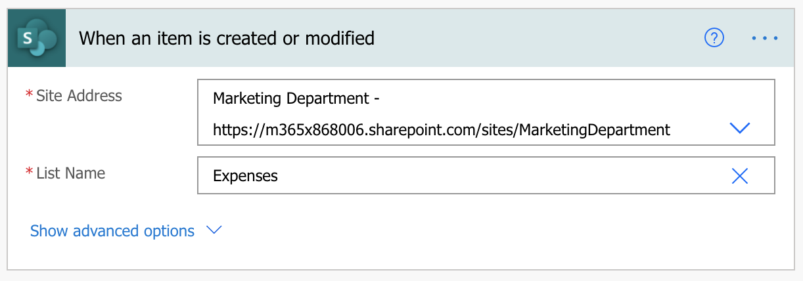
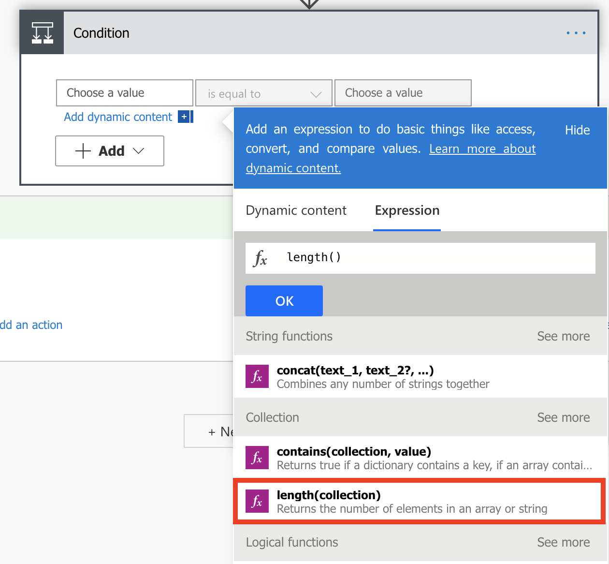
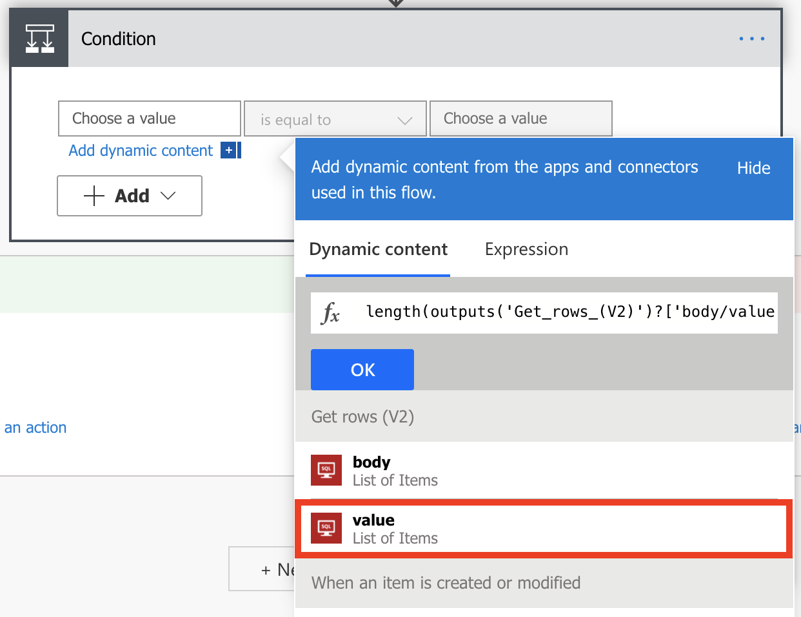
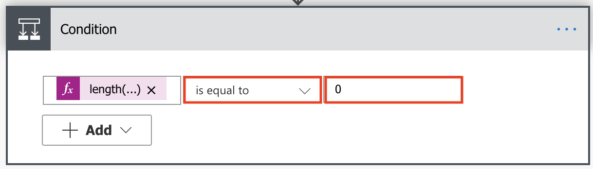
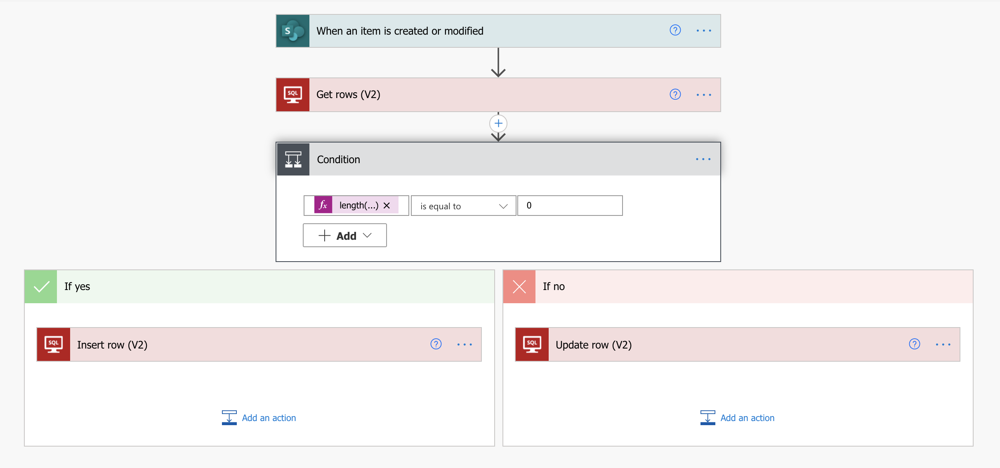

This unit shows how to create a flow that monitors a source for new or changed items, and then copies those changes to a destination. You might create a flow of this type if your users enter data in one location, but your team needs that data in a different location or format.

In this unit, you'll copy data from a list in [Microsoft Lists](https://support.office.com/article/SharePoint-lists-I-An-introduction-f11cd5fe-bc87-4f9e-9bfe-bbd87a22a194/?azure-portal=true), the source, to a [Microsoft Azure SQL Database](/azure/sql-database/sql-database-technical-overview/?azure-portal=true) table, the destination.

Keep in mind that you can copy data over more than [275 services](https://flow.microsoft.com/connectors/?azure-portal=true) that Power Automate supports.

> [!IMPORTANT]
> Changes that you make in the destination aren't copied back to the source, because two-way synchronization isn't supported. If you try to set up two-way synchronization, you'll create an infinite loop where changes are sent endlessly between the source and destination.

## Prerequisites

- Access to a data source and a destination. This unit doesn't include the steps to create the source and destination.
- Access to [Power Automate](https://flow.microsoft.com/?azure-portal=true).
- A basic understanding of how your data is stored.
- Familiarity with the basics of creating flows. For this unit, it's assumed that you know how to perform these actions.

> [!TIP]
> Column names in the source and destination don't need to match, but you must provide data for all required columns when you insert or update an item. Power Automate identifies the required fields for you.

## Quick overview of the steps

If you're comfortable with Power Automate, use these quick steps to copy data from one data source to another.

1. Identify the source that you'll monitor and the destination that you'll copy changed data to. Confirm that you have access to both the source and the destination.
1. Identify at least one column that uniquely identifies items in the source and destination. In the example that follows, we use the **Title** column, but you can use any columns.
1. Set up a trigger that monitors the source for changes.
1. Search the destination to check whether the changed item exists.
1. Use a condition like this:

    - If the new or changed item doesn't exist in the destination, create it.
    - If the new or changed item exists in the destination, update it.

1. Trigger your flow, and then confirm that new or changed items are being copied from the source to the destination.

> [!NOTE]
> If you haven't previously created a connection to SharePoint or a SQL Database, follow the instructions when you're prompted to sign in.

Here are the detailed steps to create the flow.

## Monitor the source for changes

First, we'll set up the SharePoint site to monitor changes.

1. Launch Power Automate and sign in using your organizational account.

1. In the left pane, select **My flows**.

1. Select **+ New flow**, and then select **Automated cloud flow**.

1. Under Flow name, you can either enter a flow name now or one will be generated automatically.

1. In the Search all triggers field, enter *When an item is created* and then select the **SharePoint - When an item is created or modified** trigger.

1. Select **Create**.

1. On the **When an item is created or modified** card, enter the site address, and then select the name of the list in Microsoft Lists that your flow monitors for new or updated items.

    

## Search the destination for the new or changed item

Next, we'll use the **SQL Server - Get rows** action to search the destination for the new or changed item.

1. Select **+ New step**.

1. Under **Choose an operation**, search for *SQL Get rows*, and then select **SQL Server - Get rows (V2)**.

1. Set the **Server name**, **Database name**, and **Table name** for the table you wish to monitor.

1. Select **Show advanced options**.

1. In the **Filter Query** box, enter *Title eq* followed by a space and a single quotation mark ('). Then select the **Title** token in the dynamic content list, and enter another single quotation mark (').

    This step assumes that you're matching the titles, or in this example the ExpenseTitle field in SQL (destination) to the Title column in SharePoint (source).

    The **Get rows** card should now look like this image.

    

## Check whether the new or changed item was found

Next, we'll check whether the new or changed item was found.

1. Select **+ New step**, and then select **Condition**.

1. On the **Condition** card, select the field on the left.

    The **Add dynamic content from the apps and connectors used in this flow** list opens.

1. Select **Expression** and choose **length**. Your cursor should be between the parentheses in the equations.

    

1. Without leaving the open pane, select **Dynamic content**.

1. In the **Get rows (V2)** category, select **value** and then select **OK**.

    

    > [!TIP]
    > Confirm that you've selected **value** in the **Get rows (V2)** category. Don't select **value** in the **When an item is created or modified** category.

1. In the field in the center, select *is equal to*.

1. In the field on the right, enter *0* (zero).

    The **Condition** card should now look like this image.

    

    > [!TIP]
    > The addition of the `length()` function lets the flow check the **value** list and check whether it has any items.

When your flow gets items from the destination, there are two possible outcomes.

| Outcome | Next step |
| --- | --- |
| The item exists. | Update the item. |
| The item doesn't exist. | Create a new item. |

## Create the item in the destination

If the item doesn't exist in the destination, create it by using the **SQL Server - Insert row** action.

1. On the **If yes** branch of the condition, select **Add an action**, search for *insert row SQL*, and then select **SQL Server - Insert row (V2)**.

1. On the **Insert row** card, set the **Server name**, **Database name**, and **Table name** for the table to insert the new item into (the information you entered above).

    The **Insert row** card expands and shows all fields in the selected table. Fields that are marked with an asterisk (*) are required and must be filled in for the row to be valid.

1. Select each field that you want to fill in, and enter the data.

    You can manually enter the data, select one or more tokens in the dynamic content pane, or enter any combination of text and tokens into the fields.

> [!NOTE]
> The **Insert row** and **Update row** cards show the names of the columns in the SQL Database table that's being used in the flow. Therefore, the cards that are shown in the images in this procedure might differ from the cards that you see.

## Update the item in the destination

Next, if the item exists in the destination, update it with the changes.

1. Add the **SQL Server - Update row** action to the **If no** branch of the condition.

1. Select **Save** to save the flow.

    

Now, whenever an item in your list, the source, changes, your flow is triggered. It either inserts a new item or updates an existing item in SQL Database, the destination.

> [!NOTE]
> Your flow isn't triggered when an item is deleted from the source. If this scenario is important to you, consider adding a separate column that indicates when an item is no longer needed.

