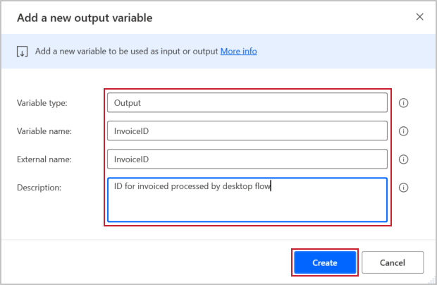

The main difference between input and output variables is where they are defined. Input variables are defined before the flow runs and have a default value in case they are not defined. Output variables, on the other hand, are defined along the process of the flow. This could be an invoice number after the desktop flow enters and saves the invoice, or it could be a total or ID field. There are many scenarios in which you not only need to input information, but also need to read information in automated processes.

To define an output variable, click the **plus icon** beside Input/output variables and then choose **Output**.

> [!div class="mx-imgBorder"]
> 

As you can see, there are fewer parameters you need to define as part of an output variable. This is because the information is being pulled from the process of running the flow. You don't need a default or to define the data type. For the values which do require definition, feel free to use values relevant to your solution, or if you are using the Contoso Invoicing App, use the values below.

> [!div class="mx-imgBorder"]
> 

Our example only requires one output variable, but feel free to define others as your process dictates.

Now that you know how to define output variables, take a look at the next unit to learn how to utilize them.
