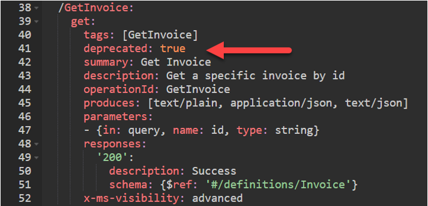

Custom connectors that have been published either through certification or just open-sourcing, can still be updated. The process for doing the update is almost identical to the initial publishing. The main difference is you must consider your existing users as you plan your updates. Breaking changes to your connector definition, even if small, can affect existing users.

A connector's triggers and actions can grow and change over time as features are added or expanded in the underlying API. Some changes are merely additive and don't necessarily break the contract that exists between apps and flows that use your connector. Adding new parameters, returning more data, or allowing more flexible inputs might fall into this category. However, many changes may break the contract described in the OpenAPI specification. The following are some examples of breaking changes:

- Removing parameters

- No longer supporting certain inputs

- Changing the meaning and behavior of an input, output, or the operation itself

The API that your custom connector describes must avoid these breaking changes as well. In cases where different groups maintain the connector definition and the API, coordination must happen to keep them in sync.

To evolve a custom connector and API safely, it's important to follow a pattern that can be navigated by the users of the connector. It's the connector and therefore also the API's responsibility to maintain backward compatibility, communicate intention, and delineate versioning attributes. It's the tool's designer's responsibility whether to allow use of the connector to either show or hide operations that are deprecated, expired, or that may have newer versions available. In this way, operations can grow and develop over time without causing undue fragility on applications that rely on them.

## Annotating connector actions

Using OpenAPI configuration you can annotate the actions on your connector so when presented in the design surface it will convey the intended use. For example, by adding the OpenAPI extension **x-ms-api-annotation** to the GetInvoice action we've indicated its status is preview.

> [!div class="mx-imgBorder"]
> 

As a result, when this action is presented in the Power Automate cloud flow designer it shows (preview) after the action name.

> [!div class="mx-imgBorder"]
> 

## New versions of an action

At some point in an action's lifetime, you might realize you need to introduce a breaking change. The best thing to do is create a new version of the action. Existing users of the original action won't be affected, but new users can take advantage of the new version. A common practice is to indicate the version as part of the summary. The following is what this would look like:

> [!div class="mx-imgBorder"]
> 

## Deprecation of an action

At some point after introducing your new action you may want to deprecate the old action, so it\'s no longer used in new apps and flows. A good first step would be to mark the old action as advanced. If you have any actions marked as important, you should consider if the new V2 action should also be marked important. Both of these visibility changes will encourage the use of the new action by placing it higher in the list of actions.

> [!div class="mx-imgBorder"]
> 

You can also indicate in the summary or description a hint of upcoming deprecation. For example, we could change Get Invoice to Get Invoice (deprecated). This can soft announce the deprecation without hiding it from users. The goal is to help navigate the connector users through any changes you make.

To hide the action from new users but not break existing users, you can mark the action as deprecated in the OpenAPI configuration. You can make this change by directly editing the OpenAPI definition using the Swagger editor. To indicate that an action is deprecated, add the following to the operation configuration:

`deprecated: false`

> [!div class="mx-imgBorder"]
> 

Once published this will hide the action from users' ability to select it in new flows.

There are many reasons to adhere to action versioning. Primarily, doing so will ensure that clients such as Logic Apps and Power Automate continue to work correctly when users integrate connector actions into their flows. Actions should be versioned using the above methods whenever one of the following is true.

- A new revision of an action is added.

- An existing action adds or removes parameters.

- An existing operation changes input or output significantly.

There may be cases where you can get away without versioning---but you should be careful when doing so and do plenty of testing to ensure you haven't overlooked edge cases where users' apps and flows may be broken unexpectedly. In any case, here's the cautious short list of when you can get away without versioning:

- A completely new action is added.

- A new optional parameter is added to an existing action.

- An existing action changes behavior subtly.

It is always recommended to err on the side of caution and create a revision when you make any non-trivial change in connector definition or underlying API.
