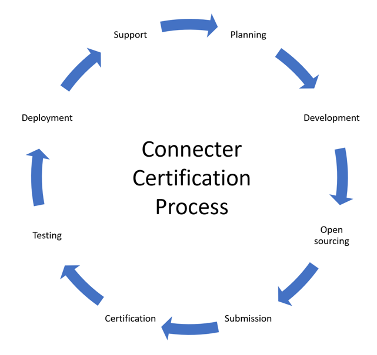

To make a custom connector available to all users in Logic Apps, Power Automate, and Power Apps as a certified connector, submit your connector to Microsoft for certification. Microsoft will review the connector and, if it meets certification criteria, will approve it for publishing. After the connector has been published, it will join the [full list](/connectors/connector-reference/?azure-portal=true) of publicly available connectors.

This unit examines each step, including some high-level steps, in the certification process. These same steps apply to later updates as well, but depending on the scope of the update, they can be considerably quicker.

> [!div class="mx-imgBorder"]
> 

## Planning

Planning is the first step in the process of certification as you start envisioning what your connector will look like. Building a connector that others will use should involve some planning. 

A few key planning factors that you should consider are:

- Identify what triggers and actions will be available initially. You don't need 100 percent of your API covered, but the initial set of triggers and actions should be a useful set. If you're too limiting on what you have in your initial version, users will become frustrated that functionality is missing for common scenarios. Consider writing or sketching one or more workflows that can be created in Microsoft Power Automate by using your connector. This approach can help you decide which APIs to include in the connector.

- Evaluate what changes might be needed to the API to support triggers or otherwise improve the ability of delivering a user-friendly connector.

- Consider how authentication will be handled and adaptation that is necessary between how your API currently authenticates and the supported capabilities of custom connectors.

- Consider how users who want to use the connector will get a key, if your API uses API keys.

- Review connector policy templates to determine if implementing templates would help the usability of your connector.

- Review the supported OpenAPI extensions for applicability. For example, the test connection is commonly implemented by certified connectors. Also, using dynamic value extensions can be helpful if you have parameters with lists of values to choose from.

For new connector certification, you don't have to wait until you finish developing the connector to register for certification. For more information, see the [Certification Process](/connectors/custom-connectors/submit-certification?azure-portal=true#certification-process). Expect to receive an email from a Microsoft representative, who will help you better understand your custom connector, explain your development progress, and guide you through the certification process.

For updates to a certified connector, the most important part of planning is to not break existing users. This issue will be discussed in more detail in a later unit.

## Development

The primary focus in the development step is getting your API and the definition for your custom connector ready for submission. Before you proceed to the next step, you should make sure that your custom connector definition is cleaned up and has all proper naming that you want to publish.

## Create an open source

The introduction unit covered a high-level overview of how to create an open-source connector. You will put the certified connector in the **certified-connectors** folder. Prior to submitting a pull request, make sure that you perform the following tasks:

- Edit your connector files to add the [specific required metadata](/connectors/custom-connectors/certification-submission?azure-portal=true#publisher-and-stack-owner). Your connector files must contain specific metadata that describes the connector and its end service.

- Run the paconn validate command on your downloaded connector and then resolve errors.

To run validation, use the following command:

`paconn validate --api-def [Location of apiDefinition.swagger.json]`

After you have passed validation, you can submit your pull request to the **dev** branch of the GitHub repository. This action will start an automated process that will conduct initial validation of your pull request and make sure that you have a proper contribution agreement in place. When the automated validation has been completed, it will be assigned to Microsoft for initial review. If reviewers find issues that need correcting, they will enter comments on the pull request, and you will be expected to resolve them and resubmit the pull request. When everything looks acceptable, your pull request will be merged into the repository.

## Submission

The next step is to submit your connector for certification in [ISV Studio](https://isvstudio.powerapps.com/ep/connector/?azure-portal=true) after you've been asked to do so by your Microsoft contact. ISV Studio is a portal for managing the rest of the certification process and will give you the health of your connector after it's been deployed.

As part of the process for submitting to ISV Studio for certification, you should be prepared to provide:

- Connector testing information, for example, an API key, other authentication details, or any details that would help a tester use the connector.

- An `Intro.md` file that contains information to include in the public documentation for the connector. You can find a template in the [Submitting to ISV Studio](/connectors/custom-connectors/certification-submission?azure-portal=true#submitting-to-isv-studio) documentation.

As the certification progresses, you will get updates in the portal and will receive an email from the primary contact. If issues are encountered, you will be expected to resolve them before the certification will proceed. After the connector has passed certification, it will be scheduled for deployment to the "Preview" region for testing.

## Testing

As part of the certification process, your connector is deployed to the "Preview" region for testing. It's now your opportunity to make sure that the deployed connector works properly before it's deployed to all regions worldwide. Make sure that you test all functionality of your connector in Power Apps, Power Automate, and Logic Apps. 

For more information, see [Instructions on testing your connector in certification](/connectors/custom-connectors/certification-testing/?azure-portal=true).

## Deployment

After testing is completed, your connector will be deployed to all public regions. This process is expected to take seven to 10 business days because Microsoft deploys incrementally in its regions around the world. You'll receive notifications as each region is deployed.

## Support

Now that your connector is publicly released, you can monitor its performance from ISV Studio. Ensure that your support staff is aware of how your connector might be used with Power Apps or Power Automate so that they can support users who are experiencing issues.
