In this exercise, you'll use CLI to download a connector, validate the definition, and resolve issues. This exercise simulates what you would do to prepare for creating and certifying an open-source custom connector.

This exercise requires you to install Python and access the command prompt on the machine that you're using for the exercise.

> [!Important]
> Use a test environment with Microsoft Dataverse provisioned. If you do not have one, you can sign up for the **[community plan](https://powerapps.microsoft.com/communityplan/?azure-portal=true)**.

> [!NOTE]
> Download the following file to your local computer to complete this exercise [Contoso Invoicing Triggers](https://github.com/MicrosoftDocs/mslearn-developer-tools-power-platform/blob/master/power-automate-connectors/certify/ContosoInvoicingOpenSource_1_0_0_0.zip). Select the download button on the middle-right of the screen.

## Task 1: Import the solution

In this task, you'll import an unmanaged solution that contains a Contoso Invoicing custom connector. You'll use this connector to complete the tasks in this exercise.

1. Go to [Power Apps maker portal](https://make.powerapps.com/?azure-portal=true) and make sure that you are in the correct environment.

1. Select **Solutions > Import**.

1. Select **Browse**.

1. Select the **ContosoInvoicingOpenSource_1_0_0_0.zip** solution and then select **Open**.

1. Select **Next**.

1. Select **Import** and then wait for the import to complete. You should get a success message after the import completes.

1. Select the **Contoso Invoicing - Open Source** solution that you imported.

   You should see the **Contoso Invoicing - Open Source** custom connector component.

   > [!div class="mx-imgBorder"]
   > [](../media/3-01-open-source.png#lightbox)

## Task 2: Install Microsoft Power Platform CLI

Microsoft Power Platform CLI includes the paconn command-line tool that is designed to aid Microsoft Power Platform custom connector development. The paconn tool uses Python runtime, which you'll be installing as well.

1. Go to [Download Python](https://www.python.org/downloads/?azure-portal=true) and select **Download Python**. You can use any version greater than 3.5.

1. Select the downloaded .exe file to start installation.

1. Select the **Add Python xx to Path** check box, select **Install Now**, and then wait for the installation to complete.

   > [!div class="mx-imgBorder"]
   > [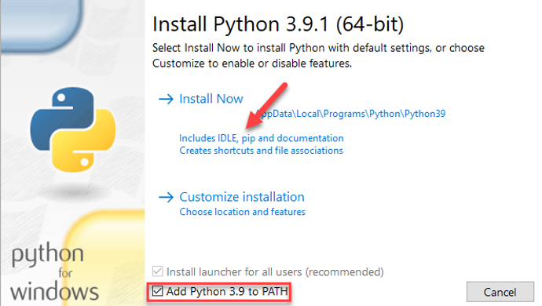](../media/3-02-install-python.png#lightbox)

1. Close the installation wizard after the installation completes.

1. Start the command prompt and then run the following command to install paconn.

   `pip install paconn`

   > [!div class="mx-imgBorder"]
   > [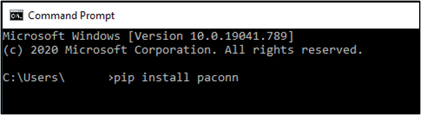](../media/3-03-install-paconn.png#lightbox)

1. Wait for the installation to complete.

## Task 3: Download the connector locally

In this task, you'll download the connector definition files locally so that you can add the Host URL property.

1. Run the login command.

   `paconn login`

1. Copy the provided **Code**.

   > [!div class="mx-imgBorder"]
   > [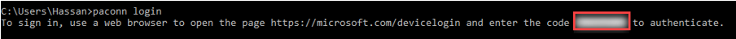](../media/3-04-log-in-code.png#lightbox)

1. In a browser, sign in with the same credentials as your environment. Go to [Microsoft Device Login](https://microsoft.com/devicelogin/?azure-portal=true), paste the **Code** that you copied, and then select **Next**.

1. Provide your credentials.

   You should get a successful sign-in message.

   > [!div class="mx-imgBorder"]
   > [](../media/3-05-success.png#lightbox)

1. Return to the command prompt, where you should see a login successful message.

1. Run the download command.

   `paconn download`

1. When prompted to select an environment, enter a number for the environment where you installed the solution and then press the **Enter** key.

1. Provide the number of the **Contoso Invoicing - Open Source** connector and then press the **Enter** key.

1. The download should complete successfully. Note the location where the connector was downloaded.

## Task 4: Validate

In this task, you'll validate the connector and fix some common errors. You'll also add the required connector metadata.

1. Copy the path where the connector was downloaded.

   > [!div class="mx-imgBorder"]
   > [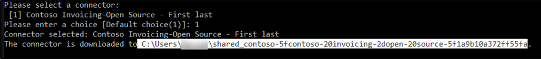](../media/3-06-connector-path.png#lightbox)

1. Run the validate command by using the path that you copied plus the API definition Swagger file name **\apiDefinition.swagger.json**.

   `paconn validate --api-def [Path to apiDefinition.swagger.json]`

   > [!div class="mx-imgBorder"]
   > [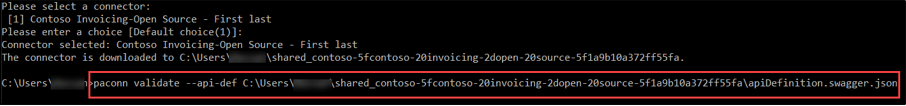](../media/3-07-validate-command.png#lightbox)

1. You should get an error for a missing summary for the fourth parameter of the ListInvoices action and a missing contact property.

   > [!div class="mx-imgBorder"]
   > [](../media/3-08-validation-errors.png#lightbox)

1. Fix the missing summary. Go to [Power Apps maker portal](https://make.powerapps.com/?azure-portal=true) and make sure that you are in the correct environment.

1. Select the **Contoso Invoicing - Open Source** connector and then select **Edit**.

   > [!div class="mx-imgBorder"]
   > [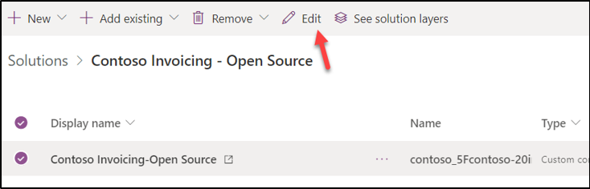](../media/3-09-edit-connector.png#lightbox)

1. Select the **Definition** tab and then select the **ListInvoices** action.

1. Scroll down to the **Request** section, select the ellipsis (**...**) button of the **toAmount** parameter, and then select **Edit**.

   > [!div class="mx-imgBorder"]
   > [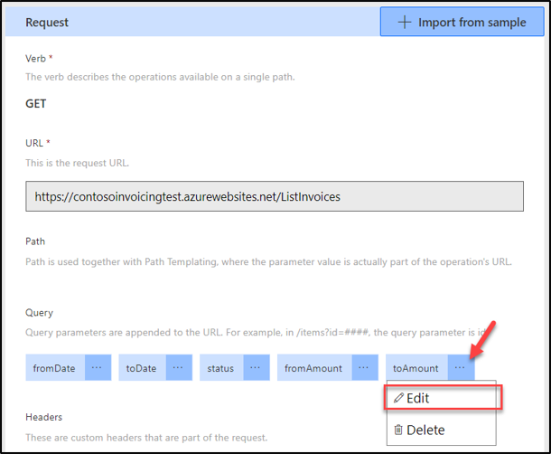](../media/3-10-edit-parameter.png#lightbox)

1. Enter **To amount** in the **Summary** field and then select **Update connector**.

   > [!div class="mx-imgBorder"]
   > [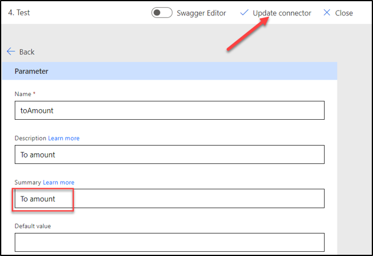](../media/3-11-update-connector.png#lightbox)

1. Wait for the connector update to complete.

1. Delete the connector that you previously downloaded (you will re-add it in a moment). Delete the connector that you downloaded from your machine.

1. Download the connector again. Return to the command prompt and run the download command again.

   `paconn download`

1. When prompted to select an environment, enter the number for the environment where you installed the solution and then press the **Enter** key.

1. Provide the number of the **Contoso Invoicing - Open Source** connector and then press the **Enter** key.

1. The download should complete successfully. Note the location where the connector was downloaded.

1. Run the validate command by using the path that you copied plus the API definition Swagger file name **\apiDefinition.swagger.json**.

   `paconn validate --api-def [Path to apiDefinition.swagger.json]`

1. You should now receive only one error for the missing contact parameter.

   > [!div class="mx-imgBorder"]
   > [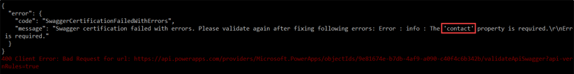](../media/3-12-validation-error.png#lightbox)

1. Go to the connector folder that you downloaded and open the **apiDefinition.swagger.json** file by using the text editor of your choice, such as Notepad.

   > [!div class="mx-imgBorder"]
   > [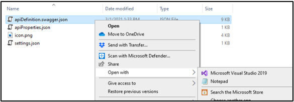](../media/3-13-open-file.png#lightbox)

1. Add a contact property to the information after the description property.

   ```json
   "contact": {
     "name": "Contoso Support",
     "url": "https://contosoinvoicingtest.azurewebsites.net",
     "email": "info@Contoso.com"
   }
   ```

   > [!div class="mx-imgBorder"]
   > [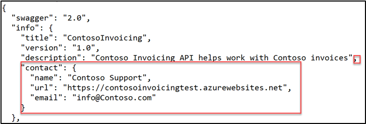](../media/3-14-add-contact.png#lightbox)

1. Add connector metadata after the information.

   ```json
   "x-ms-connector-metadata": [
     {
      "propertyName": "Website",
      "propertyValue": "https://contosoinvoicingtest.azurewebsites.net"
     },
     {
      "propertyName": "Privacy policy",
      "propertyValue": "https://contosoinvoicingtest.azurewebsites.net"
     },
     {
      "propertyName": "Categories",
      "propertyValue": "Productivity"
     }
   ],
   ```

   > [!div class="mx-imgBorder"]
   > [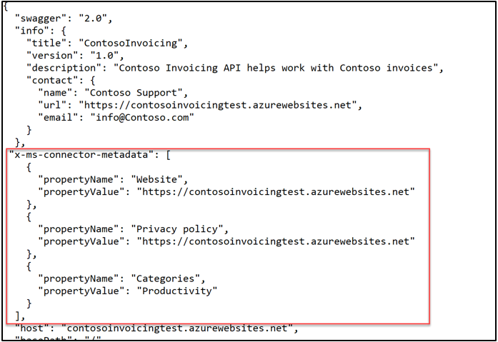](../media/3-15-add-metadata.png#lightbox)

1. Select **File** and **Save** your changes.

1. Run the validate command one more time.

   `paconn validate --api-def [Path to apiDefinition.swagger.json]`

1. The connector should now get validated successfully.

> [!div class="mx-imgBorder"]
> [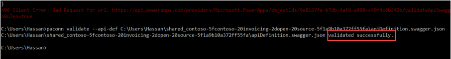](../media/3-16-validation-success.png#lightbox)

You've successfully prepared the connector to be created as open source and then certified. If you were building a real connector, you would go on to publish the connector to GitHub.
