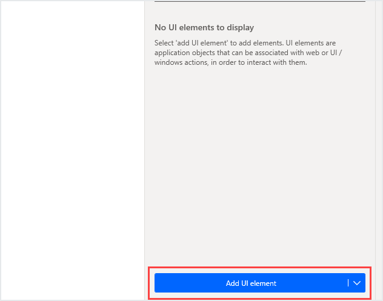
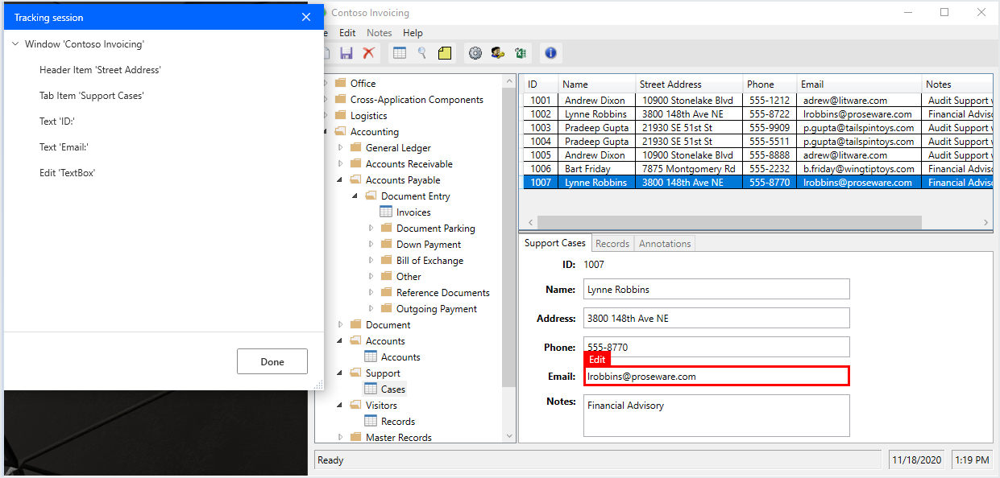
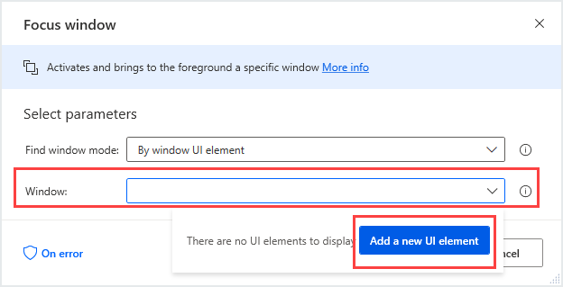

To interact with UI items, Power Automate Desktop must first identify them. To do so without resorting to image recognition or on-screen positions, Power Automate Desktop uses UI elements to identify windows and their contents.

## Add controls

In order to interact with a UI window and its elements in a flow, the first step is to add them to the flow. Select the **Add UI Element** button in the **UI elements** tab, as shown in the following screenshot:

Doing so will launch the UISpy, which allows the capturing of multiple UI elements. Select all the elements the flow will interact with, using **Ctrl & left-click**. When finished, select **Done**:

Alternatively, when configuring a UI/Windows action, select the drop-down list and press the **Add a new UI element** button:

