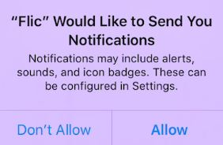
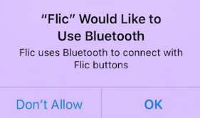
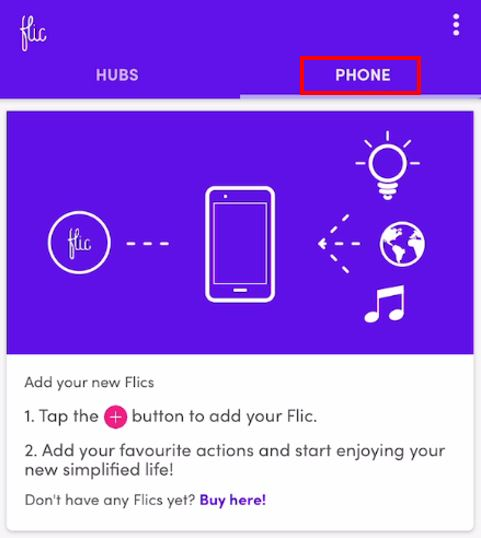
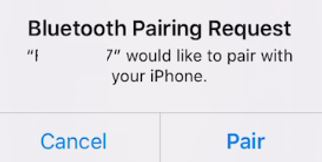
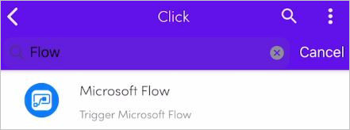
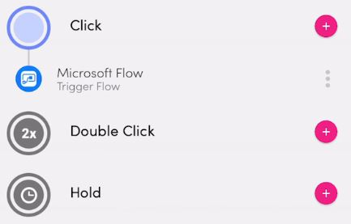
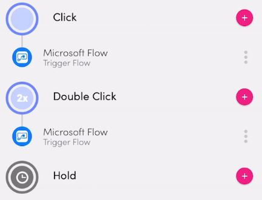
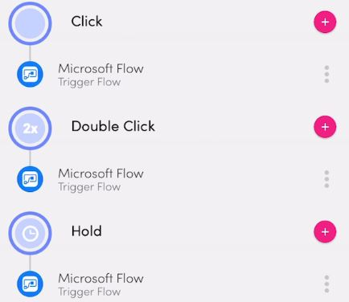

In this unit, you will install and configure the Flic.io app. Before you begin, you need to
have your smart phone and the Flic button available. Though the steps in this exercise 
are for installing on an iPhone, the procedure should be similar for Android phones. 

1.  Go to the App Store.

1.  Find the Flic app. When you've found the app, select **Get and download a copy** of the app.

1.  Open the Flic app on your smart phone. You might receive a message regarding Flic sending you notifications. Select either **Allow** or **Don't Allow**.

    

1.  You will receive a message stating that Flic would like to use Bluetooth. Select **OK**.
    
	

1.  Select the toggle switch for **I agree to the Terms of Service** and then select **Create Account**.

1.  Add an email, name, and password, and then select **Create Account**.

1.  By default, the app selects **HUBS**. Select **Phone**.

	

1.  Select the Add Flic to phone **+** button, which is available on the lower right of the app.

1.  Press and hold the Flic button until it connects. This process should take no longer than 10 seconds. If you see a sad face icon, then select the **Try again** button, which is available in the lower part of the app.

1. If the connection is successful, then you will get a Bluetooth Pairing Request message. Select **Pair**.

    

1. When the pairing is successful, you will receive the **Pairing Complete!** message on the upper part of the page and a **Finish** button on the lower part of the page. Select **Finish**.

1. Select the new Flic button that you created and then select the **+** button next to **Click**. Select the magnifying glass icon, which is available on the upper right of the app, enter **flow**, and then select **Microsoft Flow**.

    

1. Turn on the toggle switch for the **Send location data** feature. Select **Add** on the upper right of the app. You should now see Microsoft Flow added to **Click**.

    

1. Select the new Flic button that you created and then select the **+** button next to **Double-Click**. Select the magnifying glass icon, which is available on the upper right of the app, enter **flow**, and then select **Microsoft Flow**.

    

1. Turn on the toggle switch for the **Send location data** feature. Select **Add** on the upper right of the app. You should now see Microsoft Flow added to **Double-Click**.

    

1. Select the new Flic button that you created and select the **+** button next to **Hold**. Select the magnifying glass icon, which is on the upper right of the app, enter **flow**, and then select **Microsoft Flow**.

    

1. Turn on the toggle switch for the **Send location data** feature. Select **Add** on the upper right of the app. You should now see Microsoft Flow added to **Hold**.

    

You now have a Flic button successfully installed and configured with your smart phone.
