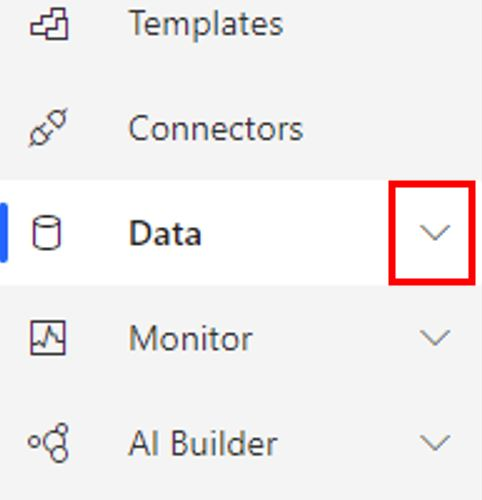

To add the Flic connector to Power Automate take the following steps.

1. Go to [Power Automate](https://flow.microsoft.com/?azure-portal=true) and sign in.

1. Select the **Data** icon on the left menu, and then select **Connections** from the drop-down menu.

	> [!div class="mx-imgBorder"]
	> 

1. On the upper left corner of the page, select **+ New connection**.

1. On the upper right of the page, select the **Search** icon and enter **Flic** in the search box. You should now see **Flic (preview)**. Add this connection by selecting the **+** icon.

    

1. Select **Create**.

1. A pop-up window will appear, asking for the email and password that you used to create your Flic.io account. Enter your information and then select the **Login** button. A pop-up window will appear, asking for the email and password that you used to create your Flic.io account. Enter your information and then select the **Login** button.

    

You should now have a Flic connection successfully created.

> [!div class="mx-imgBorder"]
> 