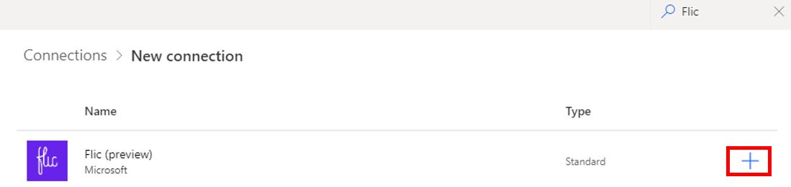
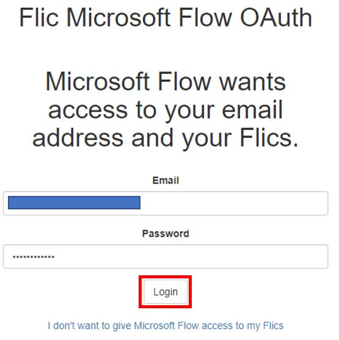

Let's add the Flic connector to Power Automate.

1.  [Sign in to Power Automate](https://flow.microsoft.com/?azure-portal=true).

1.  Click on the settings icon which is available on the top right of the web site. Select **Connections** from the drop-down menu.

1.  On the top left you'll see **+ New connection**, click on it.

1.  On the top right, you'll see a magnifying icon with Search. Type in Flic. You should now see Flic (preview). Add this connection by clicking on **+**.

	

1.  Next click on **Create**.

1.  You will see a pop-up window asking for the email and password you used to create your Flic.io account.

    

You should now have a Flic connection successfully created.
