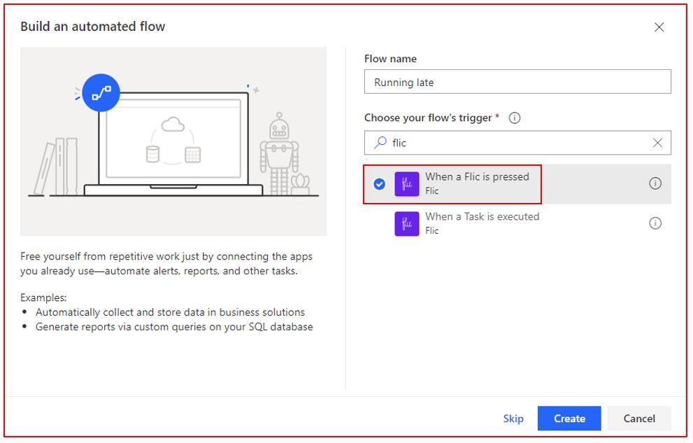
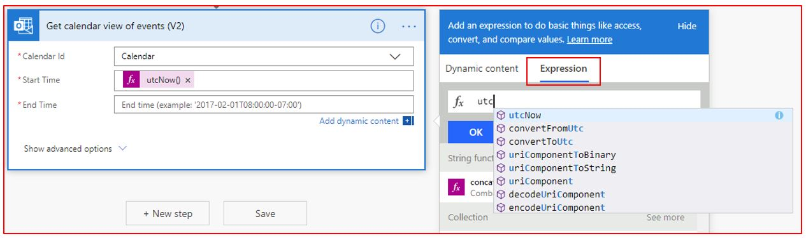
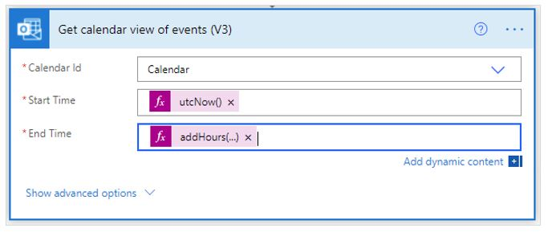
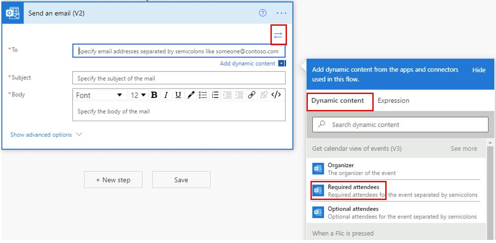
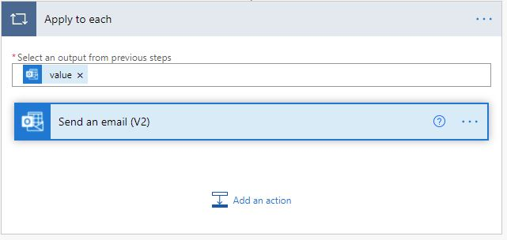
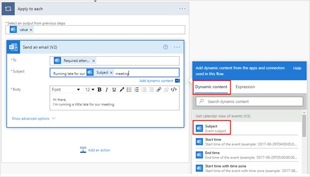

In this unit, you will build a flow, which is triggered by the Flic button, that looks up your next
appointment and sends the attendees an email letting them know that you are running slightly late.

1.  [Go to Power Automate](https://flow.microsoft.com/?azure-portal=true) and sign in.

1.  Select **+ Create**, which is available on the left navigation pane.

1.  In the **Start from blank** area of the page, select **Automated flow**.

1.  In the **Flow name** field, enter **Running Late** as the name of the flow. Under **Choose your flow's trigger**, search for **Flic**. Select **When a Flic is pressed** and then select **Create**.

	

1.  In the Flic button trigger, select the drop-down arrow and then select the Flic button that you added previously. For **Events**, select **click**.

1.  Select **+ New step**.

1.  In the **Choose an action** field, search for **Get calendar events** and then select the **Get calendar view of events (V2)** action.

1.  For **Calendar ID**, select **Calendar**.

1.  In the **Start Time** field, select **Expression** and then enter **utc**. Select the **utcNow** option from the drop-down list.

    

1. Select **OK**.

1. In the **End time** field, select **Expression** and then add the **```addHours(utcNow(),1)```** formula.

1. Select **OK**.

	The action should look like the following image.

    

1. Select **+ New step**.

1. In the **Choose an action** field, search for **send email**. Select the **Send an email (V2)** action.

1. In the **To** field, select the advanced icon and then select **Required attendees** from **Dynamic content**.

    

    The **Send an email (V2)** action will automatically be added inside the **Apply to each** loop.

    

1. Select **Send an email (V2)** to expand it.

    

1. In the **Subject** field, enter **Running late for our**.

1. Select **Dynamic content** and then select **Subject**.

1. After **Subject**, enter **meeting**.

    

1. In the **Body** field, enter the following text:
    ```
	Hi there,

    I'm running a little late for our meeting.
	```

	The following image shows what the full flow should look like.

    

1. Select the **Flow checker** icon, which is available on the upper right of the screen. 
   If no errors occur, select **Save**.

Congratulations, you have now successfully built a flow that triggers by use of a physical button. 
To test the flow, you need to have the Flic app open on your phone and then select the Flic 
button once. The flow will check to see if any meetings are currently happening or are 
pending between now and the next hour, and then it will send out a notification to all attendees.
