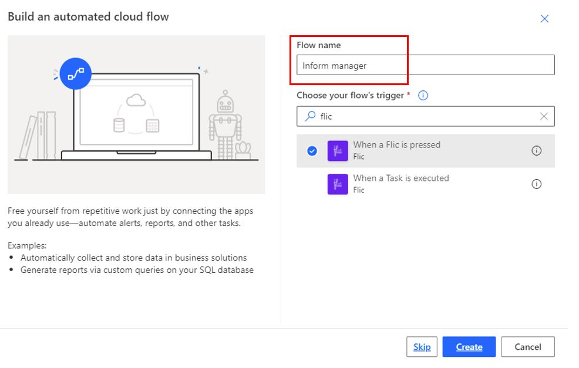
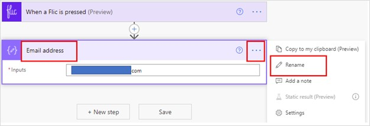
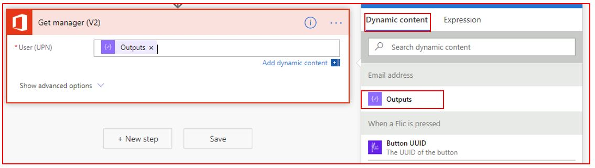
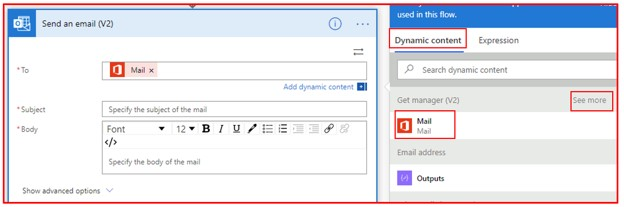
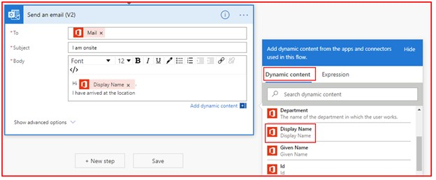

Let's show how you can build a flow triggered by the Flic button that lets your manager
know you are onsite.

1.  [Sign in to Power Automate](https://flow.microsoft.com/?azure-portal=true).

1.  Click on **+ Create** available on the left vertical navigation.

1.  In the Start from blank section of the page, click **Automated flow**.

1.  Name the flow, **Inform manager**. Under Choose your flow's triggers search for Flic. Select **When a Flic is pressed** and then click **Create**.

	

1.  In the Flic button trigger, click on the drop-down arrow at the right and select the Flic button you added above. For Events, select **double-click**.

1.  Click on **+ New step**.

1.  In the **Choose an action** field, search for compose and select the **Compose** action.

1.  In the **Inputs** field, type in your email address. Then click on the three dots or ellipses button that is available on the top-right, and then click on **Rename**, and rename the action to Email address.

    

1.  Click on **+ New step**.

1. In the **Choose an action** field, search for and select **Get manager (V2)**. In the User (UPN) field, select **Outputs** from Dynamic content.

    

1. Click on **+ New step**.

1. In the **Choose an action** field, search for and select the **Send an email (V2)** action.

1. In the **To:** field, click on the advanced icon and select **Mail** from Dynamic content. You may have to click on **See more** to find Mail.

    

1. In the **Subject** field, type **'I am onsite'**.

1. In the **Body** field, type **'Hi'**. Then, in Dynamic content, select **Display Name**. In the next line type, **'I have arrived at the location.'**.

    

16. Finally, click on the **Flow checker** icon, which is available on the top-right of the screen, and if there are no errors then click **Save**. 

Congratulations! You have now successfully built a flow, which will trigger 
using a physical button. To test, you need to have the Flic app open in your 
phone, and then click the Flic button twice. The flow will send an email to 
your manager.
