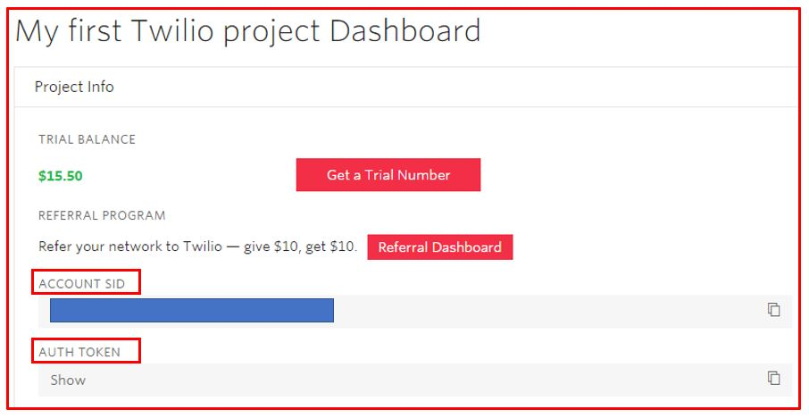
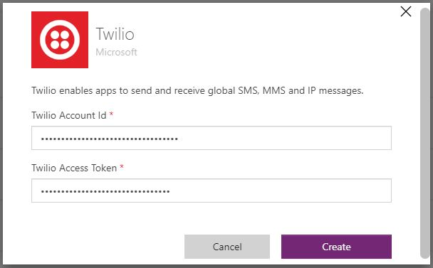

Here's a video that demonstrates how the Flic button with Twilio can
send an SMS message to the required attendees of your next appointment.
You need to register with Twilio and get the account ID and token.

> [!VIDEO https://www.microsoft.com/videoplayer/embed/]
