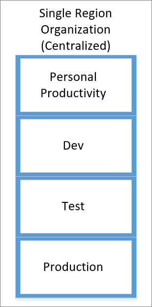
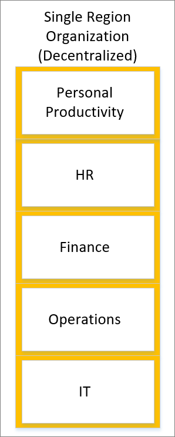
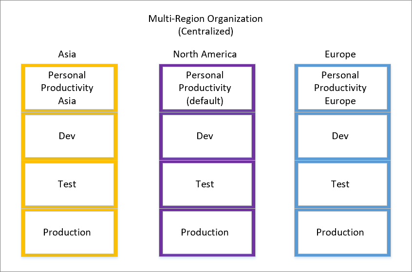
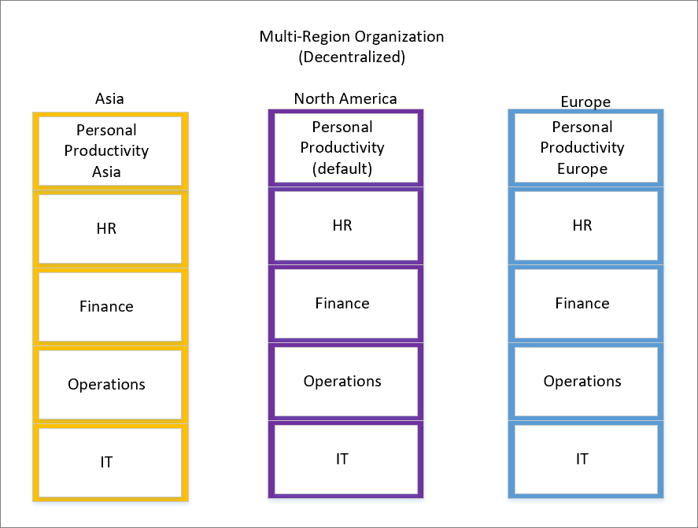

Environment design is highly dependent on organizational design.
Considerations include size, location, regulatory environment, and
appetite for adoption. While environment design is organization-dependent, 
the following recommendations will aid you in designing the
right landscape for your organization.

> [!NOTE]
> The Introduction to Power Automate security and governance module 
discussed the default environment. If you recall, every user within 
the tenant will automatically have access to this environment. Because 
no method exists for removing access to this environment, it is a common pattern to 
rename this environment to be called Personal Productivity to imply that this 
environment is general use. Administrators should also be 
aware of the location of this environment to ensure that no issues occur 
from a data privacy perspective.

Another important consideration is the aspect of centralization. For
example, consider whether your organization has a centralized IT function. You should also determine if 
your organization is responsible for the administration and governance of the Power Platform
environment. Alternatively, your organization could have a decentralized
organization where some aspects of technology are managed outside of an
IT department. When establishing environment design, you have additional important parameters to consider.

## Sample configurations

The following sections outline sample configurations that you could use
based on your organization's design and goals.

### Single region organization (centralized)

In single region organization (centralized), environments are centrally managed and include
isolation for personal productivity, development, testing, and production
purposes. The personal productivity environment can be used to support
scenarios like email notifications, team-based approvals, ad hoc data
collection, and the integration with Office 365 services. The central
team that manages environments will also provide access into non-default
environments.

Because this organization operates in a single region, data
residency concerns do not exist and do not require further segregation from other
regions.

### Single region organization (decentralized)

In single region organization (decentralized), environments are independently managed, and the
administrative responsibilities have been assigned to individual
business units to manage. This organization operates within
a single region and the default environment has been renamed to be
called Personal Productivity. Additional environments have been created
for respective business units like HR, Finance, Operations, and IT.

### Multi-region organization (centralized)

In multi-region organization (centralized), environments are centrally managed and include
isolation for personal productivity, development, testing, and production
purposes. The personal productivity environment can be used to support
scenarios like email notifications, team-based approvals, ad hoc data
collection, and the integration with Office 365 services. The central
team that manages environments also provides access into non-default
environments.

Because this organization operates in multiple regions throughout the
world, environments must be created within the region that the
organization operates. To address this requirement, a default
environment has been created within the home region where the tenant was
created. This environment has been renamed Personal Productivity
(default). In addition, Dev, Test, and Production environments have 
been created within this region (North America). To address requirements
in other regions and to provide symmetry, Personal Productivity, Dev,
Test, and Production environments have also been created in the Asia and
Europe regions.

Because the default environment behavior is that all licensed users
are makers in this environment, you cannot remove users from
this default environment. However, to create a workspace for users to build
ad hoc apps and flows, Personal Productivity environments are also
created in Asia and Europe so that users can build these assets without
being concerned about data drifting away from their home region.

Regional teams can apply their IT Change Management practices to these
environments so that business-critical apps and flows can be promoted
through environments to address any compliance requirements.

### Multi-region organization (decentralized)

In multi-region organization (decentralized), the environments are independently managed, and
the administrative responsibilities have been assigned to individual
business units to manage. This organization operates in
multiple regions, and the default environment has been renamed to be
called Personal Productivity and resides within the same region as the
tenant (North America). Within this home region, additional environments
have been created for different business units that provide them with
the autonomy that they require. To illustrate this concept, environments for the HR, Finance, Operations, and IT business
units have been created.

Because the default environment behavior is that all licensed users
are makers in this environment, you cannot remove users from
this default environment. However, to create a workspace for users to build
ad hoc apps and flows, Personal Productivity environments are created in
Asia and Europe so that users can build these assets without being
concerned about data drifting away from their home region.

In addition, environments for business units in Asia and
Europe will be created to ensure that they have the autonomy to build apps and flows without
a central authority.

## Manage exceptions

The previous four examples illustrated configurations that
organizations can choose to implement that address the productivity and
governance needs of their organization. However, because every
organization is unique, circumstances might occur where you need to
support exceptions. For example, you might have a tenant-wide DLP policy
that prevents joining SharePoint and Twitter connectors within the same
app or flow. For many job functions, having the ability to retrieve data
from SharePoint and then publish it to Twitter is not a valid business
scenario. However, for a business unit like Corporate Communications, this
might be a perfectly valid use case to support.

If people have a need to use a connector like Twitter, but an
organization wants to restrict its use to a broader audience,
governance tools can be layered on top of the out-of-the-box DLP
capabilities. In this scenario, the Twitter connector can be moved into
the same data group as SharePoint, but you can govern its use. More
specifically, Power Platform for Admins and Flow management
connectors can aid in the detection of newly created or edited flows
that use this combination of connectors.

When a new or updated flow event occurs, the Flow management connector
can retrieve the flow definition and examine if the Twitter connector is
being used. When this situation does occur, an administrator can enable their own
governance process. For example, an administrator might restrict access to
the Twitter connector for a certain group of people, which can be
managed in a security group. Alternatively, an approval can be included
in the flow logic where an administrator can approve the enabling of the
maker's flow. If the administrator chooses to reject the request,
they can use the **Disable Flow as Admin action** that is part of the Flow
management connector and it will prevent the flow from running. The
administrator can include additional automation, including notifying the
flow maker through email that the action is not permitted in the
environment. For a detailed walkthrough of a similar governance
scenario, refer to the [Automating Microsoft Power Automate Governance blog post](https://flow.microsoft.com/blog/automate-flow-governance/?azure-portal=true).
