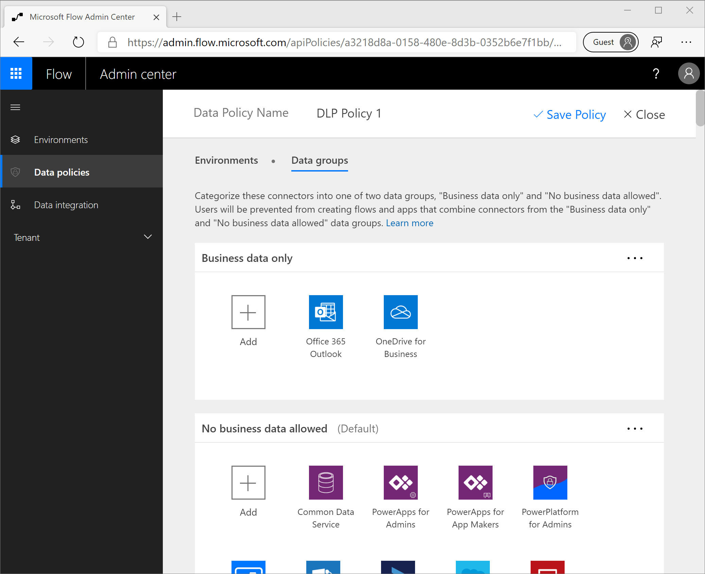
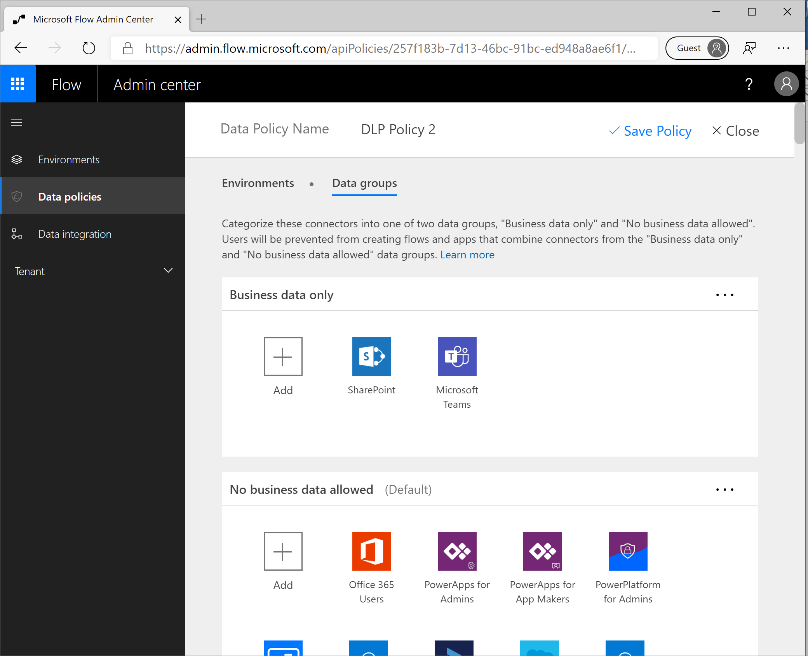
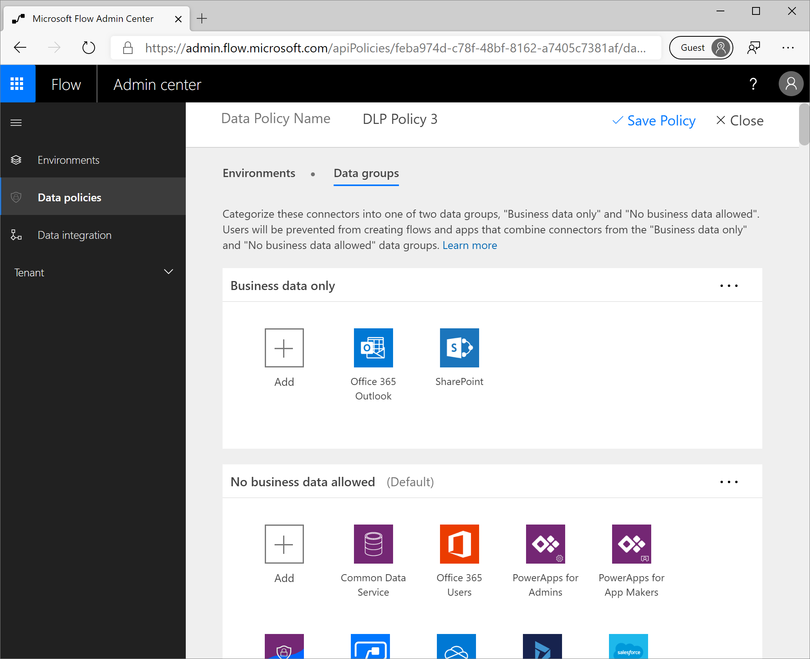

In Module 1, we introduced Data Loss Prevention (DLP) policies to
restrict what connectors can be used together within the same flow, or
app. We also introduced the scope that a DLP policy will apply to. For
example, we can create a DLP policy that only applies to an environment.
In addition, we can create a DLP policy that applies to the entire
tenant, which means that when new environments are created, they
automatically inherit this tenant-wide DLP policy.

In this section, we are going to discuss layering DLP policies. An
organization may choose to implement a layered approach that enables
specific scenarios, but blocks others. It is important to note that when
there are conflicting policies, Microsoft will still apply the most
restrictive policy.

### Scenario 1: Office 365 Outlook and OneDrive for Business

In this use case, an IT department wants to enable people to
automatically copy their email attachments into their OneDrive for
Business account. As a result, an environment administrator will create
a DLP policy that includes the **Office 365 Outlook** and **OneDrive for
Business** connectors in the **Business data only** data group and
leaves all remaining connectors in the **No business data allowed** data
bucket.

Once this DLP policy is saved, makers are able to create flows that
allow them to copy their email attachments to their OneDrive.

Upon saving a flow, the DLP policies are enforced. If our flow is
enabled, or in an **on** state, then we know that we have not violated
any policies. We will experience the behavior of a flow that violates a
DLP policy later in this module.

### Scenario 2: SharePoint and Teams

The second scenario that we want to discuss is publishing notifications
in a Microsoft Teams channel whenever a new item is created in a
SharePoint list. To enable this scenario, we will create another DLP
policy. In this scenario, we will only have the **SharePoint** and
**Microsoft Teams** connectors in the **Business data only** data group.
All remaining connectors will be placed in the **No business data
allowed** data group.

Once this DLP policy has been saved, we can go ahead and create a flow
that will implement our designed functionality that includes posting a
message in a Teams channel whenever a new item is created in a
SharePoint list.

When we save this flow, we will discover that it has been enabled, which
means it complies with our DLP policies.

### Scenario 3: Office 365 Outlook and SharePoint

In Scenario 3 we are going to discover what happens when we have DLP
policies that conflict with each other. Our scenario includes logging
inbound emails in a SharePoint list so that we can track action items
from that mailbox.

Currently, we have unique DLP policies that include these connectors in
the **Business data only** data groups. However, these connectors are
spread across two different DLP policies. If you recall, in our first
scenario we included our **Office 365 Outlook** and **OneDrive for
Business** connectors. In our second scenario, we included
**SharePoint** and **Microsoft Teams** connectors within the same
policy. There is currently no policy that allows both **the Office 365
Outlook** and **SharePoint** connectors to be included in the same
flow/app.

We can create a third DLP policy that does include **Office 365
Outlook** and **SharePoint** connectors in the **Business data only**
data group. All of connectors are placed in the **No business data
allowed** environment.

We will now construct a flow that includes an **Office 365 Outlook**
trigger and a **SharePoint** action.

When we save this flow, we will encounter the following error indicating
that we have violated a DLP policy and as a result, our flow has been
suspended.

You might be asking yourself why this is the case considering we created
a DLP policy that explicitly allows both the **Office 365 Outlook** and
**SharePoint** connectors to be included in the same flow? While we did
create this DLP policy, Microsoft will still enforce the most
restrictive policy. Microsoft will not allow you to bypass previous DLP
policies through the introduction of new policies. Otherwise, there
could be unintended data leakage as organizations include new DLP
policies.

So how do we support the ability for **Office 365 Outlook** to
communicate with **SharePoint**? In this case we will need to update our
existing policies to include these connectors in the Business data only
data groups. Once we have completed this task, we need to explicitly
enable our flows that are currently suspended by our DLP policies.