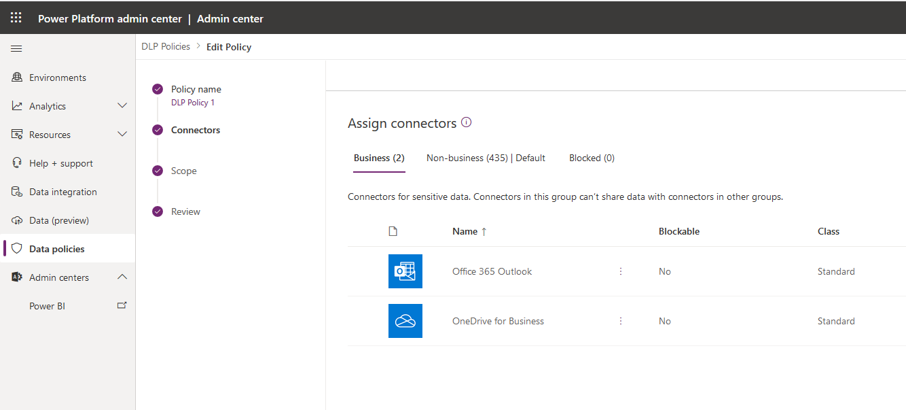
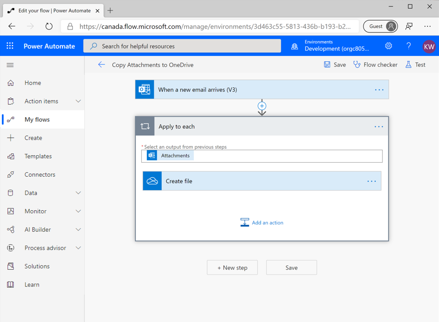
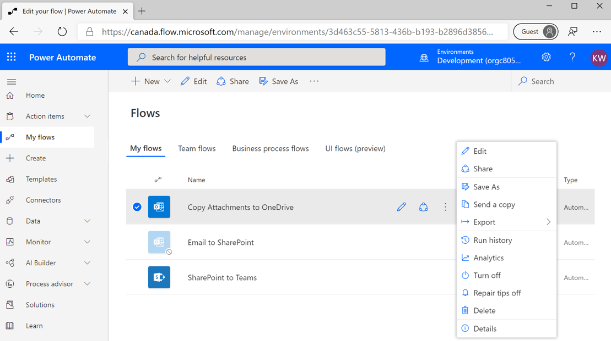
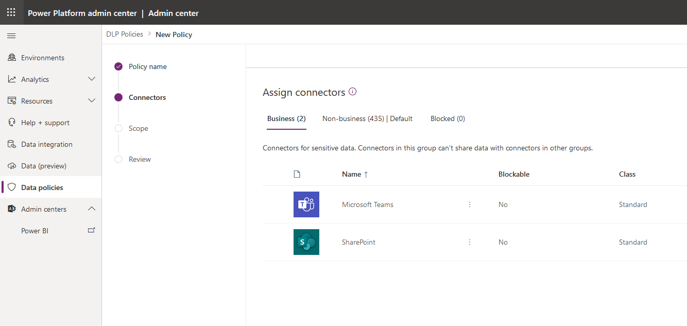
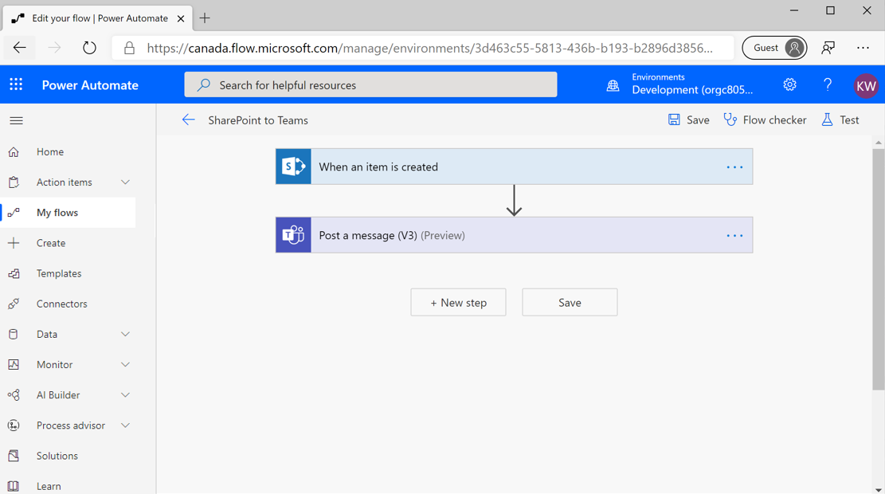
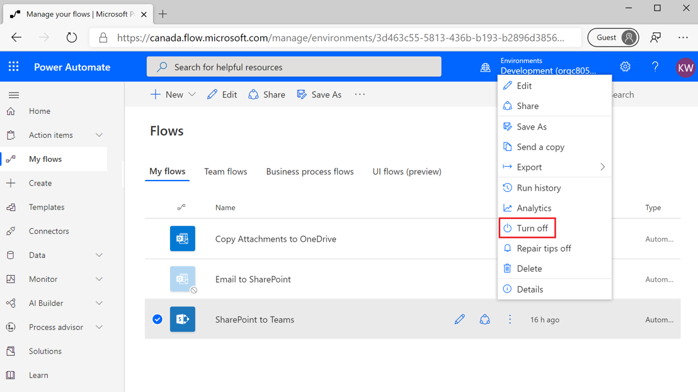
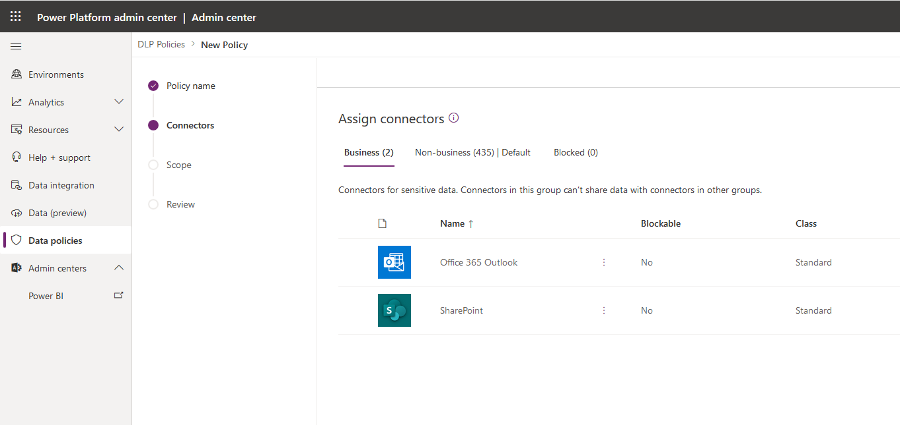
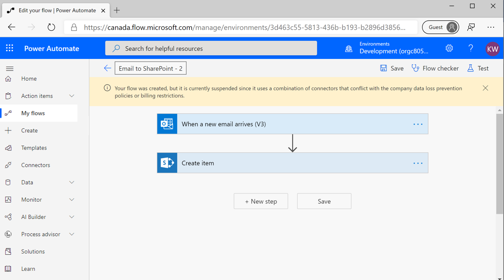

The  Introduction to Microsoft Power Platform security and governance module
introduced Data Loss Prevention (DLP) policies, which restrict the
connectors that can be used together within the same flow or
app. The module also introduced the scope that a DLP policy will apply to. For
example, you can create a DLP policy that only applies to an environment.
In addition, you can create a DLP policy that applies to the entire
tenant, which means that when new environments are created, they
automatically inherit this tenant-wide DLP policy.

The following sections discuss layering DLP policies. An
organization might choose to implement a layered approach that enables
specific scenarios but blocks others. When conflicting policies exist,
Microsoft will still apply the most restrictive policy.

### Scenario 1: Microsoft 365 Outlook and OneDrive for Business

In this use case, an IT department wants to enable people to
automatically copy their email attachments into their Microsoft OneDrive for
Business account. As a result, an environment administrator will create
a DLP policy that includes the **Office 365 Outlook** and **OneDrive for
Business** connectors in the **Business** data group and
leaves all remaining connectors in the **Non-business** data
group.

After this DLP policy has been saved, app makers are able to create flows that
allow them to copy their email attachments to their OneDrive.

When makers have saved a flow, the DLP policies are enforced. If your flow is
enabled, or in an **on** state, then you know that you have not violated
any policies. You will experience the behavior of a flow that violates a
DLP policy later in this module.

### Scenario 2: SharePoint and Teams

The second scenario involves publishing notifications
in a Microsoft Teams channel whenever a new item is created in a
list in Microsoft Lists. To enable this scenario, you will create another DLP
policy. In this scenario, you will only have the **SharePoint** and
**Microsoft Teams** connectors in the **Business** data group.
All remaining connectors will be placed in the **Non-business**
data group.

After this DLP policy has been saved, you can create a flow
that will implement your designed functionality that includes posting a
message in a Teams channel whenever a new item is created in a
list in Microsoft Lists.

When you save this flow, you will discover that it has been enabled, which
means it complies with your DLP policies.

### Scenario 3: Microsoft 365 Outlook and SharePoint

In this scenario, you will discover what happens when you have DLP
policies that conflict with each other. This scenario includes logging
inbound emails in Microsoft Lists so that you can track action items
from that mailbox.

Currently, you have unique DLP policies that include these connectors in
the **Business** data groups. However, these connectors are
spread across two different DLP policies. If you recall, in the first
scenario, you included your **Office 365 Outlook** and **OneDrive for
Business** connectors. In the second scenario, you included
**SharePoint** and **Microsoft Teams** connectors within the same
policy. Currently, no policy exists that allows both the **Office 365 Outlook**
and **SharePoint** connectors to be included in the same flow or app.

You can create a third DLP policy that does include **Office 365
Outlook** and **SharePoint** connectors in the **Business**
data group. All of the other connectors are placed in the **Non-business** data group environment.

You will now construct a flow that includes an **Office 365 Outlook**
trigger and a **SharePoint** action.

When you save this flow, you will encounter the following error indicating
that you have violated a DLP policy and, as a result, your flow has been
suspended.

You might wonder why this error has occurred considering that you created
a DLP policy that explicitly allows both **Office 365 Outlook** and
**SharePoint** connectors to be included in the same flow. While you did
create this DLP policy, Microsoft will still enforce the most
restrictive policy. Microsoft will not allow you to bypass previous DLP
policies through the introduction of new policies. Otherwise,
unintended data leakage could occur as organizations include new DLP
policies.

Consequently, you might wonder how you can support the ability for **Office 365 Outlook** to
communicate with **SharePoint**. In this case, you will need to update your
existing policies to include these connectors in the **Business**
data groups. After you have completed this task, you need to explicitly
enable your flows that are currently suspended by your DLP policies.
