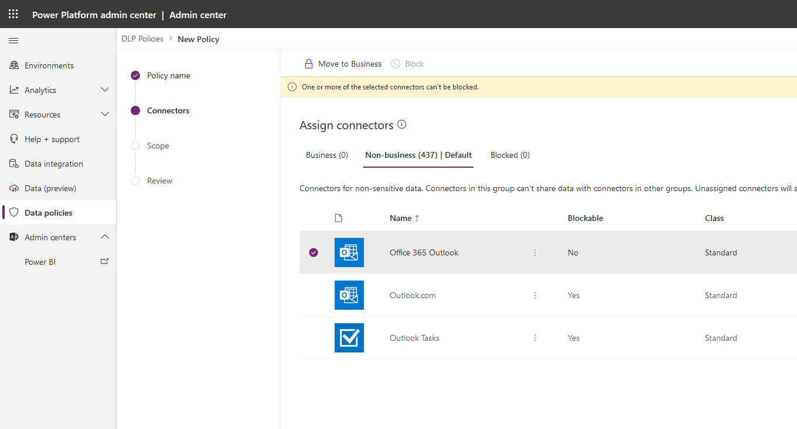
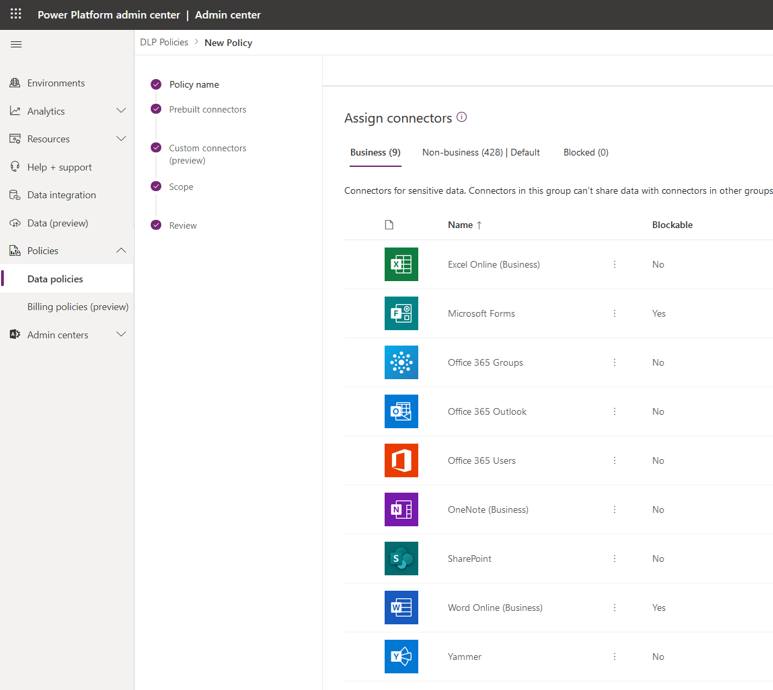
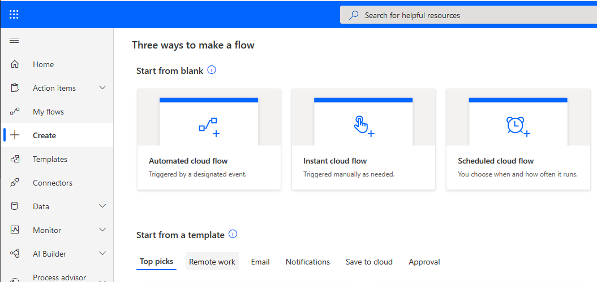
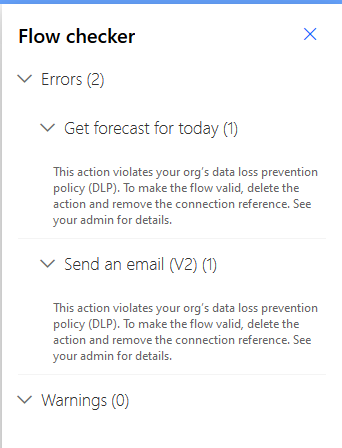

In this exercise, you will create an environment-specific DLP policy that
applies to Microsoft 365 use cases. The driver behind this scenario is an
organization that wants to ensure that makers can build automation
solutions for the Office 365 platform by using Power Automate.

This exercise will take advantage of the environment that was created in the
Introduction to Power Automate security and governance module, which is the
first module of this learning path. In addition, you should review the DLP
prerequisites that were outlined at the beginning of this module.

1. Sign in to the [Microsoft Power Platform Admin Center](https://admin.powerplatform.microsoft.com/?azure-portal=true) as an environment or tenant administrator.

1. Select **Data policies** from the left navigation pane.

1. From the upper-right corner, select **+ New policy**.
1. Type in a name for your policy *Office 365 Connectors*, then select **Next**
1. Within the **Non-business** data group, select the following connectors and then select the **Move to business** button at the top:
    - Office 365 Outlook
    - Office 365 Users
    - SharePoint
    - Excel Online (Business)
    - Microsoft Forms
    - Office 365 Groups
    - OneNote (Business)
    - Word Online (Business)
    - Yammer

    

    Your **Business** data group should now resemble the following image.

    
1. Select the **Next** button
1. For Define Scope, select **Exclude certain environments** and then select **Next**
1. Select the environment you want to add to the policy and then select the **+ Add to policy** button at the top.
1. Review the policy settings and then select **Create Policy**.

1. With your DLP policy in place, you can now create a flow that will validate that your DLP policy is working. To create this flow, go to the [Power Automate maker portal](https://flow.microsoft.com/?azure-portal=true).

1. Ensure that you are in the environment that you created previously. You can switch environments by selecting the environment picker in the upper-right corner.

1. Select **Create** from the left navigation pane.

1. Select the **Instant cloud flow** link.

    

1. Provide a **Flow name** of **Test DLP**, select **Manually trigger a flow** as your trigger, and then select the **Create** button.

    

1. From within the flow designer, select **+ New Step**.

1. Search for **MSN Weather** in the **Search connectors and actions** text box.

1. Select the **Get forecast for today** action.

1. Enter **Seattle** for the **Location** and select **Imperial** for the **Units**.

1. Select the **+ New Step** to add an Office 365 Outlook action.

1. Search for **Office 365 Outlook** in the **Search connectors and actions** text box.

1. Select the **Send an email (V2)** action.

1. Provide values for the **To:**, **Subject**, and **Body** fields.

    

1. Select the **Save** button to save the flow. The DLP enforcement job will run.

1. You should get an error as a result of violating your DLP policy that you created. As a result, your flow will be disabled, and it cannot be enabled while it conflicts with any DLP policies. In this specific example, it is disabled because you have included an **MSN Weather** connector in a flow that also contains an **Office 365 Outlook** connector. If you want this flow to run, you can either add the **MSN Weather** connector to the **Business data only** data group in your Office 365 DLP policy that you previously created, or you can remove the **Office 365 Outlook** connector from the **Business data only** data group.

    
