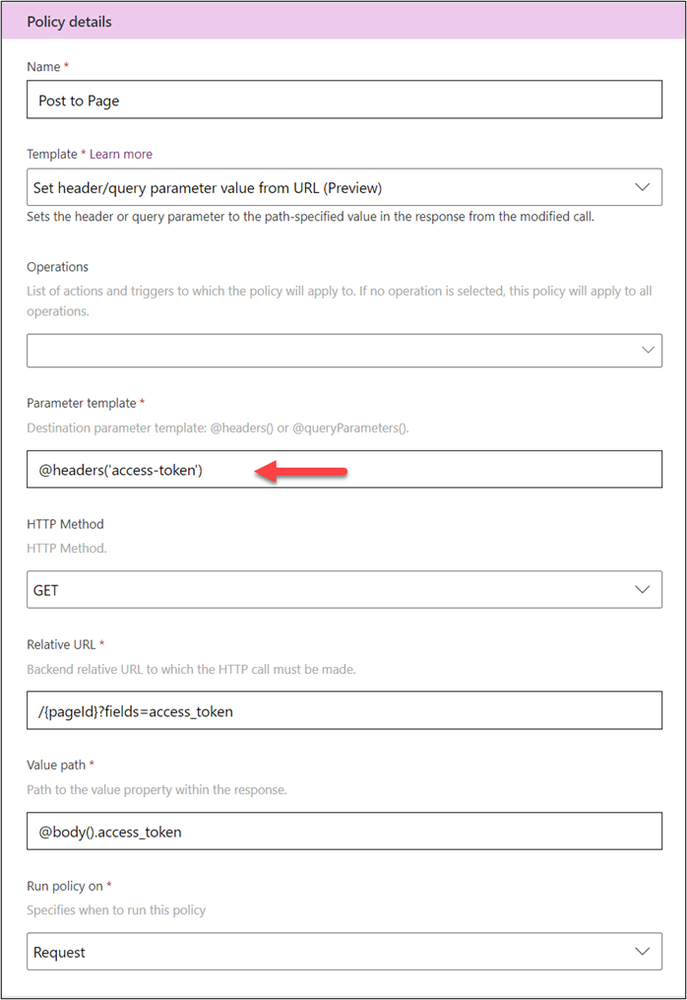
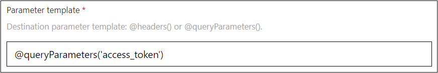
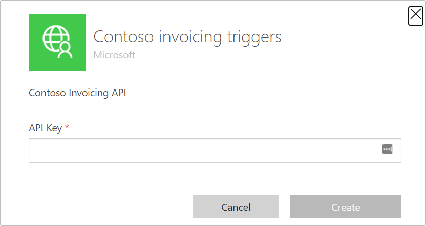
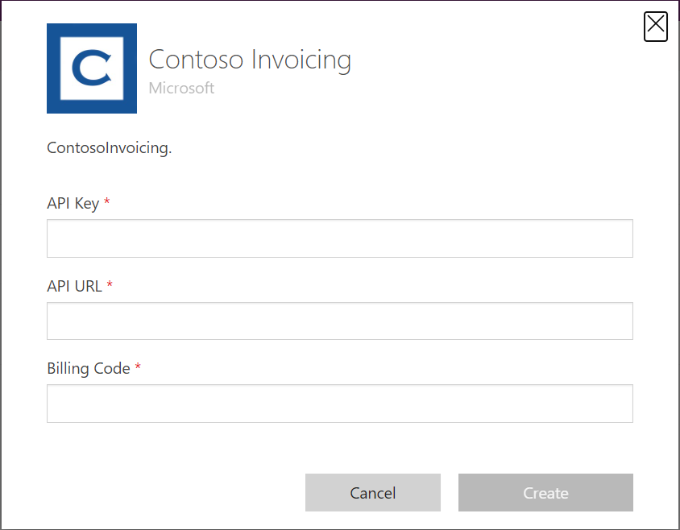

Expressions enable policy template parameters to get their values from runtime data. The functions can access and transform runtime data from the headers, query, and body of the request and response from the API. It's also common to use expressions to access data from the connector's connection properties. For example, **@connectionParameters('HostUrl')** would get the value configured for the connection property **HostUrl**, which would allow a maker to change the service URL as part of the connection, similar to test versus production API scenarios. This topic reviews some common expressions that are used with policy templates.

## Expression basics

Expressions are evaluated at runtime. An expression is a sequence of one or more functions, operators, or explicit values. When defining an expression in a parameter, you will prefix the expression with the at sign (**@**). If your expression results in a numeric value, where string input is expected, you can use the braces (**{}**) notation and it will automatically convert the numeric value into a string. 

The following example shows how both notations are used:

@{connectionParameters('HostPortNumber')}

To ensure that your expressions don't fail due to null properties, make sure that anything in the path isn't null. The following example would fail if **summary** was null:

@body().summary.amount

If you're including explicit values (string literals) in your expressions, use a single quotation mark. Don't use double quotation marks because it will conflict with the markup that is used around the expression.

## Work with response body

You can use the **body()** functions to access the response body at runtime. For example, the **List Invoice** action returns the following data:

{
“invoices”: [ { “invoiceid”:”1234”}]
}


In this example, the **body()** function is referencing the outer braces (**{}**), and it has a property invoice that is an array.

You could build an expression that references the **invoices** array by using the following logic:

@body().invoices

You could also build an expression that accesses the **invoiceid** from the first item in the array by using the following logic:

@body().invoices[0].invoiceid

## Work with header values

By using the **@headers('headerName')** expression, you can access values from the header. You can also use the **@headers** expression as a destination template parameter when you are using the **Set header from URL** policy template. This approach allows you to retrieve a value from a URL and then set it in the header. For example, a connector could use this expression to get an access token from the service to allow posting to a page. The following example shows what the policy template configuration might look like to get the access token for the **Post to Page** action.

> [!div class="mx-imgBorder"]
> [](../media/header-value.png#lightbox)

## Work with query values

Similar to working with headers, you can use the **@queryParameters('queryParameterName')** expression to access the query parameters of the request. The following example is similar to the previous example regarding headers; however, this example places the retrieved token into the query parameters.

> [!div class="mx-imgBorder"]
> [](../media/query-value.png#lightbox)

## Work with connection values

By using the **@connectionParameters('connectionParameterName')** expression, you can access values that were entered when the connection was set up for the custom connector. This expression allows you to collect information from the user of your custom connector, such as authentication or host URL values. You can use these parameter values to build URLs and fill in other connection-specific configuration values.

Connection parameters that are configured in the apiProperties.json file are used to build the connection dialog box that the user fills out when they create a new connection.

When you configure authentication on a custom connector, it automatically edits the **apiProperties** so that you can add the required authentication properties. If you downloaded your connector definition by using paconn, if you look in the apiProperties.json file, you will see the following logic added if you configured **API Key** authentication.

```json
"api_key": {
        "type": "securestring",
        "uiDefinition": {
          "displayName": "API Key",
          "description": "The API Key for your environment",
          "tooltip": "Provide your API Key",
          "constraints": {
            "tabIndex": 2,
            "clearText": false,
            "required": "true"
          }
        }
```

As a result, you will see the following input field when you create a connection.

> [!div class="mx-imgBorder"]
> [](../media/api-key.png#lightbox)

You can manually add other input fields to collect other data that is unique to each user of the custom connector. For example, a common field to add is **Host URL** so that you can allow the connector to work with multiple endpoints of the underlying API. The following example shows the apiProperties.json file where, in addition to the API key, you're allowing entry of a host URL and a billing code.

```json
"properties": {
    "connectionParameters": {
      "hostUrl": {
        "type": "string",
        "uiDefinition": {
          "constraints": {
            "required": "true"
          },
          "description": "Specify your API URl e.g. https://test.contoso.com",
          "displayName": "API URL",
          "tooltip": "Specify your API URl e.g. https://test.contoso.com"
        }
      },
      "billingCode": {
        "type": "string",
        "uiDefinition": {
          "constraints": {
            "required": "true"
          },
          "description": "billing code",
          "displayName": "Billing Code",
          "tooltip": "Billing Code"
        }
      },
      "api_key": {
        "type": "securestring",
        "uiDefinition": {
          "displayName": "API Key",
          "description": "The API Key for your environment",
          "tooltip": "Provide your API Key",
          "constraints": {
            "tabIndex": 2,
            "clearText": false,
            "required": "true"
          }
        }
      }
    }
```

Using this configuration results in the following connection dialog box being shown.

> [!div class="mx-imgBorder"]
> [](../media/connection-dialog.png#lightbox)

Then, you can use the **@connectionParameters('hostUrl')** and **@connectionParameters('billingCode')** expressions to use the values in your policy template configurations.

The rest of this module shows examples of using expressions while it further explains how you can use policy templates.
