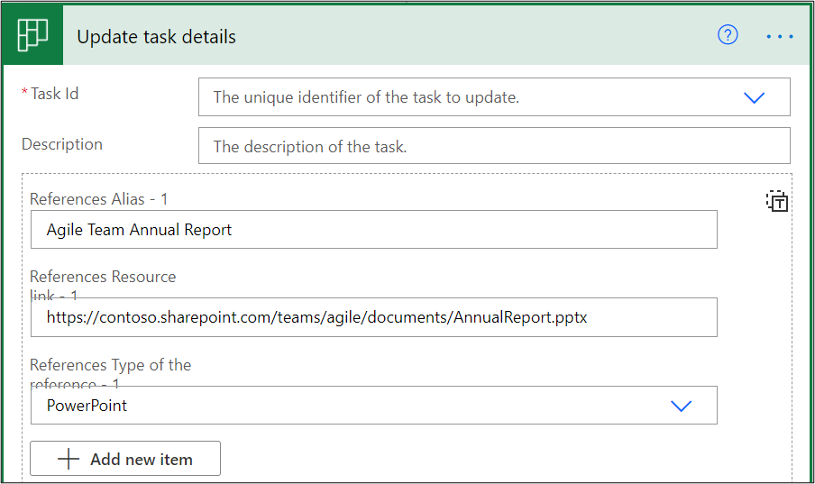
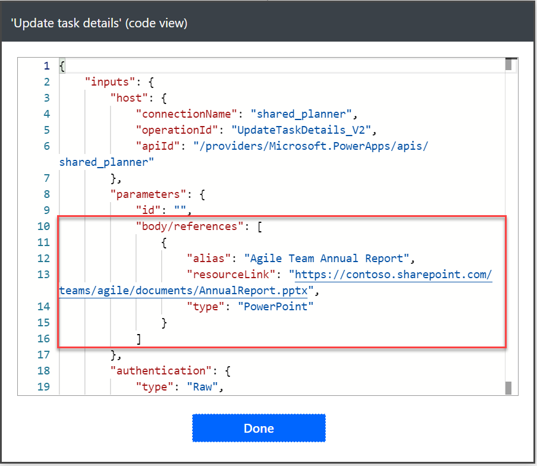
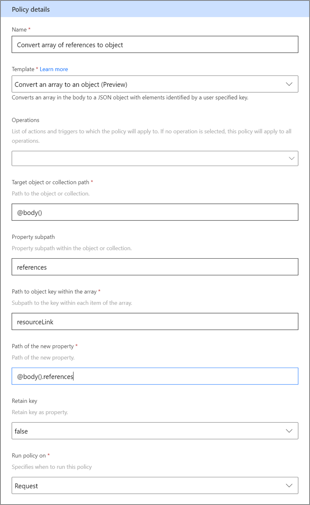
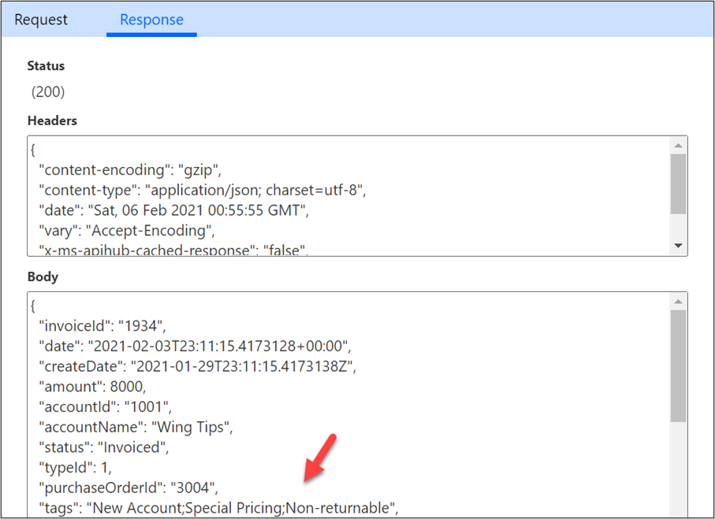
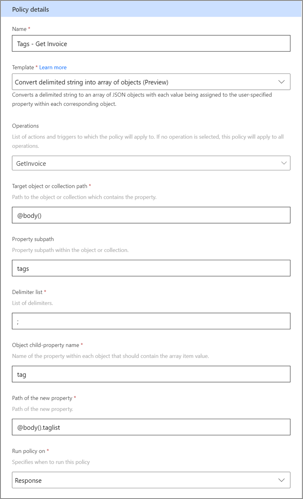
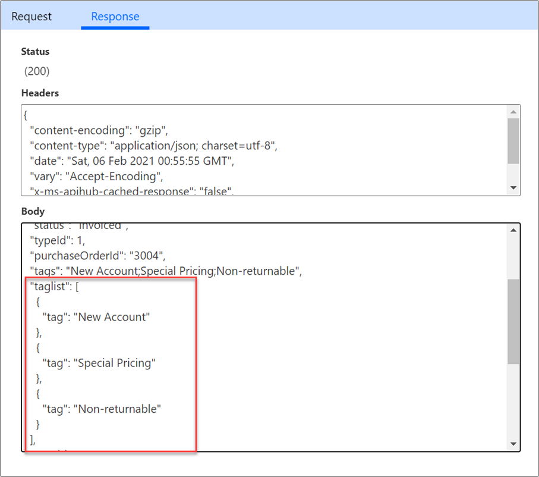
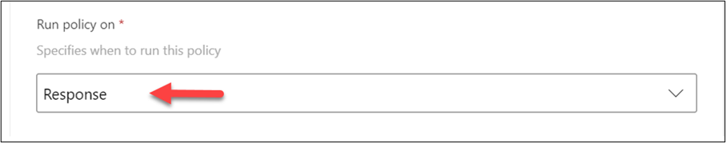
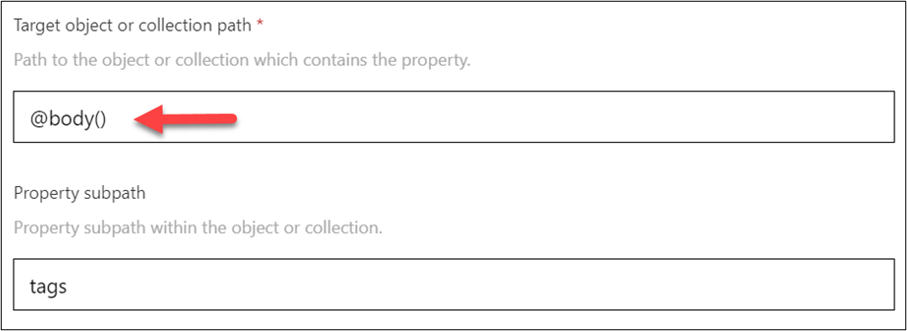
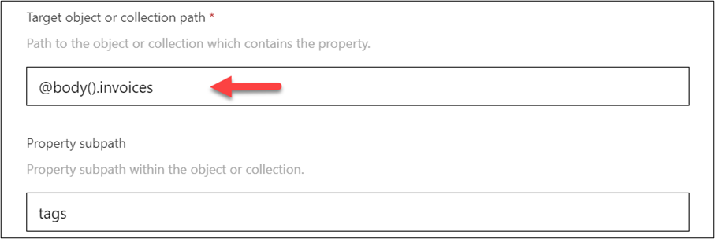
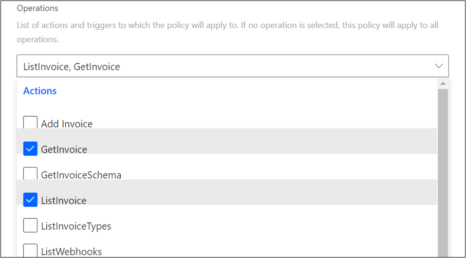

Policy templates can be used to convert data from one structure to another. This process is commonly done to simplify the maker's task of using a custom connector to provide data to the actions or to work with the response data from the action results. For example, the API might provide a comma-separated list of users who have access to the record. Converting that list to an array would make it easier to use the list in an app or flow. The following policy templates currently support converting data structures:

-   Convert an array to an object

-   Convert an object to an array

-   Convert delimited string into an array of objects

Each policy can be run against the request (input data) or the response (output data) from one or more actions. When you run a policy on the request, you're shaping the data that is provided by the maker to determine how the API wants to see it. For example, the Microsoft Planner connector uses the Convert array for an object on its **Update task details** action. This action allows the user to provide an array of external reference links and then associate them with the task. By allowing the maker to specify them as an array, users are presented with a user-friendly interface that allows them to add multiple links by selecting **Add new item**.

> [!div class="mx-imgBorder"]
> 

If you use the peek feature on the action step, you can see how the data is structured and will be presented to the API if no transformations were done by the policy templates on the connector.

> [!div class="mx-imgBorder"]
> 

If you look at the Microsoft Planner API [docs](/graph/api/plannertaskdetails-update?view=graph-rest-1.0&tabs=http/?azure-portal=true) for this operation, notice that it wants the data structured like the following example.

> [!div class="mx-imgBorder"]
> 

To convert what was provided by the flow action to what is expected by the API, the connector is configured to  multiple policy templates to transform the data. The policy templates are used as follows:

-   **Set Property** - To set the **previewPriority** field to **"!"**

-   **Set Property** - To set the **@odata.type** expression

-   **Convert array to object** - To reshape the array and include type and alias as properties

The **Convert array to object** policy would resemble the following example.

> [!div class="mx-imgBorder"]
> 

Policy templates that run on the response allow you to reshape the output from the API. For example, the Contoso Invoicing response from its **Get Invoice** action includes a semicolon-separated list of tags as part of the invoice object. The data that is returned from the API resembles the following screenshot.

> [!div class="mx-imgBorder"]
> 

A string with multiple values is more difficult for apps and flows to work with than an array. To improve the usability, you could use the **Convert delimited string** policy template on the response. The following example shows the policy template that you would configure.

> [!div class="mx-imgBorder"]
> 

This action would result in a new array named **taglist** being added to the response, as shown in the following image.

> [!div class="mx-imgBorder"]
> 

Now that you've explored some examples of policy templates in use, you can review a few key configuration details. The **Run policy on** parameter decides if the policy applies to the request or response. If you need both, you'll need to configure two policy templates.

> [!div class="mx-imgBorder"]
> 

Each convert policy template has a target object or collection parameter. This factor gives the starting point for where the policy logic will get the data to transform. The most common starting point is using the **@body()** expression, which points to the body of the request or response. In the following example, the **@body()** expression is an object and has a property named **tags**.

> [!div class="mx-imgBorder"]
> 

Alternatively, if the response was an object with a property named **invoices** that was an array of invoice objects, each having a **tags** property, the configuration would resemble the following image.

> [!div class="mx-imgBorder"]
> 

As you're configuring policies, make sure that you apply them only to the actions with request/response data that matches these configurations. For example, the **Get Invoice** action, which returns a single invoice object, would need different policy templates applied than the **List Invoice** action, which returns an array of invoice objects. If you're adding policy templates to an existing connector with all actions enabled, make sure that you test all actions and triggers to ensure that they work with the new policy.

After you have configured response policy templates, make sure that you reimport the sample data on the action response. This step is required so that apps and flows can have visibility to the transformed data.

If your configuration of a policy template creates an error, you'll typically see it in the tester as an HTTP status of 500 or it will fail to do any processing. While it isn't possible to disable a policy, you can remove an action from the list of operations to allow testing to isolate if the policy is causing problems. The following image shows only two operations selected.

> [!div class="mx-imgBorder"]
> 

Convert policy templates offer a configuration-focused approach to transforming data to and from your underlying API. They can be used to make your connector actions easier to use.
