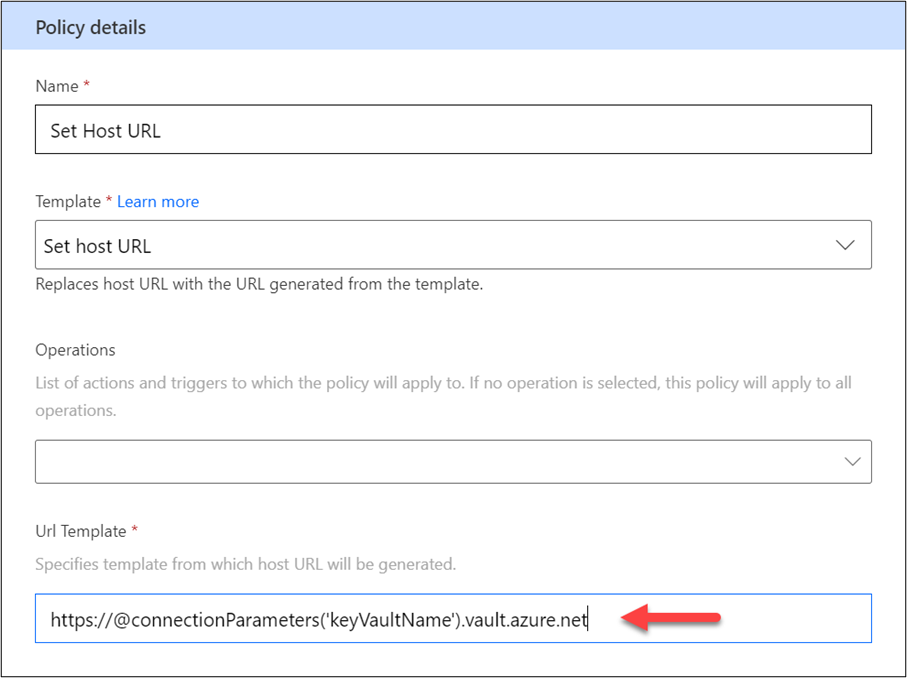
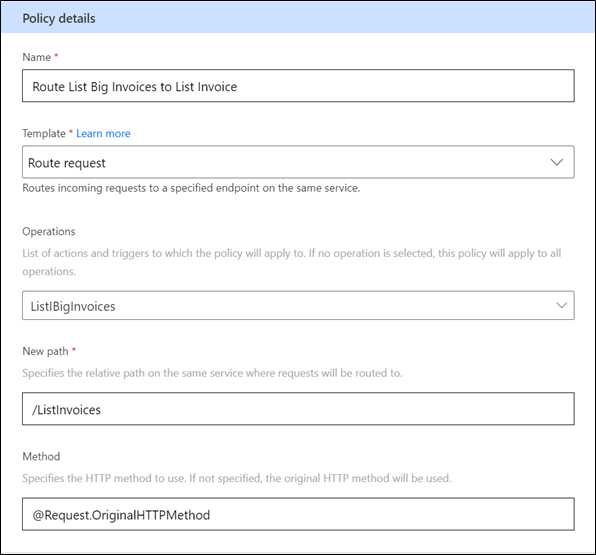
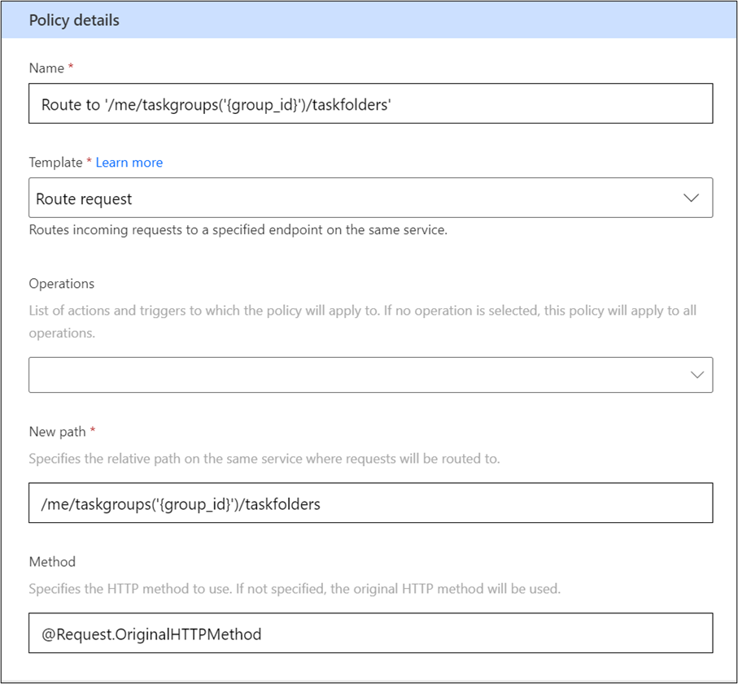

A common use of policy templates is to allow dynamic configuration of the API that endpoint triggers and actions will use at runtime. The following policy templates are available:

-   **Set host URL** - Replaces the full host URL with one that is built by the policy.

-   **Route request** - Routes an incoming request to a specified endpoint on the configured host URL.

## Set host URL

By default, the host URL that is used is statically configured, similar to all triggers and actions on your connector. By using the **Set host URL policy** template, you can configure the URL for the triggers and actions individually. An example of this scenario would be if you had order-related actions at one URL (for example, `ordersapi.contoso.com`) and user-related actions at another (for example, `userapi.contoso.com`). In this scenario, you would configure two policy templates, each selecting the appropriate user or order actions to apply the new host URLs.

Likely, the most common use is allowing people to provide the host URL at runtime when they create a new connection by using your custom connector, as previously shown in this module. In that example, a property named **hostURL** was added to the **connectionParameters** expression and the user provided the full host URL at connection time.

Another common way of using the **Set host URL policy** template is dynamically building part of the host URL and making part of it static. By using this approach, the user only has to provide their account name or other key data that would make the full URL. An example of this scenario is the Azure Key Vault connector, where the host URL is unique for each vault. Instead of asking the user to provide the full vault URL (`https://contosokv.vault.azure.net`), you can add a connection property named **keyVaultName** and then prompt the user to provide that part of the URL only (**contosokv**, in this example). The following example shows what this policy template would look like.

> [!div class="mx-imgBorder"]
> 

You can also include data by using the **@headers** and **@queryParameters** expressions in addition to using **@connectionParameters**. 

## Route request

Each action on your custom connector has a fully qualified URL (such as `https://api.contoso.com/AddInvoice`) that is used to make the request to the underlying API. This URL comes from the combination of the Host (for example, `api.contoso.com`) that you specify on the **General** tab and the path (such as **/AddInvoice**) that either came from a definition that you imported or was extracted from a sample request when you did an import sample request. The **Set Host URL** policy allows you to modify the host, and the **Route request** allows you to modify the path.

Another scenario that you can accomplish with the **Route request** policy is having multiple actions that point to the same path. For example, if you had the **List Invoices** action that took **fromAmount** as a parameter, and you wanted to create a **List Big Invoices** action that had a default value for **fromAmount**, you would get an error because they both pointed to the same path: **/ListInvoices**. Instead, you can define the **List Big Invoices** action with a path of **/ListBigInvoices**, which doesn't exist on the API. Then, you can use a **Route request** to send those action calls to **/ListInvoices**. The following example shows what the policy template would look like.

> [!div class="mx-imgBorder"]
> 

You can also include parameters and other expressions to help you build the path. For example, the Microsoft Outlook Tasks connector has a default path on the List folders in a group of **/v2/me/taskgroups('{group_id}')/taskfolders**. By using the following **Route request**, the requests will route to the new path.

> [!div class="mx-imgBorder"]
> 

Notice that, in **{group_id}**, the requests referenced one of the parameters on the action, similar to how it was done in the original path.

Using the **Set Host URL** and the **Route request** policy templates gives you some flexibility to route requests as needed to the underlying API.
