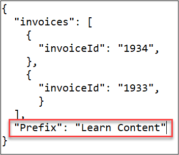
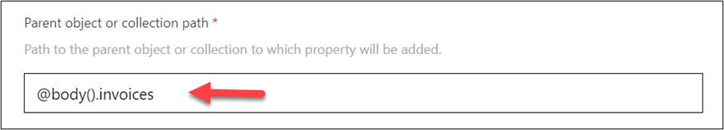
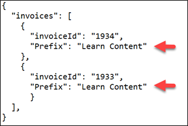
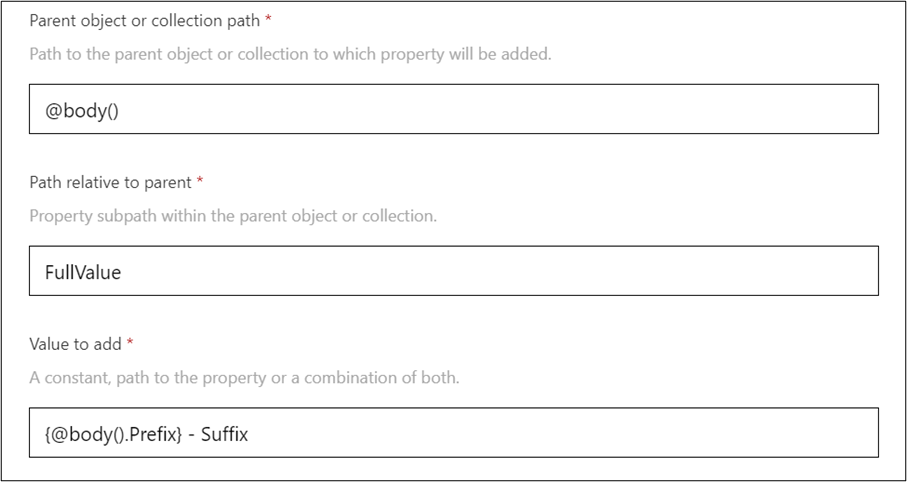
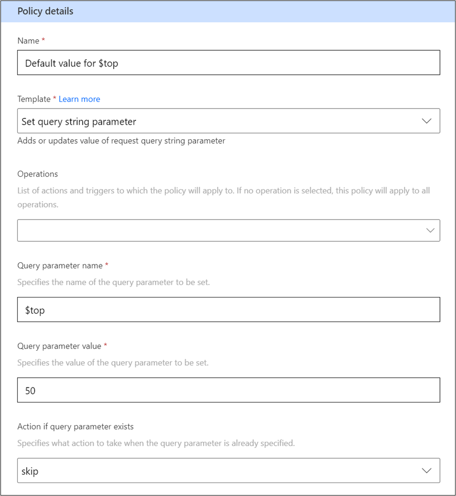
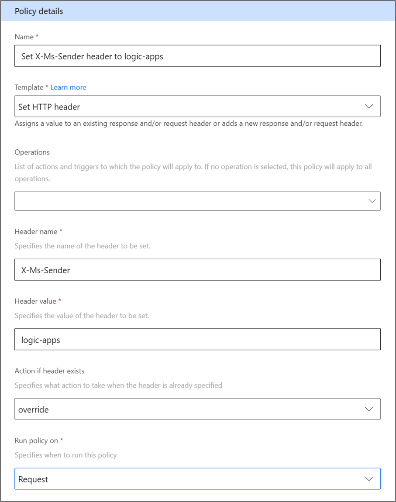

This topic explores the policy templates that you can apply to set data values in the request to and response from the API. The most common scenario is to set values that are required by the API in the body, header, or query of the request so that the maker doesn't have to provide it. The policies are flexible to handle various tasks that are related to setting data on request and response. The following policy templates are available and focused on setting data values:

-   **Set property** - Add or update a property on an object or collection.

-   **Set query string parameter** - Add or update a parameter in the query string.

-   **Set HTTP header** - Add or update a value in the request and/or response header.

## Use the Set property policy template

The **Set property** policy template can be used to set or update values in the body of either the request or the response objects. You can set a constant value by using a string value or an expression by using **@body()** to get another existing value from the body object. The following example shows how to set a constant value on the response body.

> [!div class="mx-imgBorder"]
> 

If you looked at the response after the policy template was implemented, you would see the following image.

> [!div class="mx-imgBorder"]
> 

The preceding example shows that the **ListInvoice** operation returns an object with a property invoice that is an array of invoice objects. If you wanted to set the prefix property on each invoice in the invoices array, you would change your Parent object or collection path to resemble the following image.

> [!div class="mx-imgBorder"]
> 

The output that you would have after making that change would be similar to the following image.

> [!div class="mx-imgBorder"]
> 

You can also reference other values in the body that are already set. For example, the following image shows that the **FullValue** property includes the **Prefix** property.

> [!div class="mx-imgBorder"]
> 

Notice that the **Value to add** field contains the **{@body().Prefix}** expression to get the prefix value from the body. You must surround the expression with braces (**{expression}**) for it to work.

Only referencing the **@body** expression works in this field; using other expressions such as **@connectionProperties**, **@headers**, or **@queryParameters** isn't supported.

## Use the Set query string parameter policy template

The **Set query string parameter** template policy can be used to add or update query parameters on the request. Because the query string only matters on the request, you don't have to set the **Run policy on** value. Unlike the **Set property** policy that always sets the value even if it exists, this policy is configurable. You can set the action, if the parameter exists, to one of the following options:

-   **Override** - Replaces the existing value.

-   **Skip** - The existing value isn't replaced.

-   **Append** - The policy template value is appended to the existing value.

This feature can give you control over when the value is used, making it a good approach for providing default values. An example of this approach is the Microsoft Outlook connector that has a **Set query string parameter** policy to set a default value of **50** for its **$top** parameter. The following example shows what the policy template would look like.

> [!div class="mx-imgBorder"]
> 

Notice that the **skip** option was used for the **Action if query parameter exists** value to ensure that this policy is only used as a default.

## Use the Set HTTP header policy template

You can use the **Set HTTP header** policy template to add or update values in the header of the request, response, or failure. Similar to the **Set query string** policy template, you can choose the action if the value exists already. The policy template is used most frequently to set header values that are expected by the API, such as sender identification, ETag for change tracking, or special API key headers that are not handled by the normal connector settings. For example, the Azure Cognitive Services connector uses a **Set header** policy template to set the **X-Ms-Sender** header value to Microsoft Azure Logic Apps. The following example shows what that policy template would look like.

> [!div class="mx-imgBorder"]
> 

Using these policy templates allows you to set values that are expected by the API. You can also use them to set values in the response that might simplify the maker's task of consuming the data. These policies can also be used to set default values when one isn't already provided. You can use multiple policies in a specific order to compose more complex values.
