In this exercise, you'll create a policy template to set the host URL at connection creation. This process will allow a connection to work with either test or production.

This exercise requires you to install Python and access the command prompt on the machine that you're using for the exercise.

> [!IMPORTANT]
> Use a test environment with Microsoft Dataverse provisioned. If you don't have one, you can sign up for the [community plan](https://powerapps.microsoft.com/communityplan/?azure-portal=true).

> [!NOTE]
> Download the following file to your local computer to complete this exercise [Contoso Invoicing Triggers](https://github.com/MicrosoftDocs/mslearn-developer-tools-power-platform/blob/master/power-automate-connectors/policy/ContosoInvoicingPolicyTemplates_1_0_0_2.zip). Select the download button on the middle-right of the screen.

## Task 1: Import a solution

In this task, you'll import an unmanaged solution that contains a Contoso Invoicing custom connector. You'll use this connector to complete the tasks in this exercise.

1.  Go to [Power Apps maker portal](https://make.powerapps.com/?azure-portal=true) and make sure that you are in the correct environment.

1.  Select **Solutions > Import**.

1.  Select **Browse**.

1.  Select the **ContosoInvoicingPolicyTemplates_1_0_0_2.zip** solution and then select **Open**.

1.  Select **Next**.

1.  Select **Import** and then wait for the import to complete. You should get a success message after the import completes.

1.  Select **Publish all customizations** and then wait for the publish to complete.

1.  Open the **Contoso Invoicing - Policy Templates** solution that you imported.

    You should see the **Contoso Invoicing - Policy** custom connector component.

    > [!div class="mx-imgBorder"]
    > [](../media/custom-connector-component.png#lightbox)

## Task 2: Install Microsoft Power Platform CLI

Microsoft Power Platform CLI includes the paconn command-line tool, which is designed to aid Microsoft Power Platform custom connectors development. The paconn tool uses the Python runtime, so you'll be installing that as well.

1.  Go to [Download Python](https://www.python.org/downloads/?azure-portal=true) and select **Download Python**. You can use any version greater than 3.5.

1.  Select the downloaded .exe file to start installation.

1.  Select the **Add Python xx to Path** check box, select **install**, and then wait for the installation to complete.

    > [!div class="mx-imgBorder"]
    > [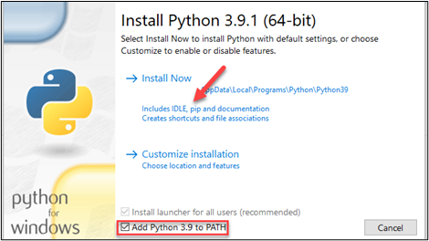](../media/python-install.png#lightbox)

1.  Close the installation wizard after the installation completes.

1.  Start the command prompt and then run the following command to install paconn.

    pip install paconn

    > [!div class="mx-imgBorder"]
    > [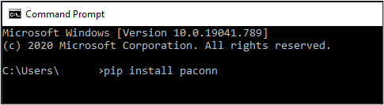](../media/pip-install.png#lightbox)

1.  Wait for the installation to complete.

## Task 3: Download the connector locally

In this task, you'll download the connector definition files locally so that you can add the **Host URL** property.

1.  Run the login command.

    paconn login

1.  Copy the provided **Code**.

1.  In a browser, sign in with the same credentials as your environment. Go to [Microsoft Device Login](https://microsoft.com/devicelogin/?azure-portal=true), paste the **Code** that you copied, and then select **Next**.

1.  Provide your credentials.

1.  You should get a successful sign-in message.

    > [!div class="mx-imgBorder"]
    > [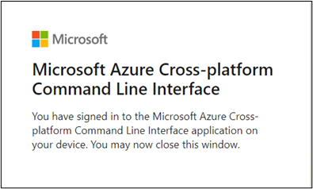](../media/success-message.png#lightbox)

1.  Go back to the command prompt and run the download command.

    paconn download

1.  When prompted to select an environment, enter a number for the environment where you installed the solution, and then press the **Enter** key.

1.  Only one connector should be listed: **Contoso Invoicing Policy**. Press the **Enter** key again to select that connector.

1.  The download should complete successfully. Note the location where the connector was downloaded.

## Task 4: Edit apiProperties.json to add the Host URL property

In this task, you'll edit the apiProperties.json file to configure the **hostUrl** property. When the property is configured, users who are creating a connection will be prompted for this value along with the API key.

1.  Go to the folder that you downloaded in the previous task, and then open the **apiProperties.json** file.

1.  Paste the JSON inside the **ConnectionParameters**, before the **api_key** property.

    ```json
    "hostUrl": {
            "type": "string",
            "uiDefinition": {
              "constraints": {
                "required": "true"
              },
              "description": "Specify your API Url e.g. https://test.contoso.com",
              "displayName": "API URL",
              "tooltip": "Specify your API Url e.g. https://test.contoso.com"
            }
          },
    ```

    > [!div class="mx-imgBorder"]
    > [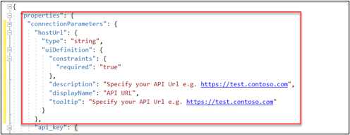](../media/code.png#lightbox)

1.  Save your changes.

1.  Change the directory to the folder that you downloaded.

1.  Return to the command prompt and run the update command.

    paconn update --api-def apiDefinition.swagger.json --api-prop apiProperties.json --icon icon.png

1.  Select the correct environment where you installed the solution.

1.  Select the **Contoso Invoicing - Policy** connector.

The update should complete successfully.

## Task 5: Add the Set Host Name policy

In this task, you will configure a **Set Host Name** policy template to use the connection property that you configured in the previous task.

1.  Go to [Power Apps maker portal](https://make.powerapps.com/?azure-portal=true) and make sure that you have the correct environment selected.

1.  Select **Solutions** and then open the **Contoso Invoicing - Policy Templates** solution that you imported.

1.  Select the **Contoso Invoicing - Policy** custom connector and then select **Edit**.

    > [!div class="mx-imgBorder"]
    > [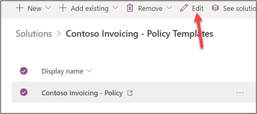](../media/edit.png#lightbox)

1.  Select the **Definition** tab.

1.  Scroll down to the **Policies** section and then select **+ New policy**.

    > [!div class="mx-imgBorder"]
    > [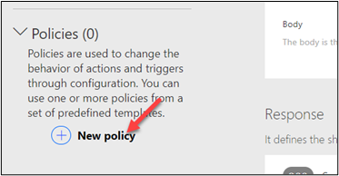](../media/new-policy.png#lightbox)

1.  Enter **Host URL Policy** for **Name** and then select **Set host URL** for **Template**.

    > [!div class="mx-imgBorder"]
    > [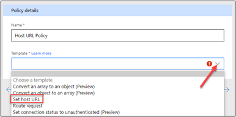](../media/set-host-url.png#lightbox)

1.  Enter **@connectionParameters('hostUrl')** for **URL Template** and then select **Update connector**.

    > [!div class="mx-imgBorder"]
    > [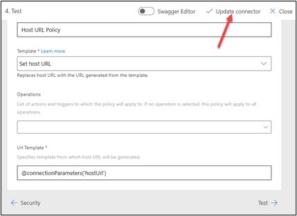](../media/update-connector.png#lightbox)

    The connector should update successfully.

1.  Don't navigate away from this page.

## Task 6: Test

In this task, you'll create a connection by using the new configuration and then you will test it.

1.  Start a new browser window and then go to [Contoso Invoicing](https://contosoinvoicingtest.azurewebsites.net/?azure-portal=true).

1.  Select the **API Key** link.

1.  Copy the **API Key**.

1.  Return to the connector.

1.  Select the **Test** tab.

1.  Select **+ New connection**.

    > [!div class="mx-imgBorder"]
    > [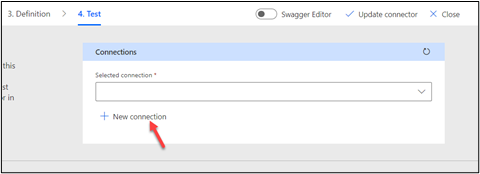](../media/new-connection.png#lightbox)

1.  Enter `https://contosoinvoicingtest.azurewebsites.net/` for **API URL**, paste the **API Key** that you copied, and then select **Create connection**.

1.  Select **Refresh connections**.

    > [!div class="mx-imgBorder"]
    > [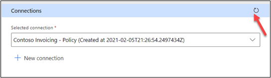](../media/refresh.png#lightbox)

1.  Select **ListInvoice > Test operation**.

    > [!div class="mx-imgBorder"]
    > [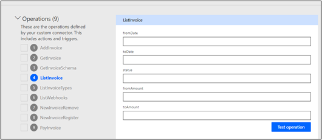](../media/test-operation.png#lightbox)

     The test should return invoices.

    > [!div class="mx-imgBorder"]
    > [](../media/returned-invoices.png#lightbox)
