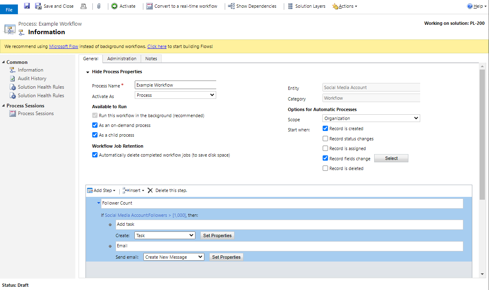

Solution architects are responsible for a solution's overall design. Understanding the capabilities of Microsoft Power Automate is imperative when designing the automation for the solution. This module focuses on Power Automate and its capabilities.

## Options for automation and custom logic

Microsoft Dataverse provides many options for automation and custom logic:

- Business rules
- Dataverse classic workflows
- Dataverse plug-ins
- Power Automate cloud flows
- Power Automate desktop flows

This module discusses how the solution architect can decide on when they should use each of these options.

## Business rules

Business rules have two purposes: first, within model-driven app forms to change how columns are displayed, and second, at the data layer to validate data and calculate values.

Characteristics of business rules are that they:

- Are useful for simple validation or setting of values.
- Are optimized to run as part of the transaction for modifications that occur on the rows.
- Can be configured to run in model-driven apps for basic UX operations such as hiding/showing columns.
- Can't access related records.
- Can't use connectors.

Business rules can be configured to run on different scopes: single form, all forms, or on table create and update operations.

## Classic workflows

You can use classic workflows to remove the need for users to manually perform complex tasks in sequence and to control the activities that are required to deliver business processes consistently and repetitively.

The primary scenario for classic workflows is when real-time processing is required.

Characteristics of classic workflows are that they:

- Can only access related records in many-to-one relationships.
- Are limited to operations on Dataverse data.

> [!IMPORTANT]
> Power Automate should be the first choice for background operations.

See [classic dataverse workflows](/power-automate/workflow-processes/?azure-portal=true) for more information.

## Plug-ins

A plug-in is a .NET assembly that you can upload to Microsoft Dataverse. Classes within the assembly can be registered to specific events (steps) within the event framework. The code within the class provides a way for you to respond to the event so that you can augment or modify the default behavior of the platform.

Characteristics of plug-ins are that they:

- Are custom logic that is an extension of the Dataverse operation.
- Have the ability to modify the request and response instantaneously.
- Are able to handle complex logic.
- Require developer skills.
- Can be synchronous or asynchronous.

## Power Automate cloud flows

Power Automate cloud flows are workflows that automate repetitive tasks and streamline processes within and across systems.

You can use Power Automate for the following tasks:

- Optimizing personal productivity
- Sending notifications
- Handling approvals
- Gathering data
- Automating processes
- Integrating systems
- Orchestrating across systems

Power Automate cloud flows are the primary choice for non-real time automation. Power Automate cloud flows can be triggered in near real time triggering by Dataverse events.

Power Automate cloud flows can use over 400 connectors to other cloud services and data sources. Power Automate can connect to any cloud service that has a REST API by creating a custom connector.

## Power Automate Desktop flows

Power Automate Desktop flows are for automation where no connector or API are available to use. Many legacy applications don't have a method for accessing their data or functionality except through their user interface. Power Automate Desktop flows use robotic process automation (RPA) techniques to automate user actions on these legacy applications.

Power Automate Desktop flows can automate desktop and web applications. Power Automate Desktop flows can be run attended with the user manually initiating the flow, or they can be run unattended with desktop flows that are running on Microsoft Azure Virtual Machines.

Power Automate Desktop flows are a valid way to perform integrations and automation when no other alternative is available or when developing an integration would be expensive and time-consuming.

## Connectors for Dataverse

Three connectors for Microsoft Dataverse are:

- **Microsoft Dynamics 365** - This connector is deprecated and should not be used.
- **Dataverse** - Use this connector when you are not using solutions. It allows connection to any Dataverse environment.
- **Dataverse (Current Environment)** - Use this connector when you use solutions. This connector is the recommended choice, has more options than the other connectors, and is more flexible in the triggers that are available.

## Assess the cost of doing nothing

A solution architect should consider the effort that it will take to build an automation and then decide whether it is justified. This decision involves weighing business value against the cost of automating the process. Business value is the ongoing benefit that the business receives from the project.

To assess whether it's worth automating the process, you need to understand the cost of not solving the problem. As a part of defining the business value that you hope to achieve from Microsoft Power Platform solution, you should get a better understanding of what it's costing the organization to solve the problem in the current manner. In other words, measure the cost of doing nothing.

If the business value that you will receive by automating the process doesn't compare favorably to the cost of doing nothing, ask yourself whether this business problem is the right one to focus on.

However, if the business value that you receive by solving the business problem is greater than the cost of doing nothing, plus development time and the monthly cost of software licenses, it makes sense to automate the process.
