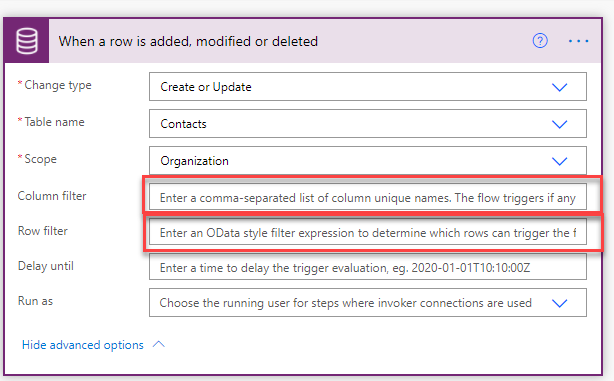

Power Automate defines a trigger as an event that starts a cloud flow. These events can be initiated by a user, are scheduled, or are generated by a connector, including custom connectors.

The triggers that are used in Power Automate are defined by connectors. Each connector has its own set of triggers. Connectors are divided into two groups:

- **Tabular** - These connectors are for data sources where the data is stored in tables. Dataverse is a tabular connector. Tabular connections will have triggers around creating, updating, and deleting of records.
- **Function-based** - These triggers are for cloud services such as Twitter or Microsoft Outlook. The triggers are related to functions in those services. For instance, the Outlook connector has a trigger for when an email is received.

## Trigger types

Three types of triggers for initiating Power Automate cloud flows are:

- **Automated** - A flow that is started by a defined event in a connector, such as a record being created or a file being added to a file location.
- **Instant** - A flow that is run manually by a user, such as a button being pressed.
- **Scheduled** - A flow that is run on a recurring basis, such as at 9:00 AM every workday, or every hour.

This section will focus on using the triggers for Dataverse. Automated flows can be triggered from data events in the platform's event framework. The **Dataverse** connector has a single automated trigger when a record is created, updated, or deleted.

In the trigger step, you have to specify the trigger condition:

- Create
- Create or update
- Create or delete
- Create or update or delete
- Delete
- Update
- Update or delete

The **Dataverse** connector has a single instant trigger when a flow step is run from a business process flow. This feature allows a Power Automate cloud flow to be manually initiated by a user as a step in a business process flow.

The **Dataverse** connector has a single instant trigger when a row is selected. This feature allows a Power Automate cloud flow to be manually initiated by a user from within a form for a row in a model-driven app.

For example, a common pattern that is used with Power Automate cloud flows is to use the **Scheduled trigger to run** feature to retrieve all rows that are due for the day and then loop through and process them on a daily basis.

## Poll vs. push triggers

Triggers represent notifications to Power Automate cloud flows that an event has occurred. Triggers are grouped into two types: poll and push. A polling trigger makes a call into the API at a reoccurring frequency to check for new messages. When new data is available, the trigger will run the flow. Examples of poll triggers include timer triggers. A push trigger responds to a push of new data from the service.

When you are using triggers, indication of whether a trigger is poll or push will be invisible to you. The deprecated **Dynamics 365** connector used polling triggers; the more modern **Dataverse** connector uses push triggers. Push triggers are more efficient and are more real-time.

Not every connector has a trigger. In such cases, you can use a scheduled trigger and then retrieve the data that has changed since the previous run. In other words, use a polling pattern. If you use this pattern, you need to ensure that you don't run the flow too often, and you should leave several minutes between each iteration.

## Use filters

Solution architects should consider minimizing the number of flow runs for each cloud flow. A common mistake that many people make with Power Automate when creating and updating triggers is to retrieve the row and then have a condition that checks if the flow needs to do anything. With **Dataverse** connectors, you do not need to retrieve the row; the trigger step contains the new/changed data.

Additionally, like other triggers, **Dataverse** connectors can have a filter applied to the trigger. A filter will prevent the flow run from being implemented, reducing unnecessary implementations of the flow.

In the previous diagram, the **When a row is added, modified or deleted** trigger for the **Dataverse** trigger has two filters that can be used:

- **Column filter** - If columns are specified, the flow will only run if any of the listed columns are modified.
- **Row filter** - If an OData query is specified, the filter expressions determine which rows can trigger the flow.

In Dataverse, if a column is included in a trigger's output, it doesn't mean that the value of the column has changed. If you need to ensure that you only process changed values, you need to use a plug-in with Pre and Post-Images.

> [!NOTE]
> Instant triggers are not currently visible from apps if the flow is in a solution.
