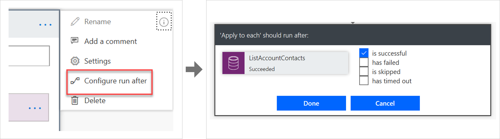
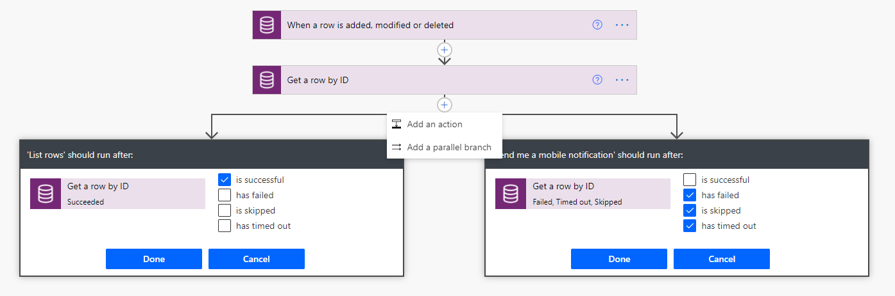
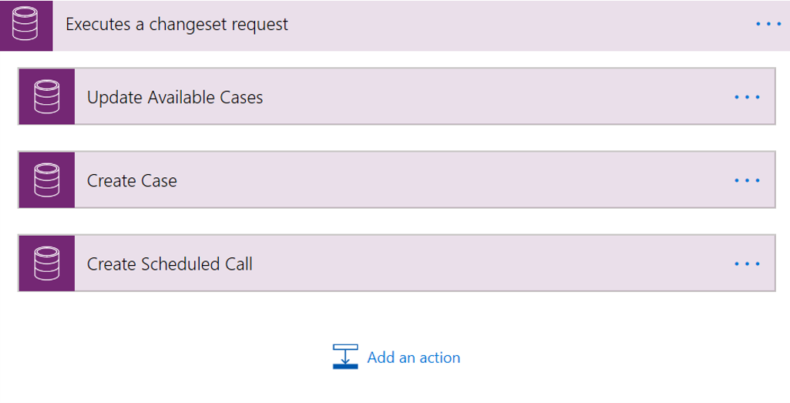

When a failure happens in a Power Automate cloud flow, the default behavior is to stop processing. You might want to handle errors and roll back earlier steps in case of failure.

A solution architect should specify how errors are to be handled within cloud flows.

## Run after

The way that errors are handled is by changing the **run after** settings in the steps in the flow, as shown in the following image.

## Parallel branches

When using the **run after** settings, you can have different actions for success and failure by using parallel branches.

## Changesets

If your flow needs to perform a series of actions on Dataverse data, and you must ensure that all steps work or none of them work, then you should use a *changeset*.

If you define a changeset, the operations will run in a single transaction. If any of the steps error, the changes that were made by the prior steps will be rolled back.

> [!NOTE]
> Changesets are only available with the **Create**, **Update**, and **Delete** actions in the **Dataverse** connector.

## API limits

The platform has API limits and service protection limits. Power Automate observes these limits; each step in a flow consumes an API call.

Limits are also applied for certain actions in Power Automate and for Power Automate:

- Many operations like the **Apply for Each** loop only work up to 100,000 iterations. You might be required to partition work when working with large sets of items.
- The **Do Until** loop has a default of 60 loops or 1 hour of run time. If it exceeds these limits, it exits the loop without error. You can increase the number of loops and time in the settings for the action.
- Flows can run for a maximum of 30 days. You should not use long running flows; use scheduled flows that check if the row needs to be processed instead.
- Connectors have throttling limits, for instance the **Dataverse** connector permits only 6,000 API calls for each connection every 300 seconds.
