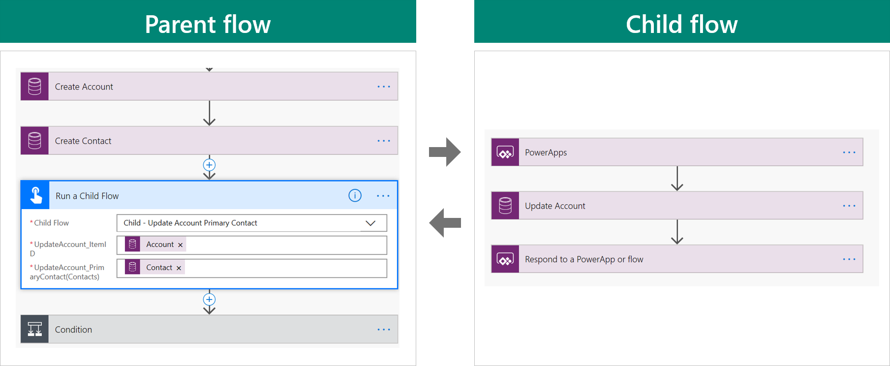
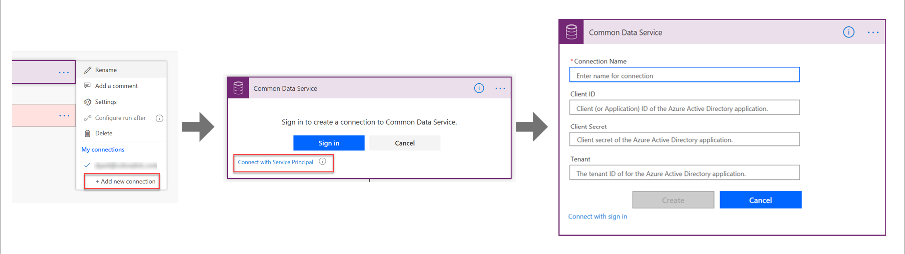

Several options are available for your team to make the flows that they build more maintainable:

- Use meaningful naming conventions and make sure that you consider admins and users.
- Rename each action, such as renaming the **List wows** action to **List Account Contacts** instead.
- Use comments on actions to document purpose.
- Use child flows to prevent overly complex flows or repeated logic.

## Parent and child flows

Using child flows allows you to separate parts of a flow into reusable child flows.

To create a child flow, you must create the flow in a solution and then use the **Dataverse** trigger. The child flow can use the following triggers:

- Manually-triggered button
- Power Apps
- HTTP request

The parent flow must also be in a solution, and then it can use the **Run a Child Flow** action. The child flow can pass data back to the parent flow with the Power Apps or HTTP response, as shown in the following image.

## Use Service Principal

When running flows, you need to understand the user context that the flow runs in. For an **Automated** or a **Scheduled** flow, the flow will run as the owner of the flow and the existing connections in the flow are used. An owner can edit and change the connection(s) that are used. For **Instant** flows, the owner can define that the flow runs as the owner or will run as the user and require the user to create connections by using their own credentials.

By default, when you add an action and sign in to a connector, it uses the current interactive user's credentials and will therefore run in that user's context. Alternatively, you can sign in with a Service Principal by using an app user that was created in Azure AD. This approach allows actions to be implemented by using a Dataverse app user context.

