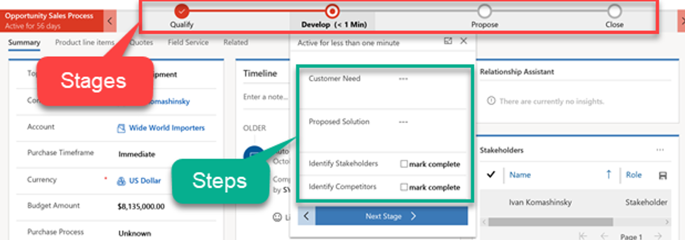

Business process flows are a capability of Microsoft Power Platform that helps users observe a defined business process, find out where they are in the process, and know what data is required to complete the next stage. Business process flows are used within model-driven apps to help guide the user through multiple steps and stages.

A business process flow consists of stages and steps. A stage is linked to a Dataverse table, and steps are typically linked to columns in the table for the stage. The business process flow is shown at the top of a form in a model-driven app.

## Capabilities

Business process flows are interactive guides for users to get work done and to track major milestones in long-running business processes. Business process flows have several capabilities that can be used in your solution to aid business processes:

- **Stage gating** - The steps in a stage can be mandatory, preventing the user from moving to the next stage in the process until the step has been completed.
- **Conditional branching** - The business process flow stages can alter which is the next stage in the process based on entered values.
- **Multiple tables** - A business process flow can include up to five tables in the process.
- **Switch** - A user can switch from one business process flow to another at any time.
- **Security** - Business process flows can be linked to security, which allows different people to use different business process flows.

When a business process flow is created, a table called the process table is created. This table is used to track the instances of the business process flow and their current stages. You can add this table to a model-driven app navigation, and you can create reports, charts, and dashboards to show usage of business process flows. A Microsoft Power BI template app provides visualizations for running of business process flows.

## Automation and developer APIs

Process management can be automated by using the API or by Power Automate to start/stop the process and advanced stages automatically.

## Use cases

Good candidates for using business process flows include:

- Encourage outcomes, not wizard data capture.
- Link between the related tables; the form changes automatically from one table to another. This action hides the data model from the user.
- Trigger automation is based on progression between stages.

## Branching vs. multiple processes

A decision that you might need to make with business process flows is to have one process with multiple branches or to have multiple processes. You can make the decision by answering the following questions:

- Do the processes need to run concurrently?
- Does the process need to return to same place after the branch?
- How will you decide which business process flow is used for new records?

## Immersive business process flows

You can use business process flows as standalone outside the context of a model-driven app by using a per-process license, which are known as immersive business process flows.

You can create an immersive business process flow by selecting **None** for the table to associate the flow with. The created process table will then become the table where columns can be added, a form can be created, and data is stored.
