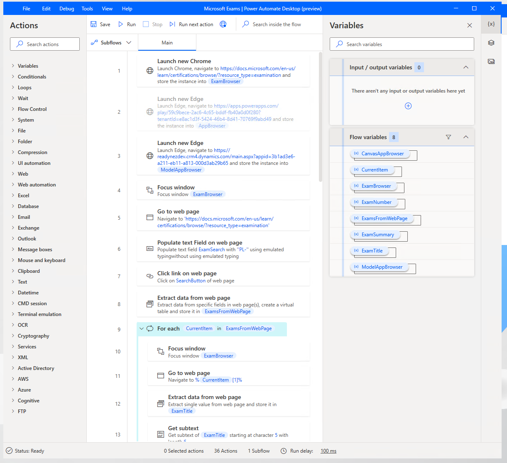

Power Automate Desktop flows are for automation where no connector or API is available to use. Many legacy applications don't have a method for accessing their data or functionality except through their user interface.

Power Automate Desktop flows use robotic process automation (RPA) techniques to automate user actions on these legacy applications. These techniques require software to be installed on the computers where the applications are installed. The software that is required to create, edit, and run desktop flows is called Power Automate Desktop.

Whether working with modern or legacy apps, on-premises, or in the cloud, Power Automate Desktop can automate rule-based UI tasks by recording mouse clicks, keyboard inputs, and data entry. Power Automate Desktop can also extract information from the application user interface. After the actions have been recorded, Power Automate Desktop has a rich editor for adjusting these user actions to create complex desktop flows.

> [!div class="mx-imgBorder"]
> 

Power Automate Desktop flows can be run attended, with the user manually initiating the flow. Alternatively, the flows can be run unattended, with desktop flows running on Microsoft Azure Virtual Machines.

Power Automate Desktop flows are a valid way to perform integrations and automation when no other alternative is available, or when developing an integration would be expensive and time-consuming.

> [!NOTE]
> Power Automate cloud flows are explained in the [Power Automate architecture module](https://docs.microsoft.com/learn/modules/power-automate-architecture/?azure-portal=true).

## Desktop software

Unlike the other Microsoft Power Platform tools, desktop flows require software to be installed on your local computer. You will need this software because you will be interacting with software applications that aren't accessible from the cloud.

The Power Automate Desktop app is a Microsoft Windows application that you can use to create, edit, and run desktop flows. You can download this tool by selecting [Power Automate Desktop setup](https://go.microsoft.com/fwlink/?linkid=2102613) or you can download from the Power Automate portal. Microsoft has announced that Power Automate Desktop will, in the future, be included with Windows 10 and is free to use on a computer that is running Windows 10.

You'll need a computer that is running Windows 10, Windows Server 2016, or Windows Server 2019 to install Power Automate Desktop.

> [!NOTE]
> For unattended flows, Windows 10 Home is insufficient, and Windows 10 Pro or Windows 10 Enterprise is required.

To start a desktop flow from the cloud, a second application is required to be installed on the computer where Power Automate Desktop is installed. This second application is the **On-premises data gateway**. This tool allows desktop flows to be triggered by a Power Automate cloud flow. You can download a gateway from [Install an on-premises data gateway](https://docs.microsoft.com/data-integration/gateway/service-gateway-install/?azure-portal=true) or from the Power Automate portal.

> [!div class="mx-imgBorder"]
> 

As a solution architect, you'll need to liaise with the IT department to arrange for these software applications to be installed. Local software installation can often take much longer to plan and implement than you might think because of IT policies and procedures. If you're planning to use RPA in your solution, you should consider addressing the deployment of this software as early as possible.

## Browser software

To interact with web applications, a modern web browser is required. The latest version of the Google Chrome browser, Microsoft Edge, and Mozilla Firefox are supported.

Additionally, you will be required to install a browser extension, which can be installed by the Power Automate Desktop installer, but it might require more configuration. Again, the solution architect will need to liaise with the IT department because installing browser extensions might be blocked by corporate IT policies.

Further settings for browsers should be configured as well. These settings are described in [Use browsers and manage extensions](https://docs.microsoft.com/power-automate/desktop-flows/using-browsers/?azure-portal=true), and the solution architect will need to arrange for these settings to be applied.

## Requirements

Power Automate Desktop requires access to a Microsoft Power Platform environment that has a Microsoft Dataverse database. You might need to create a database for the default environment if one doesn't already exist.

## Solutions

Desktop flows are solution-aware and can be included in solutions and application lifecycle management (ALM) processes.

You should use environment variables for any property that is used in a desktop flow that might vary between environments.

## Deployment

After deployment of your bot through a solution, you might need to perform certain manual tasks:

- **Gateways** - Configure desktop flows to connect by using the gateway(s) for the environment.
- **Environment variables** - Set the values for the environment.
- **User authentication** - Configure user authentication so that the desktop flow can take actions on the user’s behalf.

The solution architect should ensure that these steps are included in the deployment plan for the solution.
