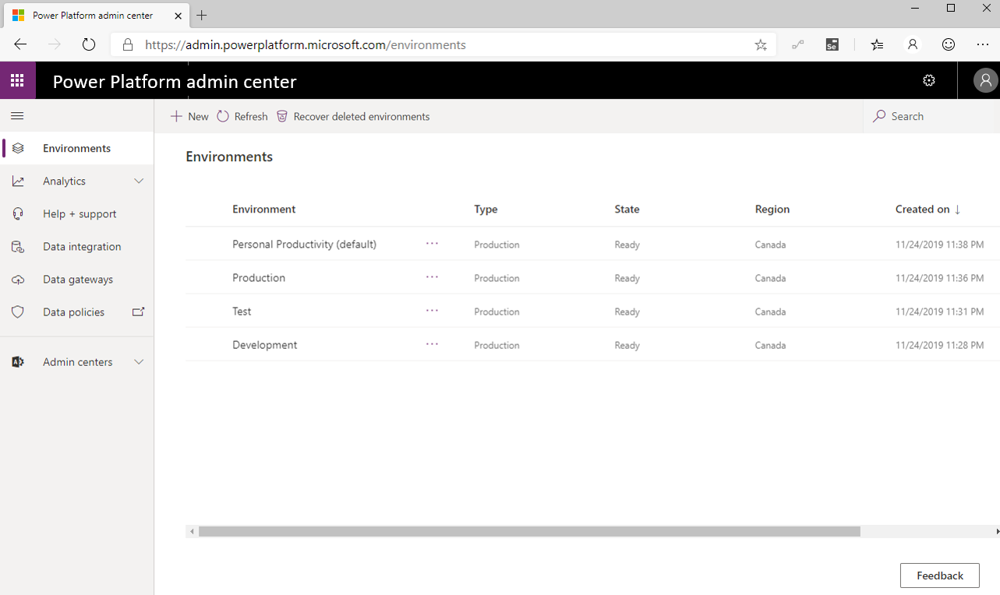

Environments are an important consideration when trying to secure and
govern Power Apps and Power Automate usage. They act as a security
container for apps and flows to execute within. Every flow must be
assigned to an environment. To avoid friction with makers creating
flows, every licensed user belongs to the default environment and there
is no way to prevent this. Additional environments can be provisioned
where opt-in access is possible. A strategy that some organizations
adopt includes [renaming the default environment](https://docs.microsoft.com/power-platform/admin/environments-administration.md?azure-portal=true#rename-your-environment) to be called **Personal Productivity**, which implies permission to build
flows that improve their own productivity. Organizations can
subsequently create additional environments for development, testing, and
production purposes. Using this strategy may also align flow creation
with existing IT change management requirements

By default, anyone can create environments, but administrators can also
[limit environment creation](https://docs.microsoft.com/power-platform/admin/control-environment-creation/?azure-portal=true)
to a set of administrators.

When creating an environment, organizations can choose which region they
want their environment to reside in. This is important for a couple
reasons, including storing data closer to users and maintaining
compliance requirements for your geography. Currently, regions are
available in Asia, Australia, Canada, Europe, France, India, Japan,
South America, United Kingdom, United States and US Government (GCC).

Regions are also important when it comes to Admin Analytics as the
Power Platform Analytics feature isolates analytics through
environments. The telemetry that is generated in one region, is not
allowed to leave that region. For an administrator to view analytics, an
Administrator needs to select an environment first, before they can view
telemetry.
