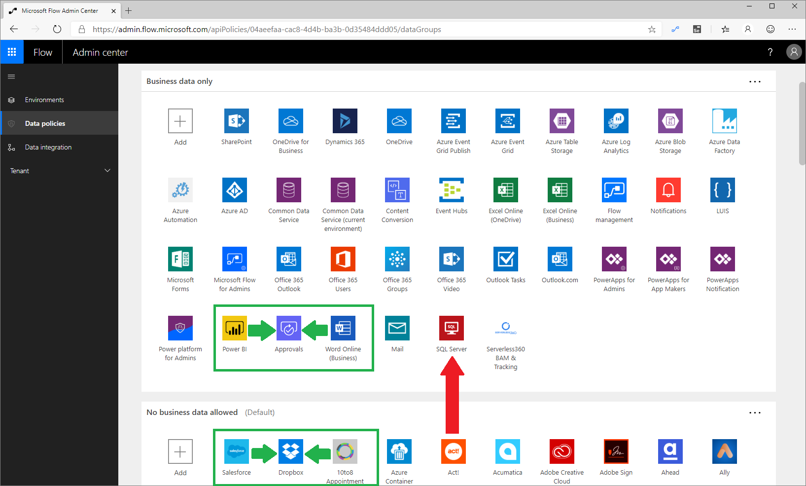
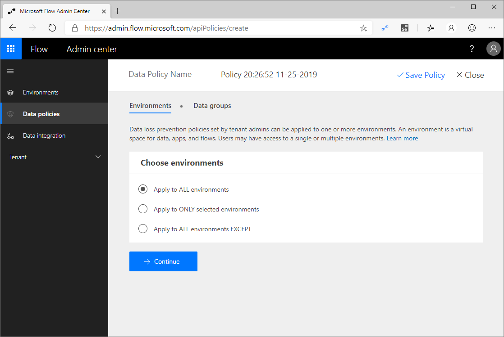

Data Loss Prevention (DLP) policies allow organizations to construct
rules that permit and prevent connectors from communicating with each
other within the same flow. Microsoft accomplishes this task by establishing
two data groups: **Business data only** and **No business data allowed**. 
The intent of these two data groups is to put connectors that
have the same data profile in the same data group. Grouping
connectors means that they can communicate with each other within the
same data group but are not able to communicate across data groups.

To illustrate this concept, consider the following scenario where 
connectors have been distributed across the two data groups.
You want to build a flow that includes the Microsoft **Word Online**,
**Approvals**, and **Power BI** connectors. Because all of these connectors
belong to the **Business data only** data group, you can confidently create and run this flow. 

Similarly, in the **No business data allowed** data group, you can combine 
the **Salesforce**, **Dropbox**, and **10to8 Appointment** connectors within 
the same flow because they all belong to the same data group. 
However, you cannot create a flow that includes the **SQL Server** connector 
and **Act!** connector because they belong to different data groups. 
If you want to create a flow that included these two connectors, you will 
need to move one of the connectors into the other data group.

Additionally, you can specify one data group to be the default data
group. Beside the name of the default data group is the
**(Default)** label appended. To change the default data group, select
the ellipsis (**...**) in the upper-right corner of the data group.

The default data group is significant because it becomes the data group that
all new connectors are added to. For example, if Microsoft deploys a new
connector to the Power Automate service, that connector will be added to
the default data group. This behavior is also true for custom connectors
that are deployed to an environment.

DLP policies can belong to two different scopes: environment and tenant. An environment-scoped DLP policy only applies to
that specific environment, whereas a tenant-scoped DLP policy applies to
all environments in that tenant. When creating a new DLP policy, 
policy authors have a few options that they can choose from, including the
ability to **Apply to ALL environments** (tenant), **Apply to ONLY
selected environments**, and **Apply to All environments EXCEPT**.

When a DLP author selects **Apply to ALL environments**, this setting
also ensures that new environments have this DLP policy applied.

Environments can have multiple DLP policies applied, which provides for
more governance scenarios to be implemented. However, when multiple DLP
policies have been implemented, the most restrictive policy is applied.
DLP policy layering is discussed further in the **Planning** module.

Configuring DLP policies depends on an organization's design
and cyber security principles. For some organizations, these principles allow
for the mixing of business-related connectors with consumer-based
services. Other organizations might choose to strictly prevent
business-related connectors from connecting with consumer-based
services. Organizations should begin by cataloging the business systems
that exist within their organization and then creating DLP policies that
align with that business mapping. DLP strategies are discussed further 
in the **Implementation recommendations for Power Automate environments** 
module of this learning path.

Organizations should also carefully evaluate which data group they would
like to declare as their default data group. Regardless of which data
group they designate, administrators should pay attention to new
connectors that are being deployed into environments so they can place
them into the appropriate data group. How
administrators can detect these new connector events is discussed further in the 
**Use templates to enforce governance policies in Power Automate** module 
of this learning path.
