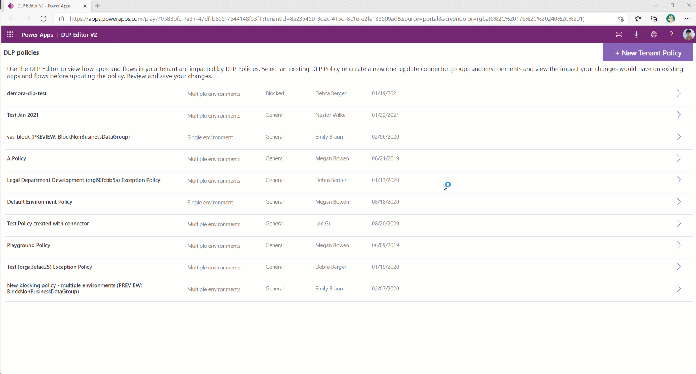
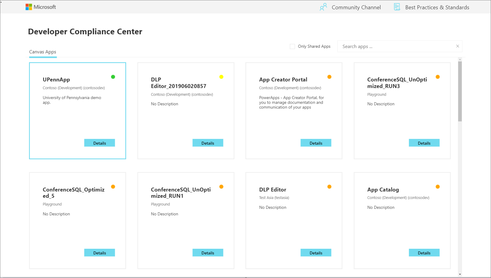
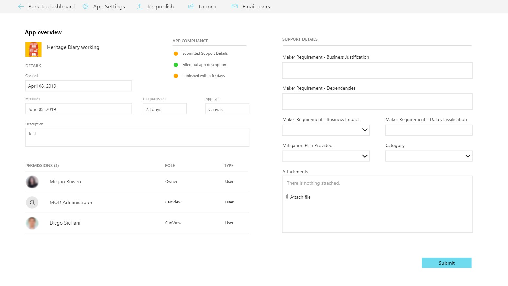
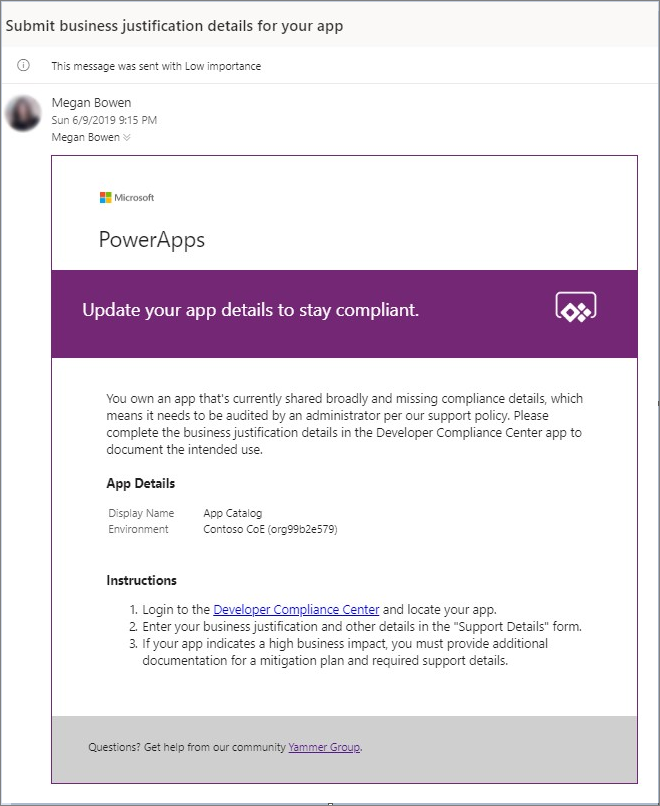
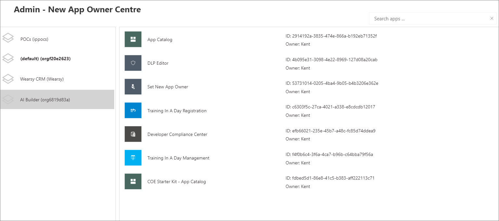

Microsoft Power Platform Center of Excellence (CoE) Starter Kit is a set of
apps, flows, a custom connector, and a Power BI dashboard that allows
organizations to govern their Microsoft Power Platform environments. The tool is
freely available for download on
[GitHub](https://github.com/microsoft/powerapps-tools/tree/master/Administration/CoEStarterKit/?azure-portal=true).

The Starter Kit is a great tool for organizations to increase the
visibility of what their makers are doing in their tenant.
Naturally, this tool immediately applies to two personas: Cyber
Security analysts and Organizational Change Management (OCM) interests.
Makers that are building applications and services that introduce risk
to the organization should be monitored, but makers who are automating
workloads within sanctioned systems and services should be empowered and
encouraged to expand on their efforts.

The Starter Kit does have some prerequisites, including:

- A global tenant admin, or a Microsoft Power Platform Service admin, or Dynamics 365 service admin role is required to access the tenant resources.

- A Power Apps Per-User license for accessing Microsoft Dataverse.

- An environment with Dataverse because the Starter Kit solution will need to store metadata about the apps and flows that are detected within an environment.

- Power BI Desktop to view the reports and visualizations that
    highlight app and flow use within the tenant.

Within the Starter Kit, administrators will discover the tools
and features that are discussed in the following sections.

### DLP Editor V2
Data loss prevention (DLP) policies act as guardrails to protect information security in the tenant and help prevent users from unintentionally exposing organizational data. These policies enforce which connectors are enabled for each environment and which connectors can be used together. DLP policies should be one of the first things you set up as an administrator.

If admins create policies that block specific connectors or disallow certain connectors to be used together, these restrictions will impact apps and flows at design and run-time.

We are excited to introduce you to the DLP Editor – a new app that is part of the Center of Excellence Starter Kit. You can use the DLP Editor to observe the impact of an existing policy or the potential impact of policy changes you’re considering.

The goal of the DLP Editor is to provide admins with a view of currently impacted apps and flows, and a view of resources that would be disabled if new or updated policies were to be enforced. The tool reads and updates DLP policies while showing a list of apps and flows that are impacted by the policy configurations.

You can use this app to:

- Review whether existing policies impact canvas apps and cloud flows in your tenant.

- Create new or change existing DLP policies and update the connector grouping in the policy.

- See what flows or apps would be impacted by the change, before you save the policy.

- Mitigate the risk by contacting makers and informing them about the best course of action for their app or flow.

- Use the DLP Editor to create new policies:

You can use the DLP Editor to update existing policies:

### Catalog tenant resources, visualize data in Power BI

While Admin Analytics, which is found in the Microsoft Power Platform Admin center,
provides some insight into the use of Power Apps and Power Automate,
it does so within the context of an environment. This parameter makes
developing a holistic picture of usage difficult. However,
using the tools that are provided in the COE Starter Kit brings all these
insights together by using Dataverse, a model-driven
Power App, and a Power BI dashboard. These assets, plus the
inclusion of flows that will sync data from Office 365 Security and
Compliance logs and through Microsoft Power Platform management connectors
into Dataverse entities, provide the greatest level of
visibility for administrators.

The Power BI dashboard connects to Starter Kit Dataverse entities and
contains tabs that provide the following reports:

- **Overview** - Includes the total number of apps and
        flows that have been created, including a breakdown based on
        the maker's location and the number of apps/flows that they have
        created.

- **Environments** - Highlights the number of environments that
        have been created and includes the type of environment (Default,
        Production, Sandbox, Trial), and then identifies the creators of the
        environments and when the environment was created.

- **Apps** - Provides insights into the usage of apps, including
        the number of sessions and users that the app has been shared
        with. This report also breaks down usage by department by pivoting data
        based on the department that has been specified inside of a
        user's Office 365 profile.

  - **App detail** - Examines the specifics of the app, including
        the connection type and when the app was last published.

- **Flows** - Displays a flow creation trend that will break down
        when flows were created. This report will also pivot data based
        on the user's department and includes a breakdown of the flows
        that were created by environment.

  - **Custom Connectors** - Lists all the custom connectors that
        exist within a tenant. This report also lists the users that created the connectors and
        then trends the month that they were created in.

  - **Makers** - Identifies all the makers within the environment
        and identifies how many apps and flows they have built. A slicer
        exists that allows a consumer of this report to filter based
        on the maker's department.

  - **Connections** - Displays the number of connections that have
        been established, by connector. This report provides great
        insight into the popularity of specific connectors within your
        tenant.

### App Audit

The main purpose of the Sample App Audit process is to demonstrate how an admin
could identify overshared or often used resources and gather further information,
like business justification and business impact of an outage, for those apps.
Having a platform that provides democratized access to technology is
only useful if people don't create many redundant or low-value
applications. Situations might also occur where people create
temporary applications for proof-of-concept purposes. These apps can
clutter an environment if they are not cleaned up. Within the COE
Starter Kit, app makers can be prompted to attest their application
to ensure that it addresses business justification requirements. If
the application doesn't address these requirements, makers can have their
application removed from the environment.

### App Catalog

The App Catalog application acts as a catalog that helps with the discoverability of apps.
Users can explore featured apps and browse apps by category. The app catalog can be a
great entry point to launch apps for end users and makers can explore to see if an
application already exists before they create another app that provides similar functionality.
An Admin decides which apps are featured in the App Catalog by completing the **App Audit** process.
After an app has been approved by the **App Audit** process, these apps can be featured in
the app catalog.

### Set Owner

Administrating access to applications can be done by the **Owner**
of the application. However, circumstances might occur where you
want an administrator to provide access. By using the **Set Owner** app, you can
allow for this situation by selecting an app, adding users,
and then indicating whether they should be able to view the app or edit
the app.

### Welcome email to new makers

Power Apps and Power Automate can be discovered virally within an
organization's tenant through the Office 365 portal.
Makers might be confused about whether they are allowed to use these
tools or not.

Detecting when a maker has created their first app or flow
and sending them some useful information to accelerate their
journey will immediately imply that these tools are the ones that they are
permitted to use. Now, they will have a list of resources that can ease
their transition into using these tools.

