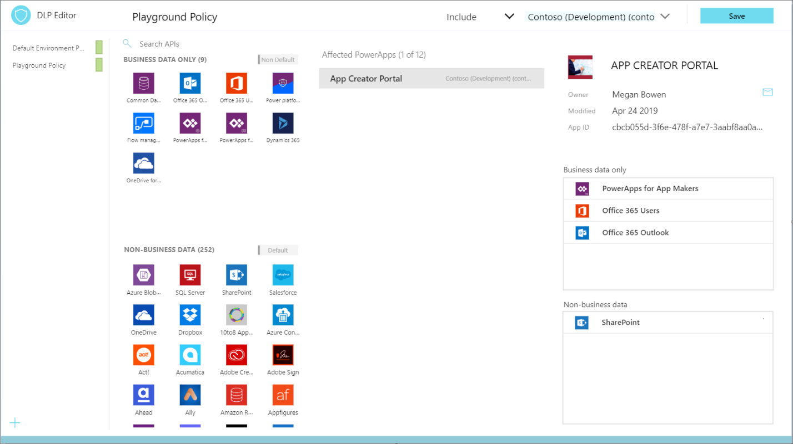
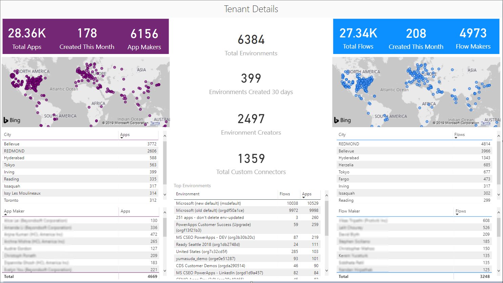

The Power Platform Center of Excellence (CoE) Starter Kit is a set of
apps, flows, a Custom connector, and a Power BI dashboard that allows
organizations to govern their Power Platform environments. The tool is
freely available for download on
[GitHub](https://github.com/microsoft/powerapps-tools/tree/master/Administration/CoEStarterKit/?azure-portal=true).

The Starter Kit is a great tool for organizations to increase the
visibility of what their makers are doing in their tenant. There
are naturally two personas that this immediately applies to: Cyber
Security analysts and Organizational Change Management (OCM) interests.
Makers that are building applications and services that introduce risk
to the organization should be monitored, but makers who are automating
workloads within sanctioned systems and services should be empowered and
encouraged to expand on their efforts.

The Starter Kit does have some prerequisites, including the following:

-   A Global tenant admin or Dynamics 365 service admin role is required
    to access the tenant resources.

-   A Power Apps Premium License for accessing the Common Data Service.

-   An environment with Common Data Service, as the Starter Kit solution 
    will need to store metadata about the apps and flows that are detected 
    within an environment.

-   Power BI Desktop to view the reports and visualizations that
    highlight app and flow usage within the tenant.

Within the Starter Kit, administrators will discover the following tools
and features:

-   **DLP Strategy**

    Using this app, an administrator can explore existing DLP policies
    and evaluate the impact of moving a connector from one data group to
    another. If a change to a data group has an impact on an existing
    app, that will be highlighted in the **Affected PowerApps** list. An
    administrator then can email, through an in-app experience, the
    owner of that application and warn them of this upcoming change.

    This current in-product DLP editor experience doesn't provide this
    type of 'what-if' analysis, so using the DLP Strategy app that comes
    with the COE Starter Kit is recommended when making DLP changes.
    Using the DLP Strategy app will also help you understand the impact
    to existing apps when DLP changes are made and reduce the chance of
    unknowingly breaking someone's app.

	

-   **Catalog tenant resources, visualize data in Power BI**

    While the Admin Analytics, found in the Power Platform Admin Center,
    provide some insights into the use of Power Apps and Power Automate,
    it does so within the context of an environment. This makes
    developing a holistic picture of usage difficult. However,
    using the tools provided in the COE Starter Kit brings all these
    insights together using the Common Data Service, a model
    driven Power App and a Power BI Dashboard. These assets, plus the
    inclusion of flows that will sync data from Office 365 Security and
    Compliance logs and via the Power Platform management connectors
    into Common Data Service entities, provide the greatest level of 
    visibility for administrators.

    The Power BI dashboard connects to Starter Kit CDS entities and
    contains tabs that provide the following reports:

    -   **Overview**- Which includes the total number of apps and
        flows that have been created, including a breakdown based upon
        the maker's location and the number of apps/flows that they have
        created.

    -   **Environments**- Highlights the number of environments that
        have been created and includes the type of environment (Default,
        Production, Sandbox, Trial), identifies the creators of the
        environments and when the environment was created.

    -   **Apps**- Provides insights into the usage of apps, including
        the number of sessions and users that the app has been shared
        with. It also breaks down usage by department, by pivoting data
        based upon the department that has been specified inside of a
        user's Office 365 profile.

    -   **App detail** - dives into the specifics of the app, including
        the connection type and when the app was last published.

    -   **Flows** - Displays a flow creation trend that will break down
        when flows were created. This report will also pivot data based
        upon the user's department and includes a breakdown of the flows
        created by environment.

    -   **Custom Connectors** - Lists all the custom connectors that
        exist within a tenant, lists the users that created them and
        then trends the month that they were created in.

    -   **Makers** - Identifies all the makers within the environment
        and identifies how many apps and flows they have built. A slicer
        exists that allows a consumer of this report to filter based
        upon the maker's department.

    -   **Connections** - Displays the number of connections that have
        been established, by connector. This report provides great
        insights into the popularity of specific connectors within your
        tenant.

        

-   **App Audit**

    Having a platform that provides democratized access to technology is
    only useful if people don't create many redundant or low-value
    applications. There also may be situations where people create
    temporary applications for proof-of-concept purposes. These apps can
    clutter an environment if they are not cleaned up. Within the COE
    Starter Kit, app makers can be prompted to attest their application
    to ensure it is addresses business justification requirements. If
    they do not do so, they can have their application removed from the
    environment.

    

    

-   **App Catalog**

    This application acts as a catalog that users can explore to see if
    an application already exists instead of creating another app that
    provides similar functionality. Once an app has been approved by the
    **App Audit** process, which we previously described, these apps can
    be featured in the app catalog by having the app's metadata
    include **In App Catalog** and **Featured In App Catalog** as part
    of the **App Audit** process.

-   **Set Owner**

    Administrating access to applications can be done by the **Owner**
    of the application. However, there may be circumstances where you
    want an administrator to provide access. Using the **Set Owner** app
    allows for this to happen by clicking on an app, then adding users
    and indicating whether they should be able to view the app or edit
    the app.

    

-   **Welcome Email to new makers**

    Power Apps and Power Automate may be discovered virally within an
    organization's tenant by clicking through the Office 365 portal.
    Makers may be confused about whether they are allowed to use these
    tools. 
    
    By detecting when a maker has created their first app or flow
    and sending them some useful information to accelerate their
    journey, it immediately implies that these are the tools that they are
    permitted to use and now they have a list of resources that can ease
    their transition into using these tools.

    